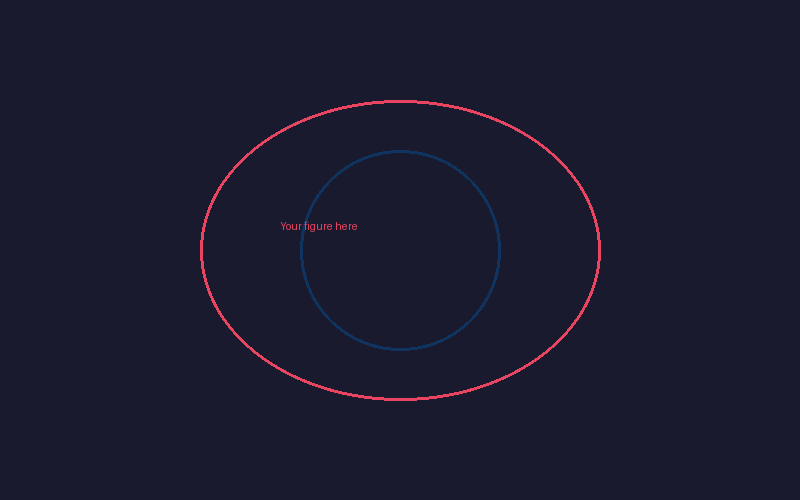

<!-- _class: lead -->

# Theory of the Universe

A sample presentation

---

## What is a Torus?

A torus is a surface of revolution generated by revolving a circle
in 3D space about an axis that is coplanar with the circle.

Key parameters:

- **R** — major radius (center of tube to center of torus)
- **r** — minor radius (radius of the tube)
- Surface area: A = 4π²Rr
- Volume: V = 2π²Rr²

---

## Energy Flow Architecture

---

## How Charge Emerges

1. Energy circulates on the torus surface
2. The winding pattern has a definite handedness (chirality)
3. This chirality **is** the electric charge — not a separate property

> "Charge is not glued onto particles; it is the
> topological winding of confined energy."

$$
q = \frac{n}{2\pi} \oint_{\gamma} \mathbf{A} \cdot d\mathbf{l}
$$

---

## Next Steps

- [ ] Derive mass spectrum from winding modes
- [ ] Show how nested tori produce the particle families
- [ ] Connect shear energy to the fine-structure constant α ≈ 1/137

---

<!-- _class: lead -->

# Questions?

[Interactive figures →](../../viz/index.html)
