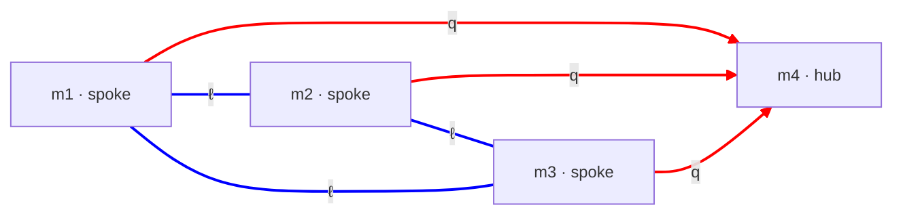

# baryon-number.md — baryon-number conservation from candidate graph topology

**Status:** Working hypothesis. Proposes that baryon-number conservation is a *topological property of the candidate's dim-graph* — specifically of the QY-ED-share3 (K4) topology — rather than a separately-postulated selection rule. Lepton number enters only as the complementary sector the argument is built against; charge is a different topology and is out of scope (§8). Addresses the open question flagged in [mode-stability.md §3 and §10](mode-stability.md).

**Cross-references:**
- [mode-stability.md](mode-stability.md) — the decay-dynamics document; §3 stratifies the conservation laws and flags baryon number as "assumed, not derived" — the gap this document tries to close
- [cand-QY-ED.md §4](cand-QY-ED.md) — QY-ED-share3, the K4 candidate whose graph this argument runs on
- [config-quark.md](config-quark.md), [config-electron.md](config-electron.md) — the QY and ED sector configs that compose into K4
- [sheet-proton clover-quarks.md](../../sheet-proton/work/clover-quarks.md) — the three-arc clover; supplies the "3 quark arcs = 1 baryon" normalization this document does *not* derive (§8)
- [metric-charge ch. 4](../../metric-charge/04-the-closure-condition.md) — electric charge as a cross-section winding; the separate topology charge lives in (§8)

---

## 1. The problem

[mode-stability.md §3](mode-stability.md) stratifies the conservation laws a decay must respect, by how fundamentally each is grounded:

- **Energy** — fundamental: Noether's theorem on the substrate's time-translation invariance.
- **Electric charge** — fundamental: a topological winding number that cannot jump under continuous evolution.
- **Baryon number** — *assumed, not derived.* Energy and charge alone would **permit** the decay p → e⁺ + (neutral products): the positron is far lighter than the proton and carries the proton's +1 charge, so both energy and charge balance. That decay is not observed. Forbidding it requires a further conserved quantity — a baryon-number analog — that the framework has not derived from anything.

This is the one gap in the stratification. This document asks whether it can be closed not by adding a postulate but by reading a conserved quantity off the **topology of the candidate's dim-graph**. The candidate examined is QY-ED-share3, whose graph is the complete graph K4 — the most connected, and as it turns out the most revealing, member of the QY-ED family.

The claim developed here is qualitative but, if correct, structural: the candidate's graph carries a conserved baryon-type quantity, distinct from and non-interconvertible with the lepton sector, for a reason internal to graph theory. The document is explicit (§8) about what this argument does establish and what it leaves to other ingredients.

---

## 2. The candidate graph

QY-ED-share3 ([cand-QY-ED.md §4](cand-QY-ED.md)) has four dims and six sheets. Read it as a graph: the **dims are nodes**, the **sheets are edges** (each sheet is a dim-pair). Four nodes and six edges, with every pair of nodes joined — that is the complete graph **K4**.

The six sheets fall into two sets of three:

- **Quark sheets** (red `q`): the three spoke→hub edges. They form a **star** centred on the hub m4 — the quark wye.
- **Lepton sheets** (blue `ℓ`): the three spoke–spoke edges. They form a **triangle** on the three spokes — the electron delta.

The wye sits inside the delta. Every node has degree 3. The hub's three edges are all quark sheets. Each spoke's three edges are **one quark sheet and two lepton sheets**.

That last count is the first clue, and §4 shows it is the local fingerprint of the decomposition this document turns on.

---

## 3. Cycle space and cut space

The graph-theory concept the argument needs is the decomposition of a graph's **edge space** into a **cycle space** and a **cut space**. This section introduces it from scratch.

Assign a real number to each of a graph's edges; the assignment is a vector, and the set of all such vectors is the **edge space** — for K4, a 6-dimensional space (one coordinate per sheet). Two natural subspaces live inside it.

**The cycle space.** A *cycle* is a closed loop of edges. More precisely, a cycle is an edge-vector that is *conserved at every node* — whatever "flows in" along some edges "flows out" along others, with no node acting as a source or sink. The cycle space is the span of all the graph's cycles. Its dimension is

dim(cycle space) = E − V + c

where E is the edge count, V the node count, and c the number of connected pieces. For K4: 6 − 4 + 1 = **3**.

**The cut space.** A *cut* (or cocycle) is built from a subset S of the nodes: it is the set of edges with exactly one endpoint in S — the edges that "cross the boundary" of S. Removing a cut's edges disconnects S from the rest. The cut space is the span of all cuts. Its dimension is

dim(cut space) = V − c

For K4: 4 − 1 = **3**.

**The decomposition.** The two subspaces fill the edge space exactly and meet only at zero, and — the fact the whole argument rests on — they are **orthogonal**:

<!-- edge space = cycle space ⊕ cut space,   cycle space ⊥ cut space -->
$$
\text{edge space} \;=\; \text{cycle space} \;\oplus\; \text{cut space},
\qquad \text{cycle space} \;\perp\; \text{cut space}
$$

For K4 the dimensions check: 3 + 3 = 6. This split is the **discrete Hodge decomposition** — the graph analog of the Helmholtz theorem that any vector field is a curl-free part plus a divergence-free part. A cycle is the divergence-free ("circulation") part; a cut is the gradient-like ("flux across a boundary") part. Any edge-vector is uniquely a cycle part plus a cut part, and because the two subspaces are orthogonal those parts are independent.

---

## 4. The quark sheets form a cut; the lepton sheets form a cycle

The two sheet-sets of §2 are, exactly, the two halves of a §3 decomposition.

**The quark sheets are a cut.** Take the node subset S = {hub}. The edges with exactly one endpoint in S are the three spoke→hub edges — the three quark sheets. So the quark wye *is* the cut of the hub. Removing the three quark sheets isolates the hub from everything else; the quark sector is the boundary of the hub.

The quark star is also a **spanning tree** of K4 — it connects all four nodes with three edges and no closed loop. So the quark sheets, taken alone, are **acyclic**: there is no closed loop made of quark sheets only.

**The lepton sheets are a cycle.** The three spoke–spoke edges close the triangle on m1, m2, m3 — a single loop, an element of the cycle space. The hub is not on it.

**The local fingerprint.** A cycle visits every node it covers exactly twice — it is *2-regular* — because a loop enters and leaves. A star meets each of its leaves exactly once. So at each spoke, the two lepton sheets are the cycle passing through (degree 2) and the one quark sheet is the star reaching the hub (degree 1). The "**two lepton sheets and one quark sheet per spoke**" observed in §2 is precisely the cycle-versus-cut signature read off locally.

**The two sheet-sets are complementary.** The quark cut and the lepton cycle share no edge and together are all six sheets. They sit in orthogonal subspaces of the edge space: the quark sector lies in the cut space, the lepton sector lies in the cycle space.

---

## 5. Baryon number as the cut invariant

A particle is a bound state — a localized, closed field configuration. A **baryon** is a bound state of quark content.

The quark sheets are acyclic (§4): there is no closed loop built from quark sheets alone. So a closed quark structure — a bound baryon — cannot be a loop confined to the quark sector. It must instead be **anchored at the hub**: the hub is the one node where all three quark sheets meet, and any closed quark structure threads through it. The hub is the root of the quark tree, and baryon content is rooted there.

Define the **baryon number** of a configuration as the count of independent hub-anchored quark structures it carries. Two facts make this a conserved quantity:

1. **It is an integer topological invariant.** Hub-anchoredness is a discrete, all-or-nothing property of a closed structure — a structure either threads the hub or it does not. A continuous evolution of the field cannot change an integer; it would need a discontinuity (a structure's amplitude passing through zero) to add or remove a hub-threading. This is the same mechanism that conserves electric charge in [mode-stability.md §3](mode-stability.md): a topological count does not jump.

2. **It is independent of the lepton sector.** This is what §3's orthogonality buys. The baryon count reads the **cut-space** content of a configuration; the lepton count (next section) reads the **cycle-space** content. Because cut space and cycle space are orthogonal complements, every configuration's cut part and cycle part are independent degrees of freedom. Baryon number is therefore a separate integer from lepton number — not a different bookkeeping of one underlying quantity.

A cut also carries an orientation — flux *into* the hub versus *out of* it. That sign distinguishes **baryon from antibaryon**.

So the candidate graph supplies a conserved, integer-valued, signed quantity attached to the quark sector. That is the structural object baryon number was missing.

---

## 6. Lepton number — the complementary cycle invariant

Lepton number enters this document only as the sector baryon number is defined against; its own full development is left to other work (§9). The minimum needed here:

The lepton sheets form a cycle (§4). A **lepton number** is the corresponding **cycle-space** invariant — a winding, or holonomy, around the lepton triangle, integer-valued and signed (the loop orientation distinguishing lepton from antilepton). It is conserved by the same integer-cannot-jump argument as §5, applied to the cycle side.

Two points matter for §7:

- Lepton number is a **cycle** quantity; baryon number is a **cut** quantity. They are different *kinds* of topological object — a circulation versus a flux across a boundary.
- The neutrino sheet attaches to the corners of the lepton delta ([config-neutrino.md §NC](config-neutrino.md); [mode-stability.md §5](mode-stability.md)), i.e. to the cycle. The neutrino therefore carries lepton number while carrying no baryon number — it never touches the hub.

---

## 7. Why baryon and lepton number do not interconvert

The result that closes §1's problem: a proton cannot decay to leptons.

Baryon number is the cut-space content of a configuration; lepton number is the cycle-space content. Cut space and cycle space are orthogonal complements (§3). A continuous evolution of the field moves content *within* each subspace but cannot rotate the cut component into the cycle component — they are independent axes of the edge space. And both quantities are integers, which a continuous evolution cannot change in any case. So baryon number and lepton number are **separately conserved**, and a process that would trade one for the other is forbidded twice over: by the integer invariance of each, and by the orthogonality that keeps them independent.

Two worked checks.

**Proton decay — forbidden.** p → e⁺ + π⁰ would carry hub-anchored quark structure (cut content, B = 1) into a lepton-sector structure (cycle content) — changing both the cut component and the cycle component. Each change is independently forbidden. The proton is stable. ✓ (matches observation)

**Beta decay — allowed.** n → p + e⁻ + ν̄ₑ. The quark-sector transition is internal — a d mode becomes a u mode on the quark sheets — and does not unthread the hub, so the cut content is unchanged: B = 1 → 1. On the lepton side, the electron (lepton number +1) and the antineutrino (−1) sum to zero cycle content: L = 0 → 0. Energy flows freely from the quark sheet to the lepton sheets through the shared spokes — energy is blind to the cut/cycle split — but the cut invariant and the cycle invariant are each separately balanced. ✓ (matches observation)

The asymmetry in §1 is resolved: energy and charge permitted proton decay because neither reads the cut/cycle structure. Baryon number does — and forbids it.

---

## 8. Scope — what this argument does and does not establish

**Establishes.** A conserved, integer-valued, signed quantity attached to the quark sector exists as a topological invariant of the candidate graph; it is independent of the lepton-sector quantity; and the two cannot interconvert. That is enough to forbid proton decay and to make baryon number a derived feature of the QY-ED-share3 topology rather than a postulate.

**Does not establish — the normalization.** This argument does not say that *three* quark arcs make one baryon. The factor of three is a property of the quark **cross-section** — the N = 3 clover with its three lobe-arcs ([clover-quarks.md](../../sheet-proton/work/clover-quarks.md)) — not of the dim-graph. (Note the two distinct "threes": the graph's three quark sheets are three *generations*; a proton's three quarks are three *arcs* of one generation's clover. They are not the same three.) The graph fixes *that* baryon number is conserved; the clover fixes *how much* a baryon is. Combining the two into a single integer-valued definition is open work (§9).

**Out of scope — charge.** Electric charge is **not** a cut/cycle quantity and is not treated here. Charge is the winding number of a sheet's *cross-section* curve ([metric-charge ch. 4](../../metric-charge/04-the-closure-condition.md)) — a topology internal to each individual sheet, one level below the dim-graph. It is carried by quark and lepton sheets alike, so it is not confined to either the cut or the cycle; it is orthogonal to the decomposition this document uses. Charge conservation is already grounded on its own terms in [mode-stability.md §3](mode-stability.md) and needs nothing from here. (The neutrino is the clean illustration: it carries the lepton-sector cycle quantity but, having no 2D cross-section, carries no charge — the two are independent.)

**Singles out K4.** The clean split of the six sheets into one cut and one cycle is a property of the K4 graph specifically. In QY-ED-share1 and QY-ED-share2 the electron delta uses fresh dims, the graph is larger, and the quark and lepton sheet-sets do not fall into complementary orthogonal subspaces. So if baryon-number conservation is this graph structure, it emerges cleanly **only in QY-ED-share3**. This is a third independent reason — after minimal dim count and the structural σ_eff = 2 ([cand-QY-ED.md §4–§5](cand-QY-ED.md)) — that K4 is the distinguished candidate.

---

## 9. Open questions

1. **A precise integer-valued definition.** §5 defines baryon number as a count of hub-anchored quark structures. Making this a rigorous ℤ-valued invariant — a homological pairing of a field configuration with the hub-cut — is the central piece of follow-up work.
2. **The clover normalization.** §8 separates the graph result (B is conserved) from the cross-section result (a baryon is three arcs). How the hub-cut invariant and the N = 3 clover combine into one baryon number, with a free quark at B = 1/3, needs to be worked through.
3. **B − L and anomalies.** This argument gives baryon and lepton number *separately* conserved — which matches the Standard Model at the classical level. The Standard Model's quantum anomalies violate B and L individually while preserving B − L exactly. Whether the graph picture sees only a quantum refinement it misses, or whether B − L has a distinguished topological status here, is open.
4. **Survival under the decay dynamics.** [mode-stability.md](mode-stability.md) treats decay as energy leaking between sheets through shared dims. The hub-anchoring of §5 must be shown to be preserved by that leakage dynamics — energy crosses the cut freely, and the argument needs the cut *invariant* to be untouched while energy flows.
5. **Lepton number's own development.** §6 uses lepton number only as the complementary sector. Its full treatment — the winding of a single lepton, its relation to the neutrino line's own topology, the matter/antimatter sign — is left to a dedicated treatment.

---

## Cross-references

- [mode-stability.md](mode-stability.md) — §3 flags baryon number as assumed-not-derived; this document is the proposed topological account
- [cand-QY-ED.md](cand-QY-ED.md) — QY-ED-share3 (K4) and the QY-ED family
- [config-quark.md](config-quark.md), [config-electron.md](config-electron.md) — the QY and ED sector configs
- [config-neutrino.md](config-neutrino.md) — the neutrino sheet, attached to the lepton-delta corners (the cycle side)
- [sheet-proton clover-quarks.md](../../sheet-proton/work/clover-quarks.md) — the three-arc clover and the quark fractional charges
- [metric-charge ch. 4](../../metric-charge/04-the-closure-condition.md) — electric charge as a cross-section winding (the separate topology, §8)
- [architecture.md](architecture.md) — `Ma(i, j)` dim-pair notation; the dim-graph reading used here
