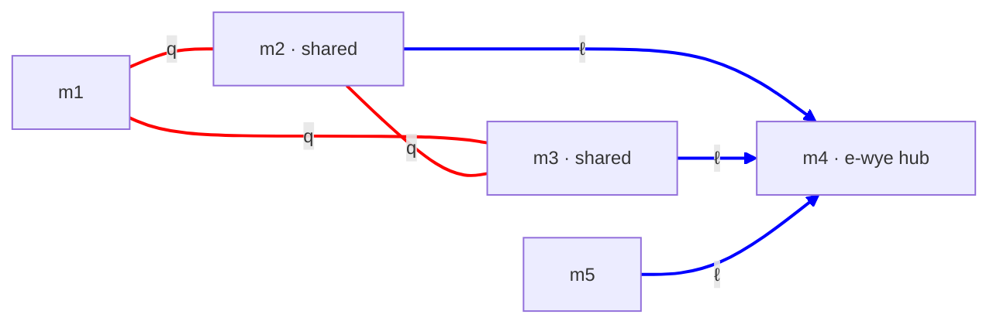

# cand-QD-EY.md — candidate: quark delta + electron wye (record only)

**Status:** Documented for the record; **not viable**. The quark sector is QD (quark delta), which is falsified — it cannot host the six quark masses. Carried forward only as the home of the compound-3D-mode result. Was the quark+electron content of the former "sym-ladder" candidate.

**Composition:**
- Quark sector — **QD** (quark delta), per [config-quark.md](config-quark.md)
- Electron sector — **EY** (electron wye), per [config-electron.md](config-electron.md)
- Neutrino sector — was a ν-delta in sym-ladder; left open here

---

## 1. Topology

Quark delta `Ma((1,2),(1,3),(2,3))`; electron wye `Ma((2,4),(3,4),(4,5))` (hub m4, spokes m2, m3, m5). The two delta spokes m2, m3 are shared with the electron wye. **R1 is satisfied** — the quark-delta pairs and the electron-wye pairs are six distinct dim-pairs.

---

## 2. Why it is not viable — the quark delta cannot host six quarks

The quark sector is QD, falsified in [config-quark.md](config-quark.md) (QD) and [quark-search.md §4–§7](quark-search.md). A 3-dim delta has three dims that must collectively encode physics from u, d (~MeV) to t (~10⁵ MeV) through cross-terms alone, and they cannot. Two mode-selection schemes were tested on this topology:

| Scheme | Best max \|Δ%\| | Verdict |
|---|---:|---|
| **Test A** — simple 2D modes, one generation per pair | **137%** | fails |
| **Test B** — compound 3D modes for s, c, b, t | **1784%** | fails |

### 2.1 Test B — compound 3D modes (the result this file preserves)

u, d are placed on `Ma(2,3)` simple modes; s, c, b, t on **compound 3D modes** `(1, n_2, n_3)`, (n_2, n_3) ∈ {1, 2}², on the (m1, m2, m3) torus. The compound modes use a **chained-shear** detuning

  δ_3 = n_3 − σ_13 − σ_23·n_2

— a cross-coupling that breaks the separable "opposite-corners equal sum" constraint, so in principle the four compound masses fit independently (six parameters, six masses — just-determined).

**Result: best max |Δ%| = 1784%** across all 48 configurations. **Structural reason:** in the delta, L_2 and L_3 each play two incompatible roles — a ring of the `Ma(2,3)` sheet (u, d at ~MeV → L ~ 1 fm) *and* a ring of the compound mode (heavy-quark splittings of 10²–10⁵ MeV → L ~ 0.01 fm). The two required scales differ by 1–2 orders of magnitude; no single L satisfies both. The chained-shear cross-coupling σ_23 shifts the detunings but does not decouple the L's from their double role.

Script: [scripts/sym_ladder_proton.py](../scripts/sym_ladder_proton.py); output [outputs/sym_ladder_proton.txt](../outputs/sym_ladder_proton.txt).

### 2.2 What could still rescue it (not pursued)

- A bilinear cross-term `D·δ_2·δ_3` as an *independent* free parameter — underdetermined, trivially fittable, but loses parsimony and needs a physical origin for D.
- The full 3-torus inverse-metric mass formula (the chained-shear is only an analog of it).
- Relaxation 1 (m_t > 1 on the legs) brought the *simple* delta to ~4% ([quark-search.md §10](quark-search.md)); it has not been combined with the compound-mode scheme.

None is being pursued: the quark **wye** (QY) hosts all six quarks at machine precision with no such strain, so the delta has no role.

---

## 3. Verdict

**Not a working candidate.** QD-EY is retained only because (a) it is the home of the compound-3D-mode falsification (§2.1), and (b) it records the quark+electron topology of the former sym-ladder. The quark sector cannot be made to fit; QY supersedes QD. The *idea* sym-ladder carried — stable particles at graph "centers", unstable particles on legs that shed energy toward them — survives separately in [mode-stability.md](mode-stability.md).

---

## 4. Cross-references

- [config-quark.md](config-quark.md) — QD config (falsified); QY (working)
- [config-electron.md](config-electron.md) — EY config
- [quark-search.md §4–§7, §10](quark-search.md) — full QD falsification and Relaxation 1
- [mode-stability.md](mode-stability.md) — the stable-center / unstable-leg mechanism, sym-ladder's surviving idea
- [candidates.md](candidates.md) — candidate index
- [scripts/sym_ladder_proton.py](../scripts/sym_ladder_proton.py), [outputs/sym_ladder_proton.txt](../outputs/sym_ladder_proton.txt) — compound-mode test
