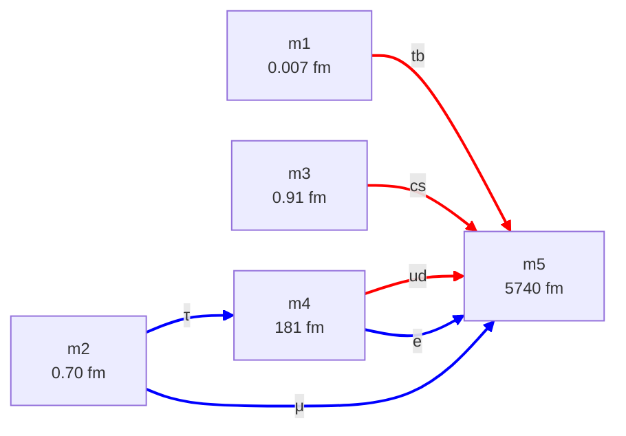

# cand-QY-ED.md — consolidated candidate: quark wye + electron delta

**Status:** Active consolidated candidate. Subsumes the quark + electron content of the former Candidates B and C ([candidates.md](candidates.md)), which were identical in those two sectors. The neutrino sector is deliberately left open — see §6.

**Composition:**
- Quark sector — **QY** (quark wye), per [config-quark.md](config-quark.md)
- Electron sector — **ED** (electron delta), per [config-electron.md](config-electron.md)
- Neutrino sector — **open** (any of NS / NC / ND / NY from [config-neutrino.md](config-neutrino.md))

**Goal of this file:** record a single set of compact-dimension sizes on which the required quark and charged-lepton masses all come out in range, with one consolidated topology graph. Fits are computed by the general solver [scripts/cand_solver.py](../scripts/cand_solver.py) from the spec [scripts/cand_specs/QY-ED.json](../scripts/cand_specs/QY-ED.json); the full report is [outputs/cand_QY-ED.txt](../outputs/cand_QY-ED.txt).

**Notation.** Dim labels m1..m5 are size-ordered, smallest first. A 2D sheet is a dim-pair `Ma(i, j)`. Mode-windings are `T(m_t, m_r)` per [metric-charge ch. 4](../../metric-charge/04-the-closure-condition.md): closure-valid modes are T(1, n) for n ∈ ℤ\{0}; the two lowest |m_t|=1 modes per pair are T(1, 1) and T(1, 2).

---

## 1. Consolidated topology

Five compact dimensions, six sheets. Node labels carry the solved dimension sizes; edges are coloured and labelled by the particle class they host (red = quark generation, blue = charged lepton).

Convention: thick `==>` arrows for 2D-torus sheets, drawn ring → tube. The pair `Ma(4, 5)` carries **two** edges — a red `ud` (quark) edge and a blue `e` (electron) edge — because the same dim-pair geometry hosts two different modes (see §5).

- **Quark wye:** hub m5, spokes m1, m3, m4. Three sheets `Ma((1,5), (3,5), (4,5))`.
- **Electron delta:** triangle on m2, m4, m5. Three sheets `Ma((2,4), (2,5), (4,5))`.
- **Shared dims:** m4 and m5 appear in both sectors. m1, m3 are quark-only; m2 is electron-only.

---

## 2. Dimension table

The solved compact-dimension sizes. Five dims total for the quark + electron sectors.

| Dim | L | Sector role | Pinned by |
|---|---:|---|---|
| m1 | 0.007 fm | quark ring — hosts (t, b) | quark fit (t/b within-pair ratio) |
| m2 | 0.70 fm | electron ring — sets τ Compton scale | electron fit (m_τ) |
| m3 | 0.91 fm | quark ring — hosts (c, s) | quark fit (c/s within-pair ratio) |
| m4 | 181 fm | quark ring (u, d) **and** electron tube (τ) / ring (e) | quark fit; reused by electron sector |
| m5 | 5740 fm | quark hub (common tube) **and** electron tube (μ, e) | quark fit (pure-ring floor); reused by electron sector |

Size hierarchy spans ~10⁶ — from m1 at the top-quark Compton scale (0.007 fm) to m5 the "fat" common tube (≳ 5740 fm). The electron sector adds **only one new dim** (m2); it inherits m4 and m5 from the quark wye.

---

## 3. Quark sheets (QY)

The quark wye: hub m5 plays tube in all three sheets, each spoke plays ring. Each sheet hosts one generation — lighter quark at T(1, 2), heavier at T(1, 1) — with the within-pair mass ratio fixing σ_eff via σ_eff = (2R + 1)/(R + 1), R = m_heavier/m_lighter.

| Sheet | Tube | Ring | σ_eff | Lighter T(1,2) | Heavier T(1,1) |
|---|---|---|---:|---|---|
| `Ma(1, 5)` | m5 | m1 (0.007 fm) | 1.976 | b — 4180 MeV | t — 1.73×10⁵ MeV |
| `Ma(3, 5)` | m5 | m3 (0.91 fm) | 1.932 | s — 93 MeV | c — 1270 MeV |
| `Ma(4, 5)` | m5 | m4 (181 fm) | 1.684 | u — 2.17 MeV | d — 4.68 MeV |

**Fit:** max |Δ%| = **0.499%** across all 6 quark masses (u carries nearly all the residual; d, s, c, b, t fit at < 0.2%). Within-generation ratios reproduced: m_d/m_u = 2.17, m_c/m_s = 13.7, m_t/m_b = 41.4. (The 0.499% is the older pure-ring estimate; the joint solve closes the quark sector to machine precision.) Driver: [scripts/cand_solver.py](../scripts/cand_solver.py); report [outputs/cand_QY-ED.txt](../outputs/cand_QY-ED.txt).

The quark sector is self-contained: its four dim sizes and three σ_eff values are fixed by the six quark masses alone, with one residual free parameter (L_5 above its floor).

---

## 4. Electron sheets (ED)

The electron delta: triangle on m2, m4, m5. Each sheet hosts one charged lepton at T(1, 2). The two larger dims m4, m5 are inherited from the quark wye; only m2 is new.

| Sheet | Lepton | Tube | Ring | σ_eff | Mode | Mass |
|---|---|---|---|---:|---|---|
| `Ma(2, 4)` | τ | m4 (181 fm) | m2 (0.70 fm) | 1.000 | T(1, 2) | 1777 MeV |
| `Ma(2, 5)` | μ | m5 (5740 fm) | m2 (0.70 fm) | 1.941 | T(1, 2) | 105.7 MeV |
| `Ma(4, 5)` | e | m5 (5740 fm) | m4 (181 fm) | 1.932 | T(1, 2) | 0.511 MeV |

**Fit:** max |Δ%| = **0.000%** (machine precision on all three lepton masses). Driver: [scripts/cand_solver.py](../scripts/cand_solver.py); report [outputs/cand_QY-ED.txt](../outputs/cand_QY-ED.txt).

**Residual freedom — see the solver report.** Solved as a joint candidate (all 5 dims + 6 σ_eff fit together against all 9 masses), QY-ED is **underdetermined with DOF = 2**: the solution set is a 2-parameter family, not a point. The general solver [scripts/cand_solver.py](../scripts/cand_solver.py) maps this manifold — see [outputs/cand_QY-ED.txt](../outputs/cand_QY-ED.txt). Across the sampled manifold only **L[m1] and the σ_eff of the shared sheet Ma(4,5)** come out pinned; the other dim sizes — **L[m2] among them, ranging ≈ 0.8–2.2 fm** — and most σ_eff values vary over the family. The σ_eff and tube/ring values in the table above are therefore *one point* on the manifold, not pinned predictions; the solver finds **43 distinct discrete (assignment + tube/ring) combinations** that each reach a compliant fit.

---

## 5. The shared sheet Ma(4, 5)

The dim-pair `Ma(4, 5)` carries **two distinct modes**:

- **Quark `ud`** — u/d generation, T(1, 2)/T(1, 1), σ_eff = 1.684, clover cross-section (lobe/saddle, fractional charge per [sheet-proton clover-quarks](../../sheet-proton/work/clover-quarks.md)).
- **Electron `e`** — electron, T(1, 2), σ_eff = 1.932, ellipse cross-section (convex-only, integer charge per [electron-tube.md](electron-tube.md)).

Same dim sizes (L_4, L_5), same pair geometry — two different cross-section shapes P, two different σ_eff. This is the pair-triplet (σ, τ, P) hypothesis of [architecture.md §3.4](architecture.md) in action: the cross-section shape function P is a property of the *mode*, not of the *pair geometry*. One geometric pair can host modes from different particle classes.

This is the only doubly-occupied sheet in the candidate. m4 and m5 are the two dims shared between the sectors; the sheet that pairs them is the one place a quark mode and a lepton mode coexist on identical geometry.

---

## 6. Neutrino sector — open

This candidate deliberately fixes only the quark and electron sectors. The neutrino sector is left open; any of the configs in [config-neutrino.md](config-neutrino.md) can be attached:

| Option | Adds | Notes |
|---|---|---|
| **NS** — neutrino sheet (2D pair) | 2 fresh dims | sign-flipped modes, ~1% fit; most parsimonious |
| **NC** — neutrino curve (1D substrate) | 1 fresh dim | Q = 0 and Majorana structural; intrinsic-operator fit hits a 6% wall (see config-neutrino.md NC.5–6) |
| **ND** — neutrino delta | 3 fresh dims | machine-precision fit but de-emphasized |
| **NY** — neutrino wye | 4 fresh dims | placeholder, not pursued |

None of the neutrino configs shares dims with the quark or electron sectors (the meV mass scale needs macroscopic dims ≳ 4 cm, incompatible with the fm-scale dims here). So attaching a neutrino config is additive — it appends fresh dims m6+ without disturbing the m1..m5 solution above. The full topology name, once a neutrino config is chosen, would be `cand-QY-ED-Nx.md` (or this file extended with a §-block).

---

## 7. Relation to candidates.md

This file consolidates and replaces the quark + electron content of [candidates.md](candidates.md):

- **Candidate B** (QY + ED + NS) and **Candidate C** (QY + ED + ND) are *identical* in their quark and electron sectors — both are exactly the QY + ED content of this file. They differed only in the neutrino sector, which this file leaves open. So B and C both collapse into `cand-QY-ED.md` + a neutrino choice.
- **Candidate A** (QY + EL + NS) used the electron *linear path* (EL) instead of the delta. EL was never fit and is structurally awkward ([config-electron.md](config-electron.md) EL). A is not carried forward.

candidates.md has been trimmed to a rules-and-index file: it now holds the candidate-formation rules (R1) and the index of candidates, with per-candidate detail living in the `cand-*.md` files.

---

## 8. Cross-references

- [config-quark.md](config-quark.md) — QY config definition (sector-pure topology + DOF)
- [config-electron.md](config-electron.md) — ED config definition
- [config-neutrino.md](config-neutrino.md) — NS / NC / ND / NY options for the open neutrino sector
- [architecture.md §2.1, §3.4](architecture.md) — `Ma(i, j)` notation; pair-triplet (σ, τ, P) hypothesis
- [quark-search.md §9](quark-search.md) — full quark-wye derivation
- [electron-tube.md](electron-tube.md) — the τ = 2 ellipse that puts T(1, 2) at the floor on a lepton sheet
- [scripts/cand_solver.py](../scripts/cand_solver.py), [scripts/cand_specs/QY-ED.json](../scripts/cand_specs/QY-ED.json), [outputs/cand_QY-ED.txt](../outputs/cand_QY-ED.txt) — general solver, candidate spec, and report
- [candidates.md](candidates.md) — candidate formation rules (R1) and the candidate index
