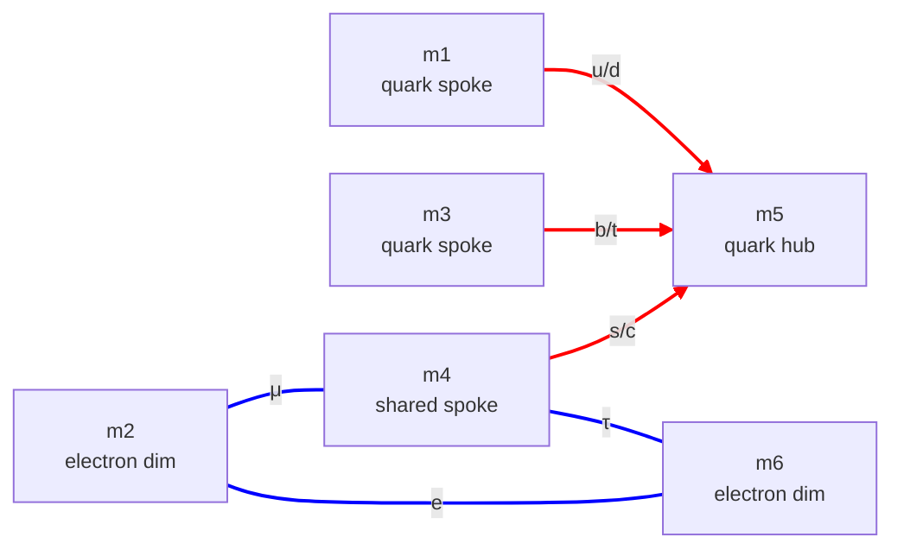
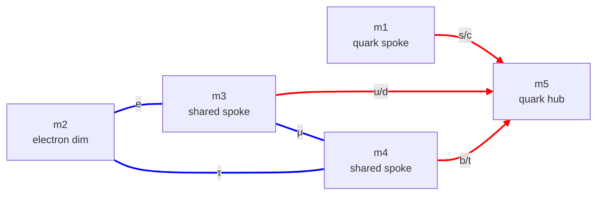
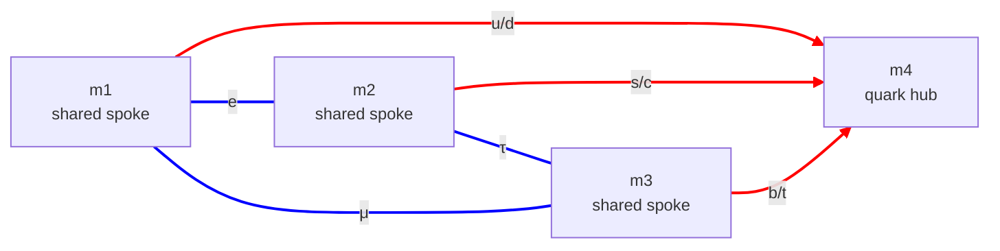

# cand-QY-ED.md — the QY + ED candidate family (quark wye + electron delta)

**Status:** Active candidate family. Three members, all **R1-compliant**, all fitting the 9 quark + charged-lepton masses at machine precision. Subsumes the quark + electron content of the former Candidates B and C. The neutrino sector is left open for all three — see §6.

**Composition.** Every member is the same config pair: quark sector **QY** (quark wye, [config-quark.md](config-quark.md)) + electron sector **ED** (electron delta, [config-electron.md](config-electron.md)). The members differ in one parameter only:

> **the share count** — how many of the quark wye's three spokes the electron delta reuses as its own nodes.

| Member | Shares | Electron delta on | Dims | DOF |
|---|---|---|---:|---:|
| **QY-ED-share1** | 1 spoke | 1 spoke + 2 fresh dims | 6 | 3 |
| **QY-ED** (canonical) | 2 spokes | 2 spokes + 1 fresh dim | 5 | 2 |
| **QY-ED-share3** | 3 spokes | the 3 spokes (= complete graph K4) | 4 | 1 |

"QY-ED" unqualified means the **share-2** member — the canonical one. Specs: [QY-ED-share1.json](../scripts/cand_specs/QY-ED-share1.json), [QY-ED.json](../scripts/cand_specs/QY-ED.json), [QY-ED-share3.json](../scripts/cand_specs/QY-ED-share3.json). Solver: [scripts/cand_solver.py](../scripts/cand_solver.py); reports `outputs/cand_QY-ED*.txt`.

**Notation.** Dim labels are identifiers, not size-ordered (which dim takes which size is a fit output). A 2D sheet is a dim-pair `Ma(i, j)`. Mode-windings are `T(m_t, m_r)` per [metric-charge ch. 4](../../metric-charge/04-the-closure-condition.md): a quark generation puts its lighter quark at T(1, 2) and heavier at T(1, 1); a charged lepton sits at T(1, 2).

---

## 1. The family — shared structure

### 1.1 The quark wye is identical in all three

Every member uses the same quark sector: a wye with a hub dim and three spoke dims, hub plays tube in all three sheets, each spoke plays ring (the fat-torus regime, [config-quark.md](config-quark.md) QY). The three sheets are the three **spoke-hub** pairs; each hosts one quark generation. All six quark masses fit at machine precision.

### 1.2 The electron delta reuses spokes — the family parameter

The electron sector is always a delta (3 nodes, 3 sheets = all pairs among the 3 nodes), each sheet hosting one charged lepton at T(1, 2). What varies is how many of the delta's 3 nodes are quark-wye **spokes** (the rest being fresh electron-only dims): 1, 2, or 3. That share count is the only thing separating the three members.

### 1.3 Why all three satisfy R1 — share spokes, never the hub

[Rule R1](candidates.md) forbids two sheets on one dim-pair. The quark wye's sheets are *exactly* the three spoke-hub pairs. An electron delta built on quark **spokes** forms only spoke-spoke and spoke-fresh pairs — never a spoke-hub pair — so it can never collide with a wye sheet. Hence **every member that shares only spokes is R1-compliant**, for any share count. (Sharing the *hub* instead would force a hub-spoke pair that *is* a wye sheet — that was the bug in the original QY-ED, now corrected.)

### 1.4 The share-count trade

As the share count rises, the electron delta folds more tightly into the quark wye: fewer fresh dims, fewer total dims, tighter DOF, fewer compliant discrete assignments — i.e. **more predictive**. The far end (share 3) is the complete graph K4 on just 4 dims. §5 collects the trend.

---

## 2. QY-ED-share1 — electron delta shares 1 spoke (6 dims)

The electron delta reuses one quark spoke and adds two fresh dims. 6 dims, 6 sheets.

Quark wye `Ma((1,5),(3,5),(4,5))`; electron delta `Ma((2,4),(2,6),(4,6))`. Only m4 is shared. Edge labels are the solver's best (lowest-error) assignment — **representative**, since 101 discrete combinations reach a compliant fit.

**Result:** R1 satisfied; fit machine-precision; **DOF = 3** (loosest of the family — a 3-parameter solution family). Only one parameter is pinned across the manifold (the smallest quark ring, the b/t ring, ≈ 0.0073 fm); every other dim size and σ_eff ranges. With 101 compliant combos the particle→sheet assignment is barely constrained. Report: [outputs/cand_QY-ED-share1.txt](../outputs/cand_QY-ED-share1.txt).

---

## 3. QY-ED — electron delta shares 2 spokes (5 dims) — the canonical member

The electron delta reuses two quark spokes and adds one fresh dim. 5 dims, 6 sheets. This is "QY-ED" unqualified.

Quark wye `Ma((1,5),(3,5),(4,5))`; electron delta `Ma((2,3),(2,4),(3,4))`. Spokes m3, m4 are shared. Edge labels are the solver's best assignment — **representative**, since 27 discrete combinations reach a compliant fit.

**Result:** R1 satisfied; fit machine-precision; **DOF = 2** (a 2-parameter solution family). Three parameters pin across the manifold — the b/t ring (≈ 0.0073 fm) and **two of the three electron σ_eff, both at ≈ 2** (the R53 magic-shear value); the rest range. The R53 σ_eff = 2 pinning is starting to appear here and becomes complete at share 3 (§4). Report: [outputs/cand_QY-ED.txt](../outputs/cand_QY-ED.txt).

---

## 4. QY-ED-share3 — electron delta shares 3 spokes = the complete graph K4 (4 dims)

The electron delta reuses *all three* quark spokes; no fresh electron dim is needed. 4 dims, 6 sheets. The quark wye is the three spoke-hub edges; the electron delta is the three spoke-spoke edges; together they are **every edge of the complete graph K4** on the 4 dims.

Quark wye `Ma((1,4),(2,4),(3,4))`; electron delta `Ma((1,2),(1,3),(2,3))`. All three spokes shared. Edge labels are the solver's best assignment — **and here it is nearly determined**: only 4 discrete combinations reach a compliant fit, all with the quark generations on the spoke-hub legs and the leptons on the spoke-spoke legs (exactly the "u/d on a hub leg, electron on a spoke-spoke leg" layout — the spoke labels are free).

**Result — the standout of the family:**

- R1-compliant **by construction** (K4: each of the 6 dim-pairs carries exactly one sheet).
- Fewest dims (**4**), tightest **DOF = 1** — the most predictive member.
- Only **4 compliant discrete combos** — the topology nearly pins the particle→leg assignment.
- **All three electron σ_eff pin to ≈ 2.0** — the R53 magic-shear value — across the *entire* 1-parameter solution manifold. This is a *structural* output, forced by the topology, not a value the fit was free to choose. It is the "unified R53 mechanism" the wye-ladder analysis hoped for and could not get from an underdetermined fit; K4 produces it because it is so tightly constrained.

Report: [outputs/cand_QY-ED-share3.txt](../outputs/cand_QY-ED-share3.txt).

---

## 5. Family comparison

| Property | QY-ED-share1 | QY-ED (share 2) | QY-ED-share3 (K4) |
|---|:---:|:---:|:---:|
| Spokes shared | 1 | 2 | 3 |
| Fresh electron dims | 2 | 1 | 0 |
| Total dims | 6 | 5 | **4** |
| Sheets | 6 | 6 | 6 |
| R1 | ✓ | ✓ | ✓ |
| DOF | 3 | 2 | **1** |
| Compliant discrete combos | 101 | 27 | **4** |
| Quark + lepton fit | machine precision | machine precision | machine precision |
| Electron σ_eff pinned to ≈ 2 | 0 of 3 | 2 of 3 | **3 of 3** |

The family is a clean monotonic ladder: **more sharing → fewer dims → tighter DOF → fewer compliant assignments → more of the electron σ_eff forced to the R53 value**. QY-ED-share3 (K4) sits at the predictive extreme — minimal dims, near-determined assignment, and the R53 σ_eff = 2 mechanism falling out as a structural consequence. It is the most attractive member by every economy / predictivity measure; QY-ED (share 2) is the moderate middle; QY-ED-share1 is the loosest.

---

## 6. Neutrino sector — open (all members)

None of the three fixes the neutrino sector. Any [config-neutrino.md](config-neutrino.md) config — NS, NC, ND, NY — attaches additively on fresh macroscopic dims (the meV ν scale needs dims ≳ 4 cm, incompatible with the fm-scale dims here, so no ν config can collide with the quark or electron pairs). The full topology name, once a ν config is chosen, would be e.g. `cand-QY-ED-share3-Nx`.

---

## 7. Relation to QY-EL and candidates.md

- **Former Candidates B and C** (QY + ED) → subsumed by this family; they differed only in the neutrino config, now open.
- **QY-EL** ([cand-QY-EL.md](cand-QY-EL.md)) is the QY + electron-*path* candidate. It was once "the only R1-compliant quark+electron candidate" — but only against the *broken* hub-sharing QY-ED. Every member of the corrected QY + ED family is R1-compliant with a clean rotationally-symmetric delta, so **the QY-ED family supersedes QY-EL**.
- [candidates.md](candidates.md) holds the candidate-formation rules (R1) and the index.

---

## 8. Cross-references

- [config-quark.md](config-quark.md) — QY config definition
- [config-electron.md](config-electron.md) — ED config definition
- [config-neutrino.md](config-neutrino.md) — NS / NC / ND / NY options for the open neutrino sector
- [candidates.md](candidates.md) — candidate-formation rules (R1) and the candidate index
- [cand-QY-EL.md](cand-QY-EL.md) — the QY + electron-path candidate, superseded by this family
- [architecture.md §2.1, §3.4](architecture.md) — `Ma(i, j)` notation; pair-triplet (σ, τ, P) hypothesis (basis for R1)
- [scripts/cand_solver.py](../scripts/cand_solver.py), [scripts/cand_specs/](../scripts/cand_specs/) — general solver and the three QY-ED spec files
- [outputs/cand_QY-ED-share1.txt](../outputs/cand_QY-ED-share1.txt), [outputs/cand_QY-ED.txt](../outputs/cand_QY-ED.txt), [outputs/cand_QY-ED-share3.txt](../outputs/cand_QY-ED-share3.txt) — solver reports
