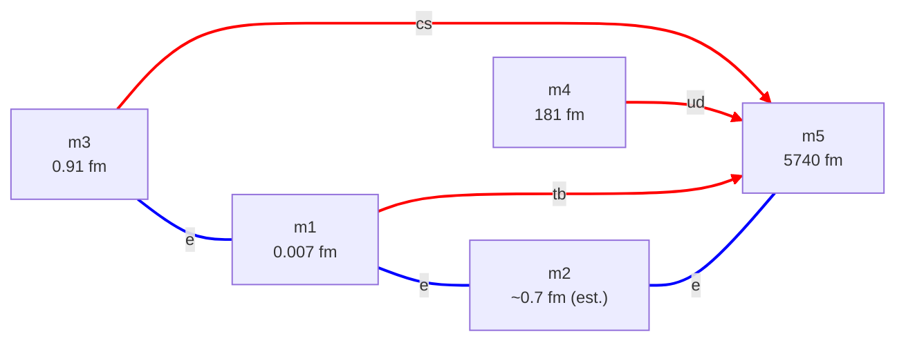

# cand-QY-EL.md — consolidated candidate: quark wye + electron linear path

**Status:** Superseded. Documented for the record; quark + electron sectors fit at machine precision, R1-compliant, but **dominated by [cand-QY-ED.md](cand-QY-ED.md)** — see §5, §7. Subsumes the quark + electron content of the former Candidate A. The neutrino sector is left open.

**Composition:**
- Quark sector — **QY** (quark wye), per [config-quark.md](config-quark.md)
- Electron sector — **EL** (electron linear path), per [config-electron.md](config-electron.md)
- Neutrino sector — **open** (any of NS / NC / ND / NY from [config-neutrino.md](config-neutrino.md))

**Why this candidate is no longer carried forward.** QY-EL satisfies R1 (one sheet per dim-pair) and fits to machine precision. It was briefly the preferred quark+electron candidate — but only because the *then-broken* QY-ED shared the quark hub and violated R1. Once QY-ED is corrected to share two spokes instead, it too is R1-compliant, and it has a clean rotationally-symmetric electron delta where QY-EL has an awkward linear path. Same dim count (5), same fit, same R1 status — but QY-ED wins on shape. QY-EL is kept as the QY + electron-path option of record, not as a working candidate. See §5.

**Notation.** Dim labels m1..m5 are size-ordered, smallest first. A 2D sheet is a dim-pair `Ma(i, j)`. Mode-windings are `T(m_t, m_r)` per [metric-charge ch. 4](../../metric-charge/04-the-closure-condition.md).

---

## 1. Consolidated topology

Five compact dimensions, six sheets. Node labels carry the dimension sizes; edges are coloured by particle class (red = quark generation, blue = charged lepton). Quark edges are drawn ring → tube (`==>`); the electron-path edges are undirected (`===`) because the path's tube/ring assignment has not been fit.

- **Quark wye:** hub m5, spokes m1, m3, m4. Three sheets `Ma((1,5), (3,5), (4,5))`.
- **Electron path:** chain m3 — m1 — m2 — m5. Three sheets `Ma((1,3), (1,2), (2,5))`.
- **Shared dims:** m1, m3, m5 appear in both sectors. m4 is quark-only; m2 is electron-only.
- **Shared sheets:** *none* — every dim-pair carries exactly one sheet (this is the R1 property; see §5).

---

## 2. Dimension table

| Dim | L | Sector role | Pinned by |
|---|---:|---|---|
| m1 | 0.007 fm | quark ring (t, b); electron-path dim | quark fit |
| m2 | ranged | electron-path dim | joint solve: free direction of the DOF = 2 manifold (§4) |
| m3 | 0.91 fm | quark ring (c, s); electron-path dim | quark fit |
| m4 | 181 fm | quark ring (u, d) | quark fit |
| m5 | 5740 fm | quark hub (common tube); electron-path dim | quark fit |

The sizes above are the canonical quark-wye layout (heaviest generation on the smallest ring). The full joint solve (§4) searches every generation/lepton-to-sheet assignment and is underdetermined at **DOF = 2**, so most dim sizes come out *ranged* rather than pinned — see [outputs/cand_QY-EL.txt](../outputs/cand_QY-EL.txt) for the pinned/ranged breakdown. This table is one reference point on that manifold, not the unique solution.

---

## 3. Quark sheets (QY)

Identical to the quark sector of [cand-QY-ED.md §3](cand-QY-ED.md) — the quark wye is the same in every current candidate.

| Sheet | Tube | Ring | σ_eff | Lighter T(1,2) | Heavier T(1,1) |
|---|---|---|---:|---|---|
| `Ma(1, 5)` | m5 | m1 (0.007 fm) | 1.976 | b — 4180 MeV | t — 1.73×10⁵ MeV |
| `Ma(3, 5)` | m5 | m3 (0.91 fm) | 1.932 | s — 93 MeV | c — 1270 MeV |
| `Ma(4, 5)` | m5 | m4 (181 fm) | 1.684 | u — 2.17 MeV | d — 4.68 MeV |

**Fit:** max |Δ%| = **0.499%** across all 6 quark masses (pure-ring estimate; the joint solve closes the quark sector to machine precision). Driver: [scripts/cand_solver.py](../scripts/cand_solver.py); report [outputs/cand_QY-EL.txt](../outputs/cand_QY-EL.txt).

---

## 4. Electron sheets (EL) — fit

The electron sector is the linear path m3 — m1 — m2 — m5, i.e., the three sheets `Ma(1,3)`, `Ma(1,2)`, `Ma(2,5)`. The general solver [scripts/cand_solver.py](../scripts/cand_solver.py) fits it as part of the joint QY-EL candidate — the chain topology needs no special handling; the solver searches every lepton-to-sheet assignment and tube/ring choice.

**Status: fit, machine precision.** The joint solve closes all 9 quark + lepton masses at **max |Δ%| = 0.0000%** (report [outputs/cand_QY-EL.txt](../outputs/cand_QY-EL.txt)). The path having no rotational symmetry is not an obstacle. The solver finds **23 distinct discrete (assignment + tube/ring) combinations** that each reach a compliant fit.

**Underdetermined at DOF = 2.** The joint candidate has 11 free continuous parameters (5 dim sizes + 6 σ_eff) against 9 mass constraints, so the solution is a 2-parameter family. Across the sampled manifold the solver finds only **one parameter pinned — the smallest quark ring, L ≈ 0.0072 fm** (it hosts the b/t generation); every other dim size and σ_eff ranges over the family.

**Dimension sizes** (solver's best discrete combo; ranges *sampled* across the manifold — indicative, not rigorous bounds):

| Dim | Role in best combo | Solved L |
|---|---|---|
| m1 | s/c quark spoke | ranged [0.91, 1.05] fm |
| m2 | electron-path dim | ranged [2.3×10⁴, 6.2×10¹²] fm |
| m3 | u/d quark spoke | ranged ≳ 575 fm (unbounded above) |
| m4 | b/t quark spoke | **pinned ≈ 0.0072 fm** |
| m5 | quark hub | ranged [181, 494] fm |

m2 (the electron-path dim) is essentially unconstrained — a free direction of the manifold, not a pinned value.

---

## 5. Rule R1 compliance — the structural point of this candidate

[candidates.md §2](candidates.md) rule **R1** states: at most one 2D sheet per dim-pair.

This candidate's six sheets occupy six **distinct** dim-pairs:

| Sector | Pairs |
|---|---|
| Quark (QY) | `Ma(1,5)`, `Ma(3,5)`, `Ma(4,5)` |
| Electron (EL) | `Ma(1,3)`, `Ma(1,2)`, `Ma(2,5)` |

No pair appears twice. **Candidate QY-EL satisfies R1.**

QY-EL satisfies R1 — but so does the corrected QY-ED, and that removes QY-EL's reason for existing.

**Correction — the pigeonhole argument was wrong.** An earlier version of this section argued that *any* electron delta reusing quark dims must collide with a wye sheet, so the linear path was "the price of R1." That is false. The quark wye's sheets are exactly the three spoke-hub pairs. An electron delta on quark **spokes** forms only spoke-spoke pairs, which are never wye sheets — no collision. Concretely:

- electron delta on **2 spokes + 1 fresh dim** → R1-compliant. *This is the corrected [cand-QY-ED.md](cand-QY-ED.md).*
- electron delta on **3 spokes** → R1-compliant (the complete graph K4 — `QY-ED-share3`).

The pigeonhole only bites a delta that reuses the **hub** — which was the bug in the old QY-ED, not a property of deltas in general. So the linear path is **not** forced by R1; an R1-compliant delta exists, and it has a cleaner shape than the path.

**Consequence — QY-EL is dominated.** At equal dim count (5), corrected QY-ED is R1-compliant *and* has a clean rotationally-symmetric delta; QY-EL is R1-compliant but uses the awkward linear path. Both fit to machine precision. QY-EL therefore has no remaining advantage. It is retained here for the record, but **corrected QY-ED supersedes it**.

---

## 6. Neutrino sector — open

As with [cand-QY-ED.md §6](cand-QY-ED.md), the neutrino sector is left open. Any of NS / NC / ND / NY from [config-neutrino.md](config-neutrino.md) can be attached on fresh macroscopic dims m6+, additively, without disturbing the m1..m5 layout above. R1 must be checked for the chosen neutrino config too — but since the ν dims are fresh and pair only among themselves, no ν config can collide with the quark or electron pairs here.

---

## 7. Relation to candidates.md and open questions

This file consolidates the quark + electron content of the former **Candidate A** (QY + EL + single-pair ν). Candidate A was deprioritized as "structurally awkward." For a while R1 seemed to rehabilitate it — QY-EL satisfied R1 while the (then-broken) QY-ED did not. That reprieve has lapsed: once QY-ED is corrected to share spokes rather than the hub, it is also R1-compliant, with a cleaner shape (§5). **QY-EL is now superseded by corrected QY-ED.**

**Where things stand:**

1. **R1 is binding, and corrected QY-ED meets it.** R1 follows from [architecture.md §3.4](architecture.md) (each pair has one (σ, τ, P) triplet → one sheet). The old QY-ED violated it by sharing the quark hub; the corrected QY-ED shares two spokes and complies. QY-EL's linear path is no longer the unique R1-compliant option.
2. **QY-EL's electron path fits.** The general solver closes the joint QY-EL candidate at machine precision (DOF = 2, 23 compliant discrete combos; [outputs/cand_QY-EL.txt](../outputs/cand_QY-EL.txt)). So QY-EL is a *valid* candidate — it just isn't a *preferred* one, since QY-ED matches it on dims, R1, and fit while beating it on shape.
3. **Disposition.** QY-EL is kept on the record as the QY + electron-path option but is not carried forward as a working candidate. The QY + ED family (share 1 / 2 / 3 spokes — see [candidates.md §4](candidates.md)) is the live line.

---

## 8. Cross-references

- [config-quark.md](config-quark.md) — QY config definition
- [config-electron.md](config-electron.md) — EL config definition
- [config-neutrino.md](config-neutrino.md) — NS / NC / ND / NY options for the open neutrino sector
- [candidates.md](candidates.md) — candidate formation rules (R1) and the candidate index
- [cand-QY-ED.md](cand-QY-ED.md) — the sibling quark+electron candidate (QY + ED); R1-compliant and supersedes this one
- [architecture.md §3.4](architecture.md) — pair-triplet (σ, τ, P) hypothesis; the basis for R1
- [scripts/cand_solver.py](../scripts/cand_solver.py), [scripts/cand_specs/QY-EL.json](../scripts/cand_specs/QY-EL.json) — general solver and the QY-EL spec
- [outputs/cand_QY-EL.txt](../outputs/cand_QY-EL.txt) — solver report for this candidate
