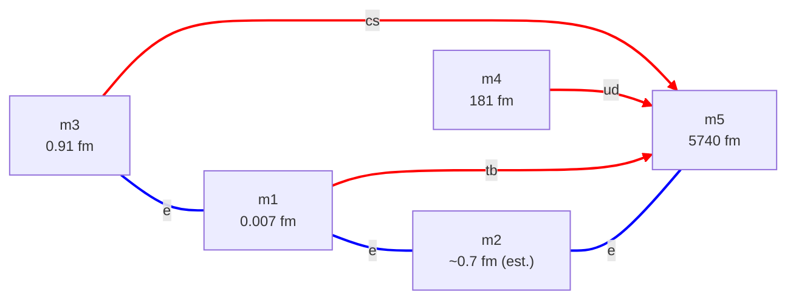

# cand-QY-EL.md — consolidated candidate: quark wye + electron linear path

**Status:** Documented candidate, partially solved. Subsumes the quark + electron content of the former Candidate A ([candidates.md](candidates.md)). The neutrino sector is left open — see §6. The electron sector (a linear path) has not been numerically fit; see §4.

**Composition:**
- Quark sector — **QY** (quark wye), per [config-quark.md](config-quark.md)
- Electron sector — **EL** (electron linear path), per [config-electron.md](config-electron.md)
- Neutrino sector — **open** (any of NS / NC / ND / NY from [config-neutrino.md](config-neutrino.md))

**Why this candidate is documented despite being awkward.** The electron path has no clean rotational shape, and its fit has not been done. But it has one structural property the cleaner-looking QY-ED candidate lacks: it **satisfies rule R1** (one sheet per dim-pair — see [candidates.md §2](candidates.md)). All six of its dim-pairs are distinct. QY-ED, by contrast, places two sheets on `Ma(4, 5)`. So this candidate is kept as the rule-compliant alternative. See §5.

**Notation.** Dim labels m1..m5 are size-ordered, smallest first. A 2D sheet is a dim-pair `Ma(i, j)`. Mode-windings are `T(m_t, m_r)` per [metric-charge ch. 4](../../metric-charge/04-the-closure-condition.md).

---

## 1. Consolidated topology

Five compact dimensions, six sheets. Node labels carry the dimension sizes; edges are coloured by particle class (red = quark generation, blue = charged lepton). Quark edges are drawn ring → tube (`==>`); the electron-path edges are undirected (`===`) because the path's tube/ring assignment has not been fit.

- **Quark wye:** hub m5, spokes m1, m3, m4. Three sheets `Ma((1,5), (3,5), (4,5))`.
- **Electron path:** chain m3 — m1 — m2 — m5. Three sheets `Ma((1,3), (1,2), (2,5))`.
- **Shared dims:** m1, m3, m5 appear in both sectors. m4 is quark-only; m2 is electron-only.
- **Shared sheets:** *none* — every dim-pair carries exactly one sheet (this is the R1 property; see §5).

---

## 2. Dimension table

| Dim | L | Sector role | Pinned by |
|---|---:|---|---|
| m1 | 0.007 fm | quark ring (t, b); electron-path dim | quark fit |
| m2 | ~0.7 fm (est.) | electron-path dim — lepton scale | **not pinned** — electron path unfit (§4) |
| m3 | 0.91 fm | quark ring (c, s); electron-path dim | quark fit |
| m4 | 181 fm | quark ring (u, d) | quark fit |
| m5 | 5740 fm | quark hub (common tube); electron-path dim | quark fit |

The quark sector pins four of the five dims (m1, m3, m4, m5) — identical to [cand-QY-ED.md §2](cand-QY-ED.md). m2 is the one electron-only dim; its size is estimated at the τ Compton scale (~0.7 fm) by analogy with the QY-ED electron fit, but the path topology has not been fit so this is not a solved value.

---

## 3. Quark sheets (QY)

Identical to the quark sector of [cand-QY-ED.md §3](cand-QY-ED.md) — the quark wye is the same in every current candidate.

| Sheet | Tube | Ring | σ_eff | Lighter T(1,2) | Heavier T(1,1) |
|---|---|---|---:|---|---|
| `Ma(1, 5)` | m5 | m1 (0.007 fm) | 1.976 | b — 4180 MeV | t — 1.73×10⁵ MeV |
| `Ma(3, 5)` | m5 | m3 (0.91 fm) | 1.932 | s — 93 MeV | c — 1270 MeV |
| `Ma(4, 5)` | m5 | m4 (181 fm) | 1.684 | u — 2.17 MeV | d — 4.68 MeV |

**Fit:** max |Δ%| = **0.499%** across all 6 quark masses. Driver: [scripts/quark_search_wye.py](../scripts/quark_search_wye.py).

---

## 4. Electron sheets (EL) — not fit

The electron sector is the linear path m3 — m1 — m2 — m5, i.e., the three sheets:

| Sheet | Dims | Available L's |
|---|---|---|
| `Ma(1, 3)` | m1, m3 | 0.007 fm, 0.91 fm |
| `Ma(1, 2)` | m1, m2 | 0.007 fm, ~0.7 fm (m2 unfit) |
| `Ma(2, 5)` | m2, m5 | ~0.7 fm (unfit), 5740 fm |

**Status: not numerically fit.** The lepton-to-sheet assignment (which of e, μ, τ on which pair), the per-sheet tube/ring choice, and the per-sheet σ_eff are all open. The path has no rotational or reflection symmetry across its sheets, so there is no symmetry argument to constrain the assignment — every permutation must be tested.

Fitting this sector would require a dedicated `electron_path_fit()` in [scripts/candidate_fits.py](../scripts/candidate_fits.py), analogous to `electron_delta_fit()` and `electron_wye_fit()` but for the chain topology. Per [config-electron.md](config-electron.md) (EL), the path has 7 continuous parameters (4 L's + 3 σ_eff) against 3 lepton masses — 4 sector-internal DOF, the same underdetermination as the electron wye EY.

Until that fit is run, this candidate's electron sector is a **topology only**. The dimension m2 ≈ 0.7 fm in §2 is an estimate, not a solved value.

---

## 5. Rule R1 compliance — the structural point of this candidate

[candidates.md §2](candidates.md) rule **R1** states: at most one 2D sheet per dim-pair.

This candidate's six sheets occupy six **distinct** dim-pairs:

| Sector | Pairs |
|---|---|
| Quark (QY) | `Ma(1,5)`, `Ma(3,5)`, `Ma(4,5)` |
| Electron (EL) | `Ma(1,3)`, `Ma(1,2)`, `Ma(2,5)` |

No pair appears twice. **Candidate QY-EL satisfies R1.**

Contrast with [cand-QY-ED.md](cand-QY-ED.md): the electron *delta* uses pairs `Ma((2,4), (2,5), (4,5))`, and `Ma(4,5)` is also a quark sheet — so QY-ED places two sheets on one pair and **violates R1**.

**Why the path is contorted — and why that is the price of R1.** The quark wye occupies every hub-spoke pair `Ma(i, 5)` for i ∈ {1, 3, 4}. An electron *delta* on three dims drawn from {m1, m3, m4, m5} would inevitably reuse one of those hub-spoke pairs (pigeonhole) — which is exactly what QY-ED's `Ma(4,5)` collision is. To avoid any collision, the electron sheets must use pairs the quark wye does not: ring-ring pairs (`Ma(1,3)`) and pairs involving the fresh dim m2 (`Ma(1,2)`, `Ma(2,5)`). Threading those three pairs into a connected sub-graph forces the linear-chain shape. **The awkward path is not a flaw of taste — it is the geometric consequence of demanding R1 while reusing quark-region dims.**

So the choice between QY-ED and QY-EL is a genuine structural trade:

- **QY-ED** — clean rotationally-symmetric electron delta, fits to machine precision, but violates R1 (one pair doubled).
- **QY-EL** — R1-compliant, but the electron sector has no clean shape and has not been fit.

Resolving this trade is an open architectural question (see §7).

---

## 6. Neutrino sector — open

As with [cand-QY-ED.md §6](cand-QY-ED.md), the neutrino sector is left open. Any of NS / NC / ND / NY from [config-neutrino.md](config-neutrino.md) can be attached on fresh macroscopic dims m6+, additively, without disturbing the m1..m5 layout above. R1 must be checked for the chosen neutrino config too — but since the ν dims are fresh and pair only among themselves, no ν config can collide with the quark or electron pairs here.

---

## 7. Relation to candidates.md and open questions

This file consolidates the quark + electron content of the former **Candidate A** (QY + EL + single-pair ν). Candidate A was previously deprioritized as "structurally awkward." That judgment stands on shape grounds — but R1 (§5) reframes it: A is the only one of the original three candidates whose quark + electron sectors satisfy the one-sheet-per-pair rule.

**Open questions this raises:**

1. **Is R1 binding?** If R1 is adopted as a hard rule, QY-ED is invalid as written and either (a) QY-EL becomes the working quark+electron candidate, or (b) QY-ED must be reworked so the electron sector avoids the `Ma(4,5)` collision. R1 follows from [architecture.md §3.4](architecture.md) (each pair has one (σ, τ, P) triplet, hence one shape, hence one sheet); the "P is per-mode" reading that would permit two sheets per pair is not what §3.4 states.
2. **Can QY-EL's electron path be fit?** The 4-DOF underdetermined path should close numerically (like EY did), but the fit has not been run. Until it is, QY-EL cannot be compared to QY-ED on fit quality.
3. **Is there an R1-compliant electron topology with a cleaner shape than the path?** A delta is impossible without a collision (pigeonhole, §5). A wye hub at a *fresh* dim might work — an electron wye whose hub is a new dim and whose spokes avoid the quark hub-spoke pairs. Worth checking as a third electron option.

---

## 8. Cross-references

- [config-quark.md](config-quark.md) — QY config definition
- [config-electron.md](config-electron.md) — EL config definition
- [config-neutrino.md](config-neutrino.md) — NS / NC / ND / NY options for the open neutrino sector
- [candidates.md](candidates.md) — candidate formation rules (R1) and the candidate index
- [cand-QY-ED.md](cand-QY-ED.md) — the sibling quark+electron candidate (QY + ED); violates R1
- [architecture.md §3.4](architecture.md) — pair-triplet (σ, τ, P) hypothesis; the basis for R1
- [scripts/quark_search_wye.py](../scripts/quark_search_wye.py) — quark-wye fit driver
- [scripts/candidate_fits.py](../scripts/candidate_fits.py) — fit driver (no `electron_path_fit()` yet)
