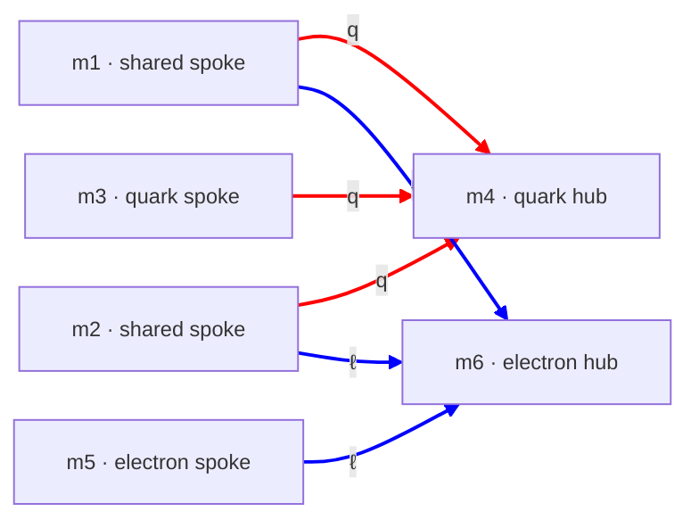

# cand-QY-EY.md — candidate: quark wye + electron wye

**Status:** Documented candidate; **solve deferred**. Was the quark+electron content of the former "wye-ladder" candidate. R1-compliant. Not yet run through the solver — see §3.

**Composition:**
- Quark sector — **QY** (quark wye), per [config-quark.md](config-quark.md)
- Electron sector — **EY** (electron wye), per [config-electron.md](config-electron.md)
- Neutrino sector — **open** (wye-ladder used a 1D substrate; see [config-neutrino.md](config-neutrino.md) NC)

---

## 1. Topology

Two wyes. The quark wye has hub m4, spokes m1/m2/m3. The electron wye reuses two of those spokes (m1, m2), adds a fresh spoke m5 and a fresh hub m6. 6 dims, 6 sheets.

Quark wye `Ma((1,4),(2,4),(3,4))`; electron wye `Ma((1,6),(2,6),(5,6))`. Shared spokes m1, m2. **R1 is satisfied** — the quark-wye pairs (all spoke-to-quark-hub) and the electron-wye pairs (all spoke-to-electron-hub) are six distinct dim-pairs; a shared spoke pairs to a *different* hub in each sector, so no pair repeats.

---

## 2. Why an electron wye

The electron sector is normally a delta (ED) — see the [QY-ED family](cand-QY-ED.md). The wye (EY) is the alternative the former wye-ladder explored: it gives the electron sector its own hub, and lets the heaviest charged leptons sit on the same tight spokes that carry the heaviest quark generations (the shared spokes m1, m2). The conjectured payoff was a "unified R53" — all three charged-lepton σ_eff landing near the magic-shear value 2.

---

## 3. Solve status — deferred

QY-EY has **not** been run through [scripts/cand_solver.py](../scripts/cand_solver.py). Solving it is a small task — write a `QY-EY.json` spec (6 dims, the 6 sheets above) and run the solver; it would search lepton/generation assignments and report R1 (✓), DOF, and the fit.

**Caution on the old wye-ladder numbers.** wye-ladder reported a prior e-wye fit with scattered σ_eff (0.70 to 1.9994) and concluded the "unified R53" did not hold. That fit was *unconstrained and underdetermined* — its σ_eff values were one arbitrary point on a multi-parameter manifold, not a structural result. Any revival of QY-EY should re-solve with cand_solver (which reports the manifold honestly) and, if the unified-R53 question is to be tested, do so as a *constrained* fit. The old scattered-σ_eff numbers should not be carried forward as fact.

---

## 4. Open: what unoccupied dim-pairs host

A predictive idea raised in the former wye-ladder: in any candidate, not every dim-pair carries a sheet. A 6-dim candidate has C(6,2) = 15 possible pairs; only 6 are sheets. If the framework does not permit empty pairs, the unoccupied ones host *something*.

For QY-EY, the shared spokes m1, m2 are both small (they carry the heaviest quark generations). The unoccupied pair `Ma(1,2)` would then have a mass scale of order 1/L ~ tens of GeV — the electroweak-boson band (W ≈ 80, Z ≈ 91, Higgs ≈ 125 GeV). If an unoccupied small-dim pair turns out to host a mode at a known electroweak-boson mass, with no parameters beyond those already fixed by the fermion fit, that would be the framework's first quantitative prediction of a gauge boson.

This is **not pursued here** — it is recorded so it is not lost. It applies to any candidate with unoccupied small-dim pairs, not only QY-EY.

---

## 5. Cross-references

- [config-quark.md](config-quark.md) — QY config
- [config-electron.md](config-electron.md) — EY config
- [cand-QY-ED.md](cand-QY-ED.md) — the QY + ED family (electron *delta* instead of wye); the live quark+electron line
- [config-neutrino.md](config-neutrino.md) — neutrino-sector options
- [mode-stability.md](mode-stability.md) — the stable-center / unstable-leg mechanism
- [scripts/cand_solver.py](../scripts/cand_solver.py) — general solver (a QY-EY spec would go in `scripts/cand_specs/`)
- [candidates.md](candidates.md) — candidate index
