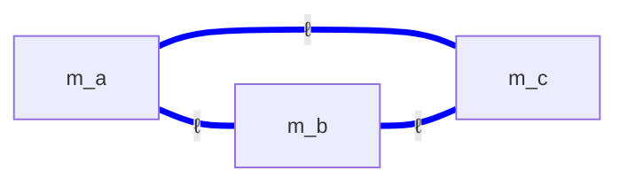
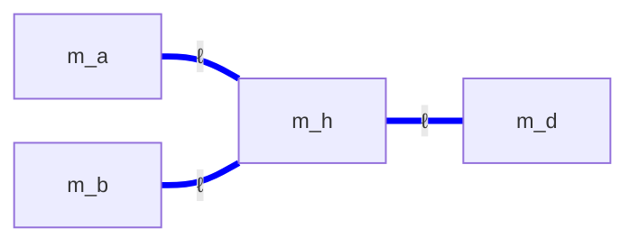
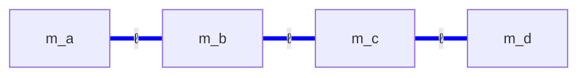

# config-electron.md — electron-sector topology configurations

**Purpose:** catalog the topology configurations available for the electron (charged lepton) sector.

**Electron sector requirements:** host all 3 charged leptons (e, μ, τ) at their observed masses (0.511 MeV, 105.66 MeV, 1776.86 MeV — span ~3500×). Each pair hosts one lepton at T(1, 2) per [architecture.md §3.3.1](architecture.md) (no within-pair doublet — Q = ±1 doesn't need a lobe/saddle split). Per-pair (σ, τ, P) triplet free per [architecture.md §3.4](architecture.md). Electrons sit on the *ellipse* cross-section per [electron-tube.md](electron-tube.md), with τ = 2 and σ_eff near 2 (the R53 magic-shear value).

**Labelling convention (local to this file):** dims are named `m_a`, `m_b`, … abstractly. The configs say nothing about which globally-labelled dims they map onto, nor whether any of these dims are shared with other sectors — those are candidate-level questions handled in [candidates.md](candidates.md).

**Scope note:** the electron sector has 3 mass constraints and (depending on config) 5–7 continuous free parameters at the sector-internal level. Every electron config is therefore *underdetermined within its sector* — sector-internal fits don't uniquely pin the σ_eff and L values. Specific σ_eff and L choices come from candidate-level inheritance or from principled constraints (e.g., enforcing R53 σ_eff = 2). This file describes topology and DOF; specific instance numbers belong in [candidates.md](candidates.md).

---

## ED — Electron Delta

3-dim triangle topology `Ma((a, b), (a, c), (b, c))`. Each pair hosts one charged lepton at T(1, 2). Each dim participates in two of the three pairs.

### ED.1 — Topology and DOF

| Element | Count |
|---|---:|
| Dims | 3 (m_a, m_b, m_c) |
| Pairs | 3 (all dim-dim pairs present) |
| Continuous params | 6 (3 L's + 3 σ_eff per pair) |
| Mass constraints | 3 (e, μ, τ) |
| Sector-internal DOF | 3 (underdetermined within sector) |

Each pair has its own tube/ring assignment and its own (σ, τ, P) triplet. The 3-fold permutation symmetry across the (m_a, m_b, m_c) labels gives a natural way to test alternative lepton-to-pair assignments.

### ED.2 — Sector-internal anchors

A few features are pinned by sector-internal physics alone, before any cross-sector inheritance:

- **Smallest dim's size scale is set by the τ Compton wavelength.** The heaviest lepton sits on the pair with the smallest ring; in the pure-ring regime that ring's circumference satisfies L_R ≈ 2πℏc·δ/m_τ, with δ small. For δ ≈ 0.01 (a single R53-style detuning) this gives L ≈ a few fm.
- **R53 σ_eff naturalness target.** The framework's working hypothesis for charged-lepton sheets is σ_eff near 2 (the magic-shear value from [electron-tube.md](electron-tube.md)). ED admits this constraint on at least two of the three pairs without over-constraining the mass fit; the third pair's σ_eff absorbs the remaining freedom.

### ED.3 — Fit status (sector-internal)

Numerically, ED closes to machine precision across the 3-DOF underdetermined manifold — the fit residual is essentially zero everywhere a solution exists. The remaining freedom (3 DOF) is removed by either (a) candidate-level inheritance from quark or neutrino sectors, or (b) principled constraints (e.g., enforcing R53 σ_eff = 2 on all three pairs simultaneously and accepting whatever residual that produces). Both directions are candidate-level choices.

### ED.4 — Verdict

**Working config.** Topology is clean (3-fold symmetric), DOF count is moderate, sector-internal mass fit is trivial under the existing underdetermination. The substantive question — *which point on the solution manifold* — is candidate-level.

---

## EY — Electron Wye

4-dim star topology `Ma((a, h), (b, h), (h, d))` with `m_h` as the topological hub (every edge meets here). Three rings: m_a, m_b, m_d.

### EY.1 — Topology and DOF

| Element | Count |
|---|---:|
| Dims | 4 (m_a, m_b, m_h, m_d) |
| Pairs | 3 (one wye, hub at m_h) |
| Continuous params | 7 (4 L's + 3 σ_eff per pair) |
| Mass constraints | 3 (e, μ, τ) |
| Sector-internal DOF | 4 (underdetermined within sector) |

m_h plays tube in two of the three pairs (with m_a, m_b) but ring in the third pair (with m_d) under the natural "larger-as-tube" reading. This is structurally distinct from a "universal-tube wye" — only 2 of 3 pairs treat the topological hub as tube.

### EY.2 — Sector-internal anchors

- **No universal R53.** Because m_h is *ring* in one of the three pairs, that pair's mass formula is dominated differently from the other two. A uniform "all σ_eff near 2" target is not naturally compatible with all three pairs under the same tube/ring convention; the third pair likely sits at a different σ_eff center.
- **One extra dim relative to ED** (4 vs 3). The additional dim m_d gives an extra degree of freedom that ED lacks; this is what distinguishes EY structurally.

### EY.3 — Fit status (sector-internal)

Sector-internal fit closes trivially (residual ≈ 0) anywhere on the 4-parameter solution manifold. Even more underdetermined than ED. The "scattered σ_eff" behavior observed under unconstrained numerical optimization is a property of the optimizer's seed distribution, not a structural prediction of the topology — different starting points produce different (σ_eff, L) tuples that all fit the same masses.

To turn this into a structural test, the fit needs an additional objective (e.g., minimize max |σ_eff − 2|) layered on top of mass-fit residual. Without such a constraint, the σ_eff values reported by any single numerical run are one arbitrary point on a 4-parameter family of equally-good solutions.

### EY.4 — Verdict

**Working topologically; underdetermined within sector.** Comparison against ED on σ_eff naturalness is meaningful only at the candidate level, where cross-sector inheritance removes some of the DOF. Until a principled constraint is layered on top, EY's fit values are not config-level properties.

---

## EL — Electron Linear (ad-hoc path)

4-dim chain topology `Ma((a, b), (b, c), (c, d))` — the path m_a — m_b — m_c — m_d. Three pairs in sequence; no shape with rotational symmetry.

### EL.1 — Topology and DOF

| Element | Count |
|---|---:|
| Dims | 4 (m_a, m_b, m_c, m_d) |
| Pairs | 3 (linear chain) |
| Continuous params | 7 (4 L's + 3 σ_eff per pair) |
| Mass constraints | 3 |
| Sector-internal DOF | 4 |

Same DOF count as EY but without rotational symmetry across pairs. No structural reason to prefer EL over EY; its only motivation is that some legacy candidate uses the chain topology.

### EL.2 — Status

**Not fit by any canonical script.** Lepton-to-edge assignment is undetermined; tube/ring per pair is undetermined; σ_eff values are open. The path shape is structurally awkward — no rotational or reflection symmetry across pairs.

### EL.3 — Verdict

**Structural placeholder, not pursued.** Without a fit, EL can't be evaluated against ED or EY. If pursued, would need a dedicated `electron_path_fit()` in [scripts/candidate_fits.py](../scripts/candidate_fits.py).

---

## Comparison

| Feature | ED | EY | EL |
|---|:---:|:---:|:---:|
| Dims used | 3 (m_a, m_b, m_c) | 4 (m_a, m_b, m_h, m_d) | 4 (m_a, m_b, m_c, m_d) |
| Pairs | 3 (triangle) | 3 (wye with hub at m_h) | 3 (linear chain) |
| Topological symmetry | C₃ across pair-permutation | C₂ across m_a ↔ m_b | none |
| Continuous params | 6 | 7 | 7 |
| Sector-internal DOF | 3 | 4 | 4 |
| Sector-internal fit | exact (trivially, given DOF) | exact (trivially) | not run |
| Used by active candidates | yes | yes | yes (without fit) |
| Status | working | working | not fit |

---

## Cross-references

- [candidates.md](candidates.md) — active combinations; maps these abstract labels to global dim indices and supplies the cross-sector inheritance that pins each config to a specific solution
- [architecture.md §3.3.1](architecture.md) — closure modes per pair (default T(1, 2) for lepton sheets)
- [architecture.md §3.4](architecture.md) — pair-triplet (σ, τ, P) hypothesis
- [electron-tube.md](electron-tube.md) — convex-only tube construction; supplies the τ = 2 ellipse that puts T(1, 2) at the floor on a lepton sheet
- [scripts/candidate_fits.py](../scripts/candidate_fits.py) — fits driven from specific candidates; report sector-internal fit residuals
- [config-quark.md](config-quark.md), [config-neutrino.md](config-neutrino.md) — sibling sector configs
