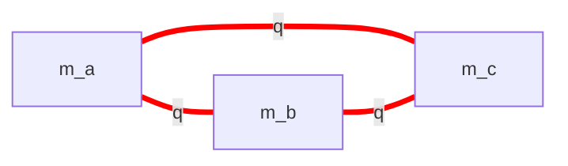
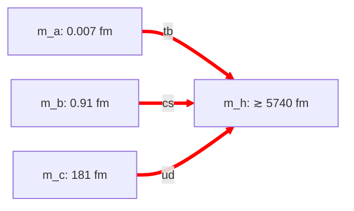

# config-quark.md — quark-sector topology configurations

**Purpose:** catalog the topology configurations available for producing 3 generations of quarks on a set of sheets shared between a set of common dimensions.

**Quark sector requirements:** host all 6 quarks (u, d, s, c, b, t) at their observed masses (2 MeV to 173 GeV — 5 orders of magnitude). Each pair hosts one generation (heavier quark at T(1, 1), lighter at T(1, 2)). Per-pair (σ, τ, P) triplet free per [architecture.md §3.4](architecture.md).

**Labelling convention (local to this file):** dims are named `m_a`, `m_b`, … abstractly. The configs say nothing about which globally-labelled dims they map onto — that is a candidate-level choice ([candidates.md](candidates.md)).

**Scope note:** numbers reported here are *sector-internal* — the quark sector's six mass constraints alone fix the per-pair sizes and σ_eff values. The configs make no assumptions about whether any of these dims are shared with the electron or neutrino sectors; that is a candidate-level question.

---

## QD — Quark Delta

3-dim triangle topology `Ma((a, b), (a, c), (b, c))`. Each pair hosts one quark generation.

### QD.1 — Motivation

The most natural quark topology under the "3 generations on 3 sheets" reading: three dims, all pairs present, one generation per pair. Symmetric, parsimonious — and it doesn't work.

### QD.2 — The delta problem

In a 3-dim delta, **two pairs always share a ring dim**. Whichever generation lives on each of those pairs, the ratio of their lighter modes is fixed by their detuning ratio f_i/f_j — *and* both f's are independently fixed by within-pair (down-type/up-type) mass ratios. Both pin the same quantity to different values:

- Required by observation: the lighter quarks of two pairs sharing a ring give a mass ratio of order m_u/m_s = 0.023 or m_u/m_b = 5×10⁻⁴
- Required by within-pair structure: f-ratios from (1−f)/f = mass ratio are of order 4.7 or 13.1 or 2.8

These disagree by 2 to 4 orders of magnitude across all 3 generation-to-pair permutations. The constraint is *not* satisfiable.

**Per-pair tube/ring choice doesn't rescue it.** With 3 dims and 3 pairs, at least two pairs share a ring dim regardless of tube/ring assignments (pigeonhole). The obstruction is structural, not a labelling artifact.

Full derivation: [quark-search.md §4–§7](quark-search.md).

### QD.3 — Numerical attempts

| Scheme | Best max \|Δ%\| | Source | Verdict |
|---|---:|---|---|
| Strict T(1, 1) + T(1, 2) per pair, smallest-as-tube | (no clean fit) | analytical ([quark-search.md §4–§7](quark-search.md)) | falsified by sharing-constraint argument; numerical spot-check shows L_b ratios off by 130× to 25,900× depending on assignment |
| Strict T(1, 1) + T(1, 2) per pair, per-pair tube/ring | open | not directly verified by a canonical script under strict modes | analytical obstruction is the same (pigeonhole forces shared L_R); a numerical pure-strict-modes sweep is not in any current canonical script |
| Relaxation 1 (allow m_t = 2 as second mode) + per-pair tube/ring | **3.97%** | [scripts/quark_search_relaxation_1.py](../scripts/quark_search_relaxation_1.py), [quark-search.md §10](quark-search.md) | viable but loose |

**What Relaxation 1 is.** The default mode-selection rule per [architecture.md §3.3.1](architecture.md) takes T(1, 1) and T(1, 2) as the two lowest closure modes on each pair (m_t = 1 on the tube; m_r ∈ {1, 2} on the ring). Relaxation 1 relaxes this by allowing **m_t = 2** as an alternative second mode (with m_r chosen to satisfy closure). The m_t = 2 mode adds energy ≈ 2·2πℏc/L_T independent of L_R — which breaks the L_R-sharing correlation that defeats the strict mode-selection. Tested across 384 configurations on the QD topology in [scripts/quark_search_relaxation_1.py](../scripts/quark_search_relaxation_1.py). The best fit requires Relaxation 1 *combined with* per-pair tube/ring choice in the fat-torus regime (larger dim as tube on all three pairs); neither relaxation alone closes the obstruction.

### QD.4 — Verdict

**Not viable under the strict closure-mode rule** (T(1, 1) + T(1, 2) per pair). **Marginally viable at ~4% with Relaxation 1** (m_t = 2 admitted as a second mode). Kept on the books as a structurally simpler fallback in case QY runs into trouble downstream (Phase 4 coherence checks or Phase 5 derivation). Not currently used in any active candidate.

---

## QY — Quark Wye

4-dim star topology `Ma((a, h), (b, h), (c, h))` with `m_h` as the common hub (plays tube in all 3 pairs). The three spokes `m_a, m_b, m_c` play ring.

### QY.1 — Why it works where QD failed

The wye has an additional dim (m_h, the hub) whose only structural job is to be a common tube. **All three pairs share L_T = L_h; each pair has its own L_R (= L_a, L_b, L_c)**. In the pure-ring regime (L_T ≫ L_R), the mass formula

m² ≈ (2πℏc)² · (1/L_T² + δ²/L_R²) ≈ (2πℏc)² · δ²/L_R²

is dominated by 1/L_R. **A shared L_T does NOT couple the masses across pairs.** The QD obstruction (shared L_R correlations) is gone because the three rings are independent dims.

The trade is 1 extra dim (4 vs 3) for full mass-spectrum freedom.

### QY.2 — Mode assignments and sector-internal fit

Each pair hosts one quark generation, lighter quark at T(1, 2), heavier at T(1, 1). The within-pair mass ratio fixes σ_eff via σ_eff = (2R + 1)/(R + 1) where R = m_heavier/m_lighter. Heavier generations sit on smaller rings (since mass ∝ 1/L_R in the pure-ring regime). All values below come from a fit using the six observed quark masses alone — no cross-sector inheritance.

| Pair | Generation | Modes (lighter / heavier) | σ_eff | L_ring |
|---|---|---|---:|---:|
| `Ma(a, h)` | (b, t) | b at T(1, 2) / t at T(1, 1) | **1.9764** | L_a = 0.007 fm |
| `Ma(b, h)` | (s, c) | s at T(1, 2) / c at T(1, 1) | **1.9318** | L_b = 0.91 fm |
| `Ma(c, h)` | (u, d) | u at T(1, 2) / d at T(1, 1) | **1.6837** | L_c = 181 fm |

L_h ≳ 5740 fm (pure-ring constraint; the hub only needs to be much larger than the largest ring; the exact value is a sector-internal free parameter).

The (b, t) pair's σ_eff = 1.976 sits microscopically close to R53's "magic shear" value of 2 — interesting cross-sector resonance hint, but not load-bearing for QY's fit.

**Max |Δ%| = 0.499%** across all 6 quark masses. The u quark accounts for nearly all the residual; d, s, c, b, t fit at < 0.2%. Reproduces the within-generation ratios m_d/m_u = 2.17, m_c/m_s = 13.7, m_t/m_b = 41.4. The QY quark wye is fit within any candidate by the general solver [scripts/cand_solver.py](../scripts/cand_solver.py); see e.g. [outputs/cand_QY-ED.txt](../outputs/cand_QY-ED.txt). (With every σ_eff treated as a free parameter the joint solve closes the quark sector to machine precision; the 0.499% above is the older pure-ring analytic estimate.)

### QY.3 — Size hierarchy

| Dim | L | Role | Note |
|---|---:|---|---|
| m_a | 0.007 fm | (b, t) ring | ≈ top-quark Compton wavelength |
| m_b | 0.91 fm | (c, s) ring | ≈ charm Compton wavelength |
| m_c | 181 fm | (u, d) ring | ≈ electron-scale |
| m_h | ≳ 5740 fm | common tube (hub) | "fat" dim shared across all 3 pairs |

L_h is a free parameter as long as it satisfies the pure-ring constraint. The fit pins L_a, L_b, L_c to within-pair mass ratios.

### QY.4 — Architectural implications

- **Per-pair tube/ring is free**, not size-determined. In QY, the LARGER dim (m_h) plays tube in every pair — the R53-style fat-torus regime applied universally. The earlier "smaller-as-tube" convention from MaSt is a proton-sheet special case, not a general rule. See [architecture.md §3.1](architecture.md).
- **Within-generation u/d distinction** is preserved across all configs: heavier quark at T(1, 1), lighter at T(1, 2). The Q_lobe = +2/3, Q_saddle = −1/3 per-arc charges from [sheet-proton clover-quarks §11](../../sheet-proton/work/clover-quarks.md) carry through unchanged.
- **The hub m_h is shared across all 3 pairs**, providing a natural geometric channel for quark-flavor-changing processes (e.g., t → b weak decay involves modes on adjacent pairs of the wye).

### QY.5 — Verdict

**Working config.** The 0.5% fit is the project's tightest sector-level achievement to date. Adopted by active candidates ([candidates.md](candidates.md)).

---

## Comparison

| Feature | QD | QY |
|---|:---:|:---:|
| Dims used | 3 (m_a, m_b, m_c) | 4 (m_a, m_b, m_c, m_h) |
| Pairs | 3 | 3 |
| Topology | triangle | wye/star with hub |
| Shared tube dim | none | m_h (universal) |
| Sector-internal DOF | 0 (over-determined; can't fit) | 1 (L_h above the floor) |
| Best fit (strict modes) | analytically falsified | **0.499%** |
| Best fit (with relaxations) | 3.97% (Relaxation 1) | not needed |
| σ_eff range | scattered, fit-dependent | 1.68 to 1.98 (natural) |
| Within-generation mechanism | clover (lobe/saddle) | clover (lobe/saddle) |
| Used by active candidates | no | yes |

QY is the working choice. QD is kept as a fallback and as the "what doesn't work" reference for the delta problem.

---

## Cross-references

- [candidates.md](candidates.md) — active combinations and the mapping of these abstract labels to global dim indices
- [quark-search.md](quark-search.md) — full derivation: §1–§8 (QD analytical falsification), §9 (QY working result), §10 (QD Relaxation 1)
- [architecture.md §3.1, §3.4](architecture.md) — per-pair tube/ring rule; (σ, τ, P) triplet hypothesis
- [architecture.md §3.3.1](architecture.md) — closure-mode inventory per pair (the default T(1, 1) + T(1, 2) rule that Relaxation 1 relaxes)
- [scripts/cand_solver.py](../scripts/cand_solver.py) — general candidate solver; fits the QY quark wye inside any candidate that uses it
- [scripts/quark_search_relaxation_1.py](../scripts/quark_search_relaxation_1.py) — QD with Relaxation 1 (produces the 3.97% best fit)
- [config-electron.md](config-electron.md), [config-neutrino.md](config-neutrino.md) — sibling sector configs
