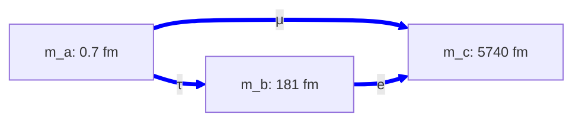
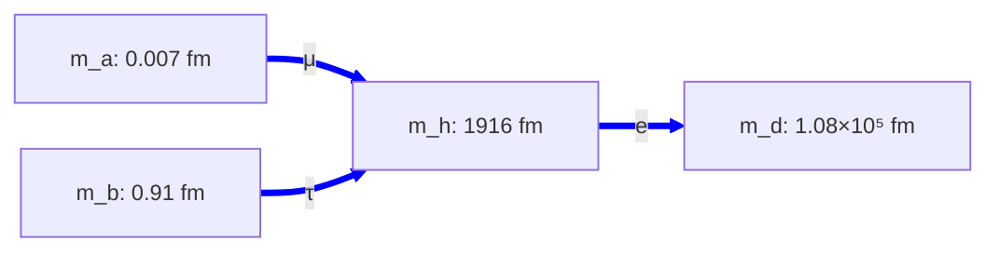
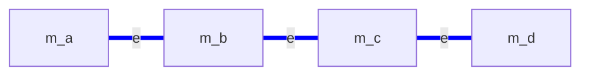

# electron-configs.md — electron-sector topology configurations

**Purpose:** catalog the topology configurations available for the electron (charged lepton) sector.

**Electron sector requirements:** host all 3 charged leptons (e, μ, τ) at their observed masses (0.511 MeV, 105.66 MeV, 1776.86 MeV — span ~3500×). Each pair hosts one lepton at T(1, 2) per [architecture.md §3.3.1](architecture.md) (no within-pair doublet — Q = ±1 doesn't need a lobe/saddle split). Per-pair (σ, τ, P) triplet free per [architecture.md §3.4](architecture.md). Electrons sit on the *ellipse* cross-section per [electron-tube.md](electron-tube.md), with τ = 2 and σ_eff near 2 (the R53 magic-shear value).

**Labelling convention (local to this file):** dims are named `m_a`, `m_b`, … abstractly. The configs say nothing about which globally-labelled dims they map onto, nor whether any of these dims are shared with other sectors — those are candidate-level questions handled in [candidates.md](candidates.md).

---

## ED — Electron Delta

3-dim triangle topology `Ma((a, b), (a, c), (b, c))`. Each pair hosts one charged lepton at T(1, 2). Each dim participates in two of the three pairs.

### ED.1 — Mode assignments and fit

Sizes sorted small → large: L_a < L_b < L_c. Larger dim plays tube in each pair (fat-torus regime); heaviest lepton sits on the pair with the smallest ring.

| Pair | Lepton | Tube | Ring | σ_eff |
|---|---|---|---|---:|
| `Ma(a, b)` | **τ** | m_b (181 fm) | m_a (0.7 fm) | **1.000** |
| `Ma(a, c)` | **μ** | m_c (5740 fm) | m_a (0.7 fm) | **1.941** |
| `Ma(b, c)` | **e** | m_c (5740 fm) | m_b (181 fm) | **1.932** |

L_a ≈ 0.698 fm is pinned by the τ Compton wavelength (m_τ ≈ 2πℏc/L_a in the pure-ring regime). L_b and L_c are *free parameters of the ED config itself*; specific candidates may choose to constrain them by inheritance from another sector (see [candidates.md](candidates.md)).

**Max |Δ%| = 0.000%** (machine precision on all three lepton masses). σ_eff values span 1.00 to 1.94. Script: [scripts/candidate_fits.py:electron_delta_fit()](../scripts/candidate_fits.py); output: [outputs/candidate_fits.txt](../outputs/candidate_fits.txt). (The script implements ED at a specific choice of globally-labelled dims selected for one of the active candidates; the abstraction here is sector-only.)

### ED.2 — Verdict

**Working config** (numerically fits at machine precision; σ_eff values in a natural range without R53 fine-tuning). The smallest dim m_a sits at the τ Compton scale; the other two dim sizes are free at the config level but typically end up pinned by candidate-level inheritance.

---

## EY — Electron Wye

4-dim star topology `Ma((a, h), (b, h), (h, d))` with `m_h` as the topological hub (every edge meets here). Three rings: m_a, m_b, m_d.

### EY.1 — Mode assignments and fit

Sizes: L_a < L_b < L_h < L_d. Larger-as-tube on each pair, which means m_h plays tube in two pairs (with m_a and m_b) but **ring** in the third pair (with m_d). This is structurally distinct from a "universal-tube wye" — only 2 of 3 pairs treat the topological hub as tube.

| Pair | Lepton | Tube | Ring | σ_eff |
|---|---|---|---|---:|
| `Ma(a, h)` | **μ** | m_h (1916 fm) | m_a (0.007 fm) | **1.9994** |
| `Ma(b, h)` | **τ** | m_h (1916 fm) | m_b (0.91 fm) | **0.6964** |
| `Ma(h, d)` | **e** | m_d (1.08 × 10⁵ fm) | m_h (1916 fm) | **1.2105** |

**Max |Δ%| = 0.000%** (machine precision). Script: [scripts/candidate_fits.py:electron_wye_fit()](../scripts/candidate_fits.py); output: [outputs/candidate_fits.txt](../outputs/candidate_fits.txt).

### EY.2 — σ_eff naturalness analysis

σ_eff values span **0.70 to 1.9994** — wider than ED's range. The 1.9994 value on `Ma(a, h)` sits within 0.06% of the R53 magic-shear value 2 — finer than anything in ED.

The fit is underdetermined: 5 free continuous parameters (L_h, L_d, three σ_eff) plus inheritance/freedom of L_a, L_b at the candidate level → multi-parameter family of valid solutions. The optimizer returned one solution; others exist with different (L, σ_eff) tradeoffs. The reported σ_eff values are *one valid choice*, not the result of a principled constraint.

An earlier analytical estimate predicted all three σ_eff would land near 2 (a "unified R53 mechanism" across all charged leptons). The actual numerical fit doesn't deliver this — σ_eff is scattered. Without an *additional constraint* that picks out the unified solution from the underdetermined manifold, EY does not provide a cleaner σ_eff range than ED.

### EY.3 — Verdict

**Working numerically (0.000%) but does not deliver the σ_eff unification it was conjectured to provide.** Tested; σ_eff range wider than ED's and includes one extreme R53 fine-tuning. Kept as a documented option in case future constraints make EY's underdetermined manifold collapse to a more natural σ_eff combination.

---

## EL — Electron Linear (ad-hoc path)

4-dim chain topology `Ma((a, b), (b, c), (c, d))` — the path m_a — m_b — m_c — m_d. Three pairs in sequence; no shape with rotational symmetry.

### EL.1 — Status

**Not fit by any canonical script.** Lepton-to-edge assignment is undetermined; tube/ring per pair is undetermined; σ_eff values are open. The path shape is structurally awkward — no rotational or reflection symmetry across pairs.

### EL.2 — Verdict

**Structural placeholder, not pursued.** Without a fit, EL can't be evaluated against ED or EY. If pursued, would need a dedicated `electron_path_fit()` in [scripts/candidate_fits.py](../scripts/candidate_fits.py).

---

## Comparison

| Feature | ED | EY | EL |
|---|:---:|:---:|:---:|
| Dims used | 3 (m_a, m_b, m_c) | 4 (m_a, m_b, m_h, m_d) | 4 (m_a, m_b, m_c, m_d) |
| Pairs | 3 (triangle) | 3 (wye with hub at m_h) | 3 (linear chain) |
| Topological symmetry | C₃ across pair-permutation | C₂ across m_a ↔ m_b | none |
| "Universal-tube" dim | none — larger of each pair is tube | no — m_h is ring in one of the three pairs | undetermined |
| Best fit | **0.000%** | 0.000% | not fit |
| σ_eff range | 1.00 to 1.94 (natural) | 0.70 to 1.9994 (scattered, includes fine-tuning) | open |
| Used by active candidates | yes | no | yes (without fit) |
| Status | working | tested, σ_eff not unified | not fit |

---

## Cross-references

- [candidates.md](candidates.md) — active combinations; maps these abstract labels to global dim indices and discusses any cross-sector dim/pair sharing
- [architecture.md §3.3.1](architecture.md) — closure modes per pair (default T(1, 2) for lepton sheets)
- [architecture.md §3.4](architecture.md) — pair-triplet (σ, τ, P) hypothesis
- [electron-tube.md](electron-tube.md) — convex-only tube construction; supplies the τ = 2 ellipse that puts T(1, 2) at the floor on a lepton sheet
- [scripts/candidate_fits.py](../scripts/candidate_fits.py) — fits for ED (`electron_delta_fit`) and EY (`electron_wye_fit`)
- [outputs/candidate_fits.txt](../outputs/candidate_fits.txt) — verified fit results referenced above
