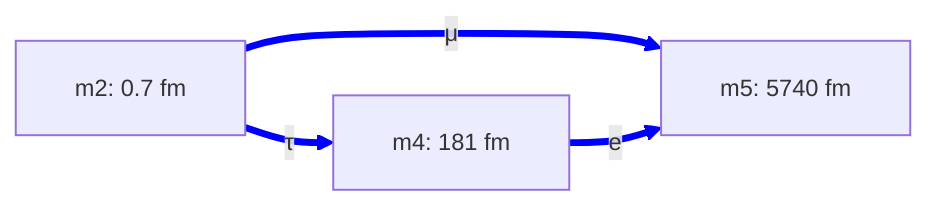
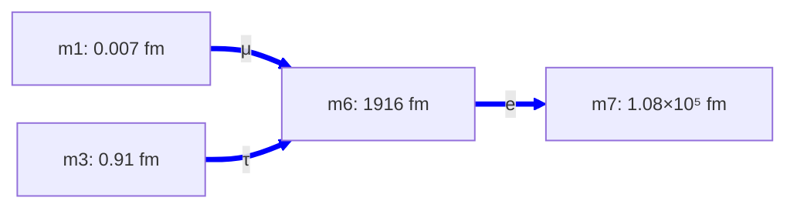
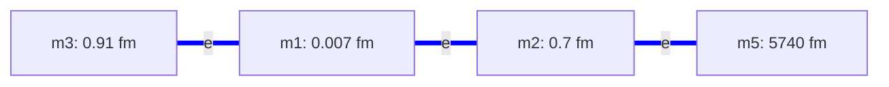

# electron-configs.md — electron-sector topology configurations

**Purpose:** catalog the topology configurations available for the electron (charged lepton) sector. Each config gets a two-letter name; candidates combine one quark-config with one electron-config and one neutrino-config (e.g. `QY-ED-N2`). See [candidates.md](candidates.md) for active combinations and [quark-configs.md](quark-configs.md) for the quark side.

**Electron sector requirements:** host all 3 charged leptons (e, μ, τ) at their observed masses (0.511 MeV, 105.66 MeV, 1776.86 MeV — span ~3500×). Each pair hosts one lepton at T(1, 2) per [architecture.md §3.3.1](architecture.md) (no within-pair doublet — Q = ±1 doesn't need a lobe/saddle split). Per-pair (σ, τ, P) triplet free per [architecture.md §3.4](architecture.md).

**Distinct from the quark sector:** electrons live on the *ellipse* cross-section per [electron-tube.md](electron-tube.md), with τ = 2 and σ_eff near 2 (the R53 magic-shear value), rather than the clover cross-section with τ = 1/3 used for quarks.

---

## ED — Electron Delta

3-dim triangle topology `Ma((2, 4), (2, 5), (4, 5))`. Each pair hosts one charged lepton at T(1, 2). m2 is a new lepton-scale dim (≈ 0.7 fm); m4 and m5 are inherited from QY (the u/d ring and the quark hub respectively).

### ED.1 — Mode assignments and fit

| Pair | Lepton | Tube | Ring | σ_eff |
|---|---|---|---|---:|
| `Ma(2, 4)` | **τ** | m4 (181 fm) | m2 (0.7 fm) | **1.000** |
| `Ma(2, 5)` | **μ** | m5 (5740 fm) | m2 (0.7 fm) | **1.941** |
| `Ma(4, 5)` | **e** | m5 (5740 fm) | m4 (181 fm) | **1.932** |

**Max |Δ%| = 0.000%** (machine precision on all three lepton masses). L_2 ≈ 0.698 fm is pinned by the τ Compton wavelength (m_τ ≈ 2πℏc/L_2 in the pure-ring regime). Script: [scripts/candidate_fits.py:electron_delta_fit()](../scripts/candidate_fits.py); output: [outputs/candidate_fits.txt](../outputs/candidate_fits.txt).

σ_eff values span 1.00 to 1.94 — consistent with the quark sector's range (1.68 to 1.98). No R53 fine-tuning required.

### ED.2 — The pair-overlap concern with the quark sector

**ED's pair `Ma(4, 5)` is also in QY's wye** (where it hosts u, d quarks at σ_eff = 1.684). The same dim-pair geometry would carry *two* modes with *two different* σ_eff values — one quark clover mode and one electron ellipse mode — which is not allowed by a strict reading of [architecture.md §3.4](architecture.md) (the pair-triplet (σ, τ, P) is a property of the pair, giving a single σ_eff = σ + 2τ).

Possible resolutions:

1. **Extend the architecture** to allow per-mode cross-sections on the same pair (multi-P on one pair-geometry). The shape function P_{ij} becomes a per-mode property; σ and τ remain per-pair. This is the framing currently used in candidates.md, but it's an extension of §3.4 that hasn't been formalized.
2. **Restrict ED to pairs disjoint from the quark wye.** Would require a different e-delta topology — e.g., `Ma((2, 6), (2, 7), (6, 7))` using m6, m7 as new lepton-region dims rather than reusing m5 and m4. Untested.
3. **Accept the overlap as a feature** but characterize it: derive what condition lets a single pair host two cross-sections with different σ_eff. Phase 4 coherence question.

This concern is specific to ED's natural-scale placement; if ED were placed on dims disjoint from the quark wye it would not apply. Trade-off: pairs near electron-Compton scale exist mostly inside the quark wye's reach, so disjoint placements tend to need extra dims or fine-tuning.

### ED.3 — Verdict

**Working config** (numerically fits at machine precision with natural σ_eff). Used in active Candidates B and C. **Open architectural question** about the pair-overlap with the quark sector — flagged for Phase 4 coherence check.

---

## EY — Electron Wye

4-dim star topology `Ma((1, 6), (3, 6), (6, 7))` with m6 as the e-wye hub. The two ring dims m1, m3 are *shared with QY's quark wye* as rings (m1 = b/t quark ring; m3 = c/s quark ring); m7 is a new electron-region dim.

### EY.1 — Mode assignments and fit

| Pair | Lepton | Tube | Ring | σ_eff |
|---|---|---|---|---:|
| `Ma(1, 6)` | **μ** | m6 (1916 fm) | m1 (0.007 fm) | **1.9994** |
| `Ma(3, 6)` | **τ** | m6 (1916 fm) | m3 (0.91 fm) | **0.6964** |
| `Ma(6, 7)` | **e** | m7 (1.08 × 10⁵ fm) | m6 (1916 fm) | **1.2105** |

**Max |Δ%| = 0.000%** (machine precision). Script: [scripts/candidate_fits.py:electron_wye_fit()](../scripts/candidate_fits.py); output: [outputs/candidate_fits.txt](../outputs/candidate_fits.txt).

### EY.2 — σ_eff naturalness analysis

σ_eff values span **0.70 to 1.9994** — *wider* than ED's range and notably *wider* than the quark sector's (1.68 to 1.98). The 1.9994 value on Ma(1, 6) sits within 0.06% of the R53 magic-shear value 2 — finer than anything in the quark sector or in ED.

The fit is underdetermined: 5 free continuous parameters (L_6, L_7, three σ_eff) vs 3 lepton masses → 2-parameter family of valid solutions. The optimizer returned one solution; other valid solutions exist with different (L, σ_eff) tradeoffs. The reported σ_eff values are *one valid choice*, not the result of a principled constraint.

An earlier analytical estimate predicted all three σ_eff would land near 2 (a "unified R53 mechanism" across all charged leptons). The actual numerical fit doesn't deliver this — σ_eff is scattered. Without an *additional constraint* that picks out the unified solution from the underdetermined manifold, EY does not provide a cleaner σ_eff range than ED.

### EY.3 — Pair-overlap status

**No pair overlap with QY.** EY's pairs are `Ma(1, 6)`, `Ma(3, 6)`, `Ma(6, 7)`; QY's pairs are `Ma(1, 5)`, `Ma(3, 5)`, `Ma(4, 5)`. EY *shares dims* m1 and m3 with the quark sector (as rings in both), but the *pairs* are different. Architecturally cleaner than ED on this axis.

### EY.4 — Verdict

**Working numerically (0.000%) but does not deliver the σ_eff unification it was conjectured to provide.** Tested but not preferred as a working config: its σ_eff range is wider than ED's and includes the extreme R53 fine-tuning (1.9994) that the natural-scale e-refactor was meant to eliminate. Kept as documented option in case future constraints (e.g., from Phase 4 coherence) make its underdetermined manifold collapse to a more natural σ_eff combination.

---

## EL — Electron Linear (ad-hoc path)

4-dim chain topology `Ma((1, 3), (1, 2), (2, 5))` — the path m3—m1—m2—m5. Uses three quark-region dims (m1, m3, m5) plus the new lepton dim m2 in a non-regular shape.

### EL.1 — Status

**Not fit by any canonical script.** Lepton-to-edge assignment is undetermined; tube/ring per pair is undetermined; σ_eff values are open. The path shape is structurally awkward — three quark-region dims (m1, m3, m5) plus m2 chained together rather than forming a symmetric delta or wye.

### EL.2 — Pair-overlap status

**No pair overlap with QY.** EL's pairs are `Ma(1, 3)`, `Ma(1, 2)`, `Ma(2, 5)`; none of these are in QY's pair set `{Ma(1, 5), Ma(3, 5), Ma(4, 5)}`. EL shares *dims* m1, m3, m5 with the quark sector but not *pairs* — same architectural cleanliness as EY in this respect.

### EL.3 — Verdict

**Structural placeholder, not pursued.** Used in Candidate A in candidates.md as the e-sector layout, but no numerical fit has been attempted. Without a fit it can't be evaluated against ED or EY. If pursued, would need a dedicated `electron_path_fit()` in [scripts/candidate_fits.py](../scripts/candidate_fits.py).

---

## Comparison

| Feature | ED | EY | EL |
|---|:---:|:---:|:---:|
| Dims used | 3 (m2, m4, m5) | 4 (m1, m3, m6, m7) | 4 (m1, m2, m3, m5) |
| Pairs | 3 (triangle) | 3 (wye: hub + 3 spokes) | 3 (linear chain) |
| Shape | delta | wye (hub at m6) | path |
| Hub dim | none | m6 (universal tube) | none |
| Best fit | **0.000%** | 0.000% | not fit |
| σ_eff range | 1.00 to 1.94 (natural) | 0.70 to 1.9994 (scattered, includes fine-tuning) | open |
| **Pair-overlap with QY** | **yes, on Ma(4, 5)** | no (dims shared, pairs disjoint) | no (dims shared, pairs disjoint) |
| Dim-overlap with QY | yes (m4, m5 shared) | yes (m1, m3 shared) | yes (m1, m3, m5 shared) |
| Used by candidates | B, C | none active | A |
| Status | working, with open pair-overlap question | tested, σ_eff not unified | not fit |

---

## Open architectural question — pair overlap

ED is the only config currently in production that introduces a *shared pair* with the quark sector (Ma(4, 5) hosts both u, d at clover σ_eff = 1.684 and e at ellipse σ_eff = 1.932). EY and EL avoid this by using pairs disjoint from QY.

The strict reading of [architecture.md §3.4](architecture.md) treats (σ, τ, P) as a per-pair property — a single σ_eff per pair. ED's two different σ_eff values on Ma(4, 5) violate this strict reading. Resolutions (recap from §ED.2):

1. **Per-mode P extension**: allow multiple cross-section shapes on one pair, each with its own effective σ_eff. Needs formalization.
2. **Disjoint-pair restriction**: rule that e-configs must use pairs disjoint from QY. Forces ED into different dims; needs retest.
3. **Coherence derivation**: prove (or refute) that the two σ_eff values are reconcilable from one underlying pair metric plus mode-dependent corrections. Phase 4 question.

Until this is resolved, ED carries an architectural caveat that EY and EL do not. The trade is: ED's σ_eff range is more natural (1.00 to 1.94), while EY's is wider (0.70 to 1.9994) and EL's is open.

---

## Cross-references

- [candidates.md](candidates.md) — active combinations (currently use ED in B and C; EL in A)
- [quark-configs.md](quark-configs.md) — companion document for the quark side; QY is the established quark config
- [architecture.md §3.3.1](architecture.md) — closure modes per pair (default T(1, 2) for lepton sheets)
- [architecture.md §3.4](architecture.md) — pair-triplet (σ, τ, P) hypothesis (subject of the pair-overlap concern)
- [electron-tube.md](electron-tube.md) — convex-only tube construction; supplies the τ = 2 ellipse that puts T(1, 2) at the floor on a lepton sheet
- [scripts/candidate_fits.py](../scripts/candidate_fits.py) — fits for ED (`electron_delta_fit`) and EY (`electron_wye_fit`)
- [outputs/candidate_fits.txt](../outputs/candidate_fits.txt) — verified fit results referenced above
