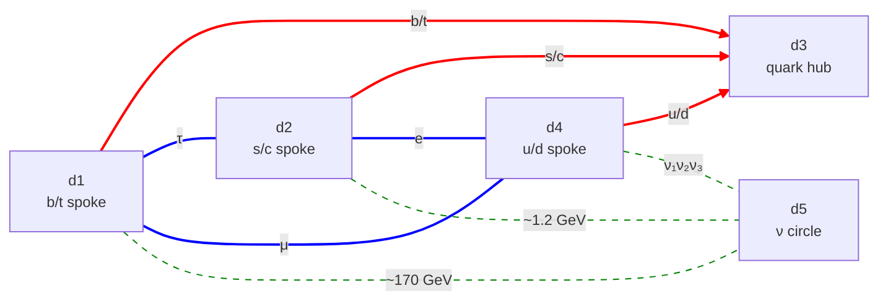

# k5-manifold.md — the K5 five-torus reframing of ma-domain

**Status:** Exploratory hypothesis under active development. Proposed as a generalization track parallel to [cand-QY-ED.md](cand-QY-ED.md) (the K4 candidate). K4's mass-fit results survive unchanged inside K5 as the dominant low-energy 2-torus modes; K5 adds a fifth dim (the neutrino circle), opens new substrates, and reframes the conservation laws as broken-U(1) survivors. Where K4 *assumes* the sheet model and fits, K5 *derives* the sheet model as the energy-optimal mode-support pattern on a single 5-torus.

This file sets the framework. Subsequent work files will run the mode sweep, work the conservation case, and address specific target particles.

---

## 1. Hypothesis

The Ma substrate of [architecture.md §1](architecture.md) is treated, for this track, as a single 5-torus on (d1, d2, d3, d4, d5). There are no sheets, curves, or lower-dimensional substrates *imposed* on the manifold. Every particle is a closure-satisfying mode on the 5-torus, with integer windings on each dim. A mode that happens to have nonzero windings on only two dims is what the existing project calls "a 2-torus sheet mode"; a mode with one nonzero winding is a "1D-curve mode" (the NC neutrino picture); a mode with three or more nonzero windings is a multi-dim mode the existing project has not catalogued.

**Two consequences fall out immediately:**

- The "sheet restriction" in [architecture.md §3.3](architecture.md) is reread as an empirical *result* — most low-energy modes have support on exactly two dims because that minimizes total energy under the closure rule. It is not a structural ban on higher-dim modes; those exist but are typically heavier.
- The R1 rule from [candidates.md](candidates.md) (no two sheets on one pair) becomes irrelevant. Conflicts between modes that would otherwise overlap are resolved energetically (the lower-energy mode is realized) rather than structurally.

---

## 2. Naming convention: d1..d5, size-ordered

K5 adopts `d` (dim) labels instead of K4's `m` labels, both to mark the framework change and to restore the size-ordering convention of [architecture.md §1](architecture.md#L29-L33) that K4 broke locally. **By convention: d1 smallest, d5 largest.**

### 2.1 Translation table from K4 to K5

| K5 label | Role | Size (K4 best-fit combo) | K4 label |
|---|---|---|---|
| d1 | b/t quark spoke | ≈ 0.0073 fm (pinned) | m3 |
| d2 | s/c quark spoke | ≈ 0.91–1.05 fm | m2 |
| d3 | quark hub | ≈ 181–493 fm | m4 |
| d4 | u/d quark spoke / ν ring | **≈ 40 µm = 4.06×10¹⁰ fm** (pinned by K5 fit) | m1 |
| d5 | neutrino tube | **≈ 160 µm = 1.59×10¹¹ fm** (pinned by K5 fit) | (new) |

The d4 and d5 values are *fit results* of the K5 joint fit ([scripts/cand_solver.py](../scripts/cand_solver.py) on [cand_specs/K5.json](../scripts/cand_specs/K5.json), [outputs/cand_K5.txt](../outputs/cand_K5.txt)), pinned by the NS-trio neutrino sheet (§8.3). K4 alone left d4 ranged from 3876 fm to 10¹⁵ fm; the three ν mass constraints collapse that to a single value at 40 µm and pin d5 at 160 µm. Both dims are macroscopic; the (d4, d5) sheet is the project's first 2-torus where both companion sizes are at the same (cm-µm) scale.

**Discrepancy with prior ν substrate estimates.** The K5 fit values (40 µm × 160 µm) differ from the K4 + NC neutrino-1D fit (radius 6.578×10⁹ fm → circumference 41 µm) by a factor of ~4 on the tube dim. These are two different mechanisms — NC's 1D shaped curve vs K5's NS-trio 2-torus — so they're not expected to land on the same L. [config-neutrino.md §NS.3](config-neutrino.md) also states "min L ≳ 4 cm", which gives 31 µeV not 30 meV and appears to be a separate doc error.

### 2.2 The d4 < d5 stipulation — confirmed by the fit

K4's manifold permits m1 (= d4) up to ~10¹⁵ fm. K5 originally stipulated **d4 < d5** as a structural assumption. The K5 joint fit (§8.3) confirms it: d4 pins to 40 µm and d5 to 160 µm — d5/d4 ≈ 4. The stipulation now stands as a fit result rather than an a-priori assumption.

---

## 3. Mode descriptor and substrate notation

### 3.1 The 5-tuple

A mode is labelled by integer windings on each dim:

> {n₁, n₂, n₃, n₄, n₅}

This is the natural restriction of [architecture.md §2](architecture.md#L40-L51)'s 11-tuple to the Ma block. Modes are sorted by the number of *nonzero* entries:

- **1-winding modes** — exactly one n_i ≠ 0. Live on a single dim. Spin 0 candidates (no second dim to twist over → integer spin).
- **2-winding modes** — exactly two n_i ≠ 0. The familiar 2-torus sheets. Spin ½ candidates (the (1, 2) WvM construction).
- **3-winding modes** — three n_i ≠ 0. Cross-sheet bound states (target case: doubly-charmed baryons).
- **4-, 5-winding modes** — heavier still; expected to be rare or absent in the observed spectrum.

### 3.2 Substrate-support notation

The existing `Ma(i, j)` pair notation extends naturally:

- `Ma(i)` — a 1-winding mode's support (a single closed dim — what the [NC config](config-neutrino.md) (Neutrino Curve) calls a "1D curve")
- `Ma(i, j)` — a 2-winding mode's support (a 2-torus — the current sheet model)
- `Ma(i, j, k)` — a 3-winding mode's support (a 3-torus)
- `Ma(i, j, k, l)`, `Ma(1..5)` — higher

### 3.3 Closure on multi-dim substrates — open

The 2-torus closure rule `m_t | m_r` (from [architecture.md §3.3.1](architecture.md#L104-L119)) is derived for one tube + one ring. The analogue for 3-tori and higher is open. The mode sweep cannot run rigorously without it; a working stand-in for v1 is "every pair of nonzero windings within a multi-dim mode independently satisfies m_t | m_r," but this may over- or under-count.

---

## 4. Substrate inventory

C(5, 2) = 10 pairs; C(5, 3) = 10 triples; C(5, 4) = 5 quadruples; one 5-torus.

### 4.1 The 10 pairs Ma(i, j) — what K4 occupies and what's new

| Pair | Role in K4 | Status in K5 |
|---|---|---|
| Ma(d1, d2) | electron τ-leg (b/t × s/c spokes) | occupied — τ at T(1, 2) |
| Ma(d1, d3) | quark b/t sheet | occupied — b at T(1, 2), t at T(1, 1) |
| Ma(d1, d4) | electron μ-leg (b/t × u/d spokes) | occupied — μ at T(1, 2) |
| Ma(d2, d3) | quark s/c sheet | occupied — s at T(1, 2), c at T(1, 1) |
| Ma(d2, d4) | electron e-leg (s/c × u/d spokes) | occupied — e at T(1, 2) |
| Ma(d3, d4) | quark u/d sheet | occupied — u at T(1, 2), d at T(1, 1) |
| **Ma(d1, d5)** | — | **new** — open (heavy-particle scale, ~170 GeV; §7.2 Higgs candidate) |
| **Ma(d2, d5)** | — | **new** — open (~1.2 GeV scale; meson candidates) |
| **Ma(d3, d5)** | — | **new** — open (~6 MeV scale) |
| **Ma(d4, d5)** | — | **new** — **3-neutrino host** at NS-style shear (§7.1) |

Particle-to-leg assignment for the electron delta follows [cand-QY-ED.md §4.1 Solution A](cand-QY-ED.md#L168-L226): e on the leg sharing the u/d spoke (d2 × d4), μ on the leg sharing the b/t spoke (d1 × d4), τ on the leg opposite u/d (d1 × d2).

K4's 6 sheets are exactly the C(4, 2) = 6 pairs on (d1..d4), filled at machine precision. K5's 4 new pairs all involve d5. **All 10 pairs are admissible substrates by default**; the sweep decides which actually host observed modes. No a-priori exclusions in v1 — the model has no current reason to forbid any pair. If the sweep produces a low-energy charged mode on a pair that doesn't correspond to a known particle (a "ghost"), that is the cue to look for a structural exclusion reason; until then, every pair stays in.

### 4.1.1 Topology figure

K4's six sheets (red wye + blue delta) plus the three K5-native d5 sheets (green, dashed). The Ma(d3, d5) pair is admissible but unlabelled here to avoid cluttering the hub. Heavy-line styles match [cand-QY-ED.md §6](cand-QY-ED.md) conventions.

**Future exclusion criterion to keep in mind:** if any two dims turn out to be *co-planar* under the spatial-relationships reading of §6, that would be a structural argument to forbid their 2-torus pair. No such determination is made in v1.

### 4.2 3-tori Ma(i, j, k) — first targets

The 10 triples are all candidate substrates for cross-sheet modes. First targets:

- **Ma(d2, d3, d4)** — combines two quark sheets via shared hub. Natural home for doubly-charmed baryons (Ξcc-like, ucc) that K4 cannot host on any single 2-torus. (§7)
- **Ma(d1, d3, d4)** — analogous for bottom + up generations.
- **Ma(d3, d4, d5)** — quark hub × u/d spoke × neutrino. Potential channel for weak interactions involving u/d and ν.

The other 7 triples are open until a sweep shows whether any hosts an observed mode.

### 4.3 Higher substrates

4-tori and the full 5-torus are admissible by the framework; no specific targets identified yet. Expected to be heavy or absent.

---

## 5. Stability model

**All observed particles are eigenmodes — exact, not approximate.** The "exact match → stable / near-miss → unstable" rule of the R-series studies is replaced by:

> **A mode is stable if no combination of lower-energy modes plus photons (or other massless quanta) can sum to its energy while conserving every survived quantum number (§6). Otherwise it decays through whichever such channel is open.**

Worked applications:

- **Lightest ν eigenstate.** No mode below it. Stable.
- **Electron.** Energetically could become ~10⁵ neutrinos; blocked by charge conservation. Stable.
- **Proton.** Energetically could become e + ν's; blocked by baryon-number conservation (§6). Stable.
- **Neutron.** A nearby mode on the quark substrate. Lower modes (proton + electron + ν̄) sum to ~939 MeV against neutron's ~940 MeV; channel is open and all quantum numbers conserved. Decays.
- **Higher-mass modes.** A decay channel almost always exists; the question is rate, not whether.

This shifts the framework's central question from "do the eigenmode energies match observed masses?" (already yes, by construction) to "**which mode is realized as the lowest in each conserved-quantum-number sector?**"

---

## 6. Conservation laws — a later track

**K5 v1 does not pursue conservation laws.** The mode sweep (§8) enumerates modes and matches them to particles; the conservation-laws track begins only after particle locations on the manifold are known.

The working hypothesis the later track will pursue: each compact dim d_i carries its own SO(2)/U(1) rotation symmetry, so in the absence of cross-coupling the manifold has full U(1)⁵ symmetry and the five winding numbers are five independently conserved integer quantum numbers. The cross-term content of the metric — the (σ, τ, P) triplets per pair from [architecture.md §3.4](architecture.md#L121-L164) — breaks some of this symmetry by mixing rotations on coupled dims. What survives the breaking pattern would be the conserved quantum numbers.

**The dictionary the later track will try to fill in:**

- **Charge (Q)** — a U(1) acting on whichever sub-manifold carries the WvM (1, 2) construction
- **Lepton number (L)** — a U(1) preserved across the lepton substrates; geometrically, the momentum on one lepton sheet would be offset by an opposite momentum on the paired ν sheet
- **Baryon number (B)** — a U(1) tied to the quark substrates, plausibly an angular-momentum invariant tied to d3 (the quark hub)
- **Color** — a Z₃ or U(1) subgroup carried by the per-sheet τ = 1/3 twist of the clover cross-section in [clover-quarks](../../sheet-proton/work/clover-quarks.md)
- **Spin** — angular momentum on the substrate of the mode itself; spin 0 from 1-winding modes, spin ½ from 2-winding modes with the (1, 2) double-cover

The prerequisite for this work is the sweep: once each particle is located on a specific substrate, the cancellation pattern between sheets can be examined directly ("how does the electron sheet's angular momentum offset the ν sheet's?"). Until then, the framework here is stated, not derived.

If it holds, the payoff is concrete: charge quantization in integer units (each dim's U(1) is compact → integer-labelled representations), and a structural reason for *why* the SM's internal U(1)s exist — they would be rotation symmetries on the manifold rather than independent labels.

---

## 7. Target cases

### 7.1 The three neutrino mass eigenstates — all on Ma(d4, d5)

The K4 + NC picture hosts ν as a 1D-curve mode on a single extra dim. K5 puts **all three ν mass eigenstates on the single 2-torus Ma(d4, d5)** via the [NS-style sign-flipped-trio mechanism](config-neutrino.md#L52-L57): three close-but-distinct closure-satisfying modes on one sheet, masses split by the shared σ_eff.

The three modes are T(1, 1), T(1, −1), T(1, 2) (or equivalently T(1, 1), T(−1, 1), T(1, 2) — sign-flipped variants). Their detunings on the sheet are:

- T(1, 1): δ = 1 − σ_eff
- T(1, −1): δ = −1 − σ_eff
- T(1, 2): δ = 2 − σ_eff

For σ_eff ≠ 0, all three are distinct, yielding three different masses. The sheet's two size parameters (d4, d5) and σ_eff give three free parameters against three observed masses — **just-determined**, no DOF left over. This is the strong constraint that K4 + NC lacked.

**Why all three ν fit on this sheet and not the others:**

| New sheet | Light scale (tube=d5, δ=0) | Heavy scale (δ ≠ 0, dominated by 1/L_small) |
|---|---|---|
| Ma(d1, d5) | 30 meV | ~170 GeV — far too heavy for ν₂, ν₃ |
| Ma(d2, d5) | 30 meV | ~1.2 GeV |
| Ma(d3, d5) | 30 meV | ~6 MeV |
| **Ma(d4, d5)** | 30 meV | ~0.5 MeV — close enough that small δ ≠ 0 keeps all three in meV range |

Only Ma(d4, d5) has a heavy scale close enough to the light scale that three modes at small δ can sit in the 30–60 meV band simultaneously. The other three d5-sheets jump too high for ν₂ or ν₃.

**Implications:**

- **Spin ½ recovered structurally.** A 2-torus admits the WvM (1, 2) construction; ν spin ½ falls out the same way the electron's does, instead of needing NC's separate accounting.
- **Q = 0 from σ_eff = 0 (approximately).** Per [config-neutrino.md §NS.5](config-neutrino.md#L81-L83), sign-symmetric ±n mode pairs cancel charge. With σ_eff small (close to but not exactly 0) the cancellation is approximate; the three modes' charge contributions still sum to zero at the integer-quantization level, but the small σ_eff breaks the exact ±n degeneracy and gives the mass splits. This is the same "Q = 0 consistent but not automatic" story NS already articulates, transferred to Ma(d4, d5).
- **d4 and σ_eff get pinned by the ν masses.** With three observed masses against (d4, d5, σ_eff), the system is just-determined. d4 was the most-ranged of K4's parameters (3876 fm to 10¹⁵ fm); the ν fit pins it.
- **Ma(d1, d5), Ma(d2, d5), Ma(d3, d5) — open for heavier particles.** The ~170 GeV, ~1.2 GeV, ~6 MeV scales are not neutrino territory. They are now hunting grounds for whatever sits at those scales: Higgs candidate on Ma(d1, d5) (see §7.2), meson candidates on Ma(d2, d5), and Ma(d3, d5) sits at an awkward scale (between e and μ) that may not host anything observed.
- **NC's status.** Becomes an alternative reading. If the Ma(d4, d5) fit closes, NC is its 1D-limit interpretation (one of the two windings goes to zero). If it doesn't, NC remains in play as the working model.

### 7.2 Higgs — included in the sweep, not tuned for

The Higgs is spin 0 and ~125 GeV. Two K5 substrates land near the right scale:

- **A 1-winding {n, 0, 0, 0, 0} mode on d1** at n=1 gives 2πℏc/d1 ≈ 170 GeV — 36% off. Spin 0 fits naturally on a 1D substrate (no second dim → no double-cover → integer spin).
- **A 2-torus mode on Ma(d1, d5)** with appropriate σ_eff could land at 125 GeV; the sheet's heavy scale is ~170 GeV (dominated by 1/d1) with shear free to bring it down. Spin on a 2-torus is more complex to argue, but worth checking whether a (1, 0) or (1, 1) style mode can yield integer spin under the σ_eff structure.

The sweep should include both modes and report whatever lands near 125 GeV, or nothing.

**The model is not contorted to make the Higgs appear.** If the sweep finds a near-match at K4-baseline dim sizes, that's a hit. If not, the Higgs's home is an open question — possibly Ma(d1, d5) with a specific σ_eff, possibly outside K5. Pinning a dim *to* the Higgs's mass is acceptable only if it doesn't displace particles already accounted for on that dim.

### 7.3 Doubly-charmed baryons (Ξcc-like)

Ξcc = ucc has two charm quarks (which K4 places on Ma(d2, d3) at T(1, 1)) and one up quark (Ma(d3, d4) at T(1, 2)). The two sheets share d3 but not d2 or d4, so K4 has no single 2-torus that hosts all three quarks. The natural K5 substrate is the 3-torus **Ma(d2, d3, d4)** — windings on d2 (for the c content), d3 (the shared hub), and d4 (for the u content). The exact mode structure (the analogue of the proton's T(3, 6) on this 3-torus) is the work to do.

---

## 8. Mode sweep — first pass

The sweep script is [scripts/k5_mode_sweep.py](../scripts/k5_mode_sweep.py). It enumerates all closure-satisfying modes {n₁..n₅} up to a winding cutoff, classifies by substrate dimensionality, computes mass via the 2-torus formula (1D and 3+D handled separately), and matches against an observed-particle catalog (3 ν + 3 charged leptons + 6 quarks + Higgs). Parameters: dim sizes, cutoff, σ_eff (uniform default + per-pair overrides), match tolerance, whether to include 3+D modes.

**Note on stale framing in §8.1–§8.2.** The v1 results below predate the §7.1 reframing (all three ν on Ma(d4, d5) via NS shear) and the discovery that the d4-tube degeneracy at σ_eff = 2 makes the sweep unable to distinguish which sheet the electron actually lives on. They are kept as a record. The next sweep — once the K4 best-fit point is extracted from `cand_solver` — should be re-run with K4 values pinned and σ_eff varied only on the four new d5-sheets.

### 8.1 First-pass results

Run at cutoff |n_i| ≤ 3, default K5 dim sizes (§2.1), uniform σ_eff = 2:

| Particle | Best match | Mode | Rel err |
|---|---|---|---:|
| ν₁ | Ma(d1, d5), tube=d5 | {−2,0,0,0,−1} | 0.07% ✓ |
| ν₂ | Ma(d1, d5), tube=d5 | {−2,0,0,0,−1} | 9.03% |
| ν₃ | Ma(d5) (1D) | {0,0,0,0,−2} | 0.07% ✓ |
| e | Ma(d1, d4), tube=d4 | {−2,0,0,−1,0} | 1.10% ✓ |
| μ | Ma(d3, d4), tube=d4 | {0,0,−3,+3,0} | 47.2% |
| τ | Ma(d2, d3), tube=d2 | {0,−1,+3,0,0} | 30.2% |
| u | Ma(d4, d5), tube=d5 | {0,0,0,−2,+1} | 4.33% ✓ |
| d | Ma(d4, d5), tube=d5 | {0,0,0,−3,+3} | 0.44% ✓ |
| s | Ma(d3, d4), tube=d4 | {0,0,−3,+3,0} | 40.2% |
| c | Ma(d2, d3), tube=d2 | {0,−1,+3,0,0} | 2.34% ✓ |
| b | Ma(d2, d3), tube=d2 | {0,−3,+3,0,0} | 11.0% |
| t | Ma(d1, d2), tube=d1 | {−1,+3,0,0,0} | 1.58% ✓ |
| H | Ma(d1, d5), tube=d5 | {−3,0,0,0,−1} | 35.6% |

**7/13 matched within 5%.**

Re-run with K4's per-pair σ_eff values (1.9764, 1.9318, 1.6837 for the quark sheets; ~2 with sub-10⁻³ deviations for the charged-lepton sheets) gives **10/13** — μ, b, τ all land on their K4 sheets at sub-1% errors, t at 0.67% on Ma(d1, d3).

### 8.2 Observations and follow-ons

- **Charged leptons reproduce K4 cleanly** under K4's σ_eff. All three land on the expected K4 share-3 solution-A sheets (e on Ma(d2, d4), μ on Ma(d1, d4), τ on Ma(d1, d2)) at sub-1% errors. Confirms K4 lives inside K5.
- **u and d on Ma(d4, d5)** — the K5-native d4×d5 sheet matches u and d masses at higher windings (T(2,1) and T(3,3)), while K4 places them on Ma(d3, d4). Two interpretations: (a) coincidental near-degeneracy from the manifold's mass scale, (b) the K5-native d5 sheets give u, d a structural home that competes with the K4 assignment. Sweep alone can't decide; needs decay-channel and conservation analysis.
- **ν₃ as a 1D mode** {0,0,0,0,−2} on d5 — pure single-winding, σ_eff irrelevant — sits at 60 meV (0.07% from observed). ν₁ matched a 2D mode on Ma(d1, d5). ν₂ misses by 9%, expected since the Wilson-flux doublet split mechanism of [config-neutrino.md §NC.5](config-neutrino.md) is not in the sweep.
- **Higgs misses by ~30%** at uniform σ_eff = 2 and remains a miss with K4 σ_eff. No 1-winding mode on the K4 dim sizes lands at 125 GeV; nearest is 2πℏc/d1 ≈ 170 GeV. The Higgs's K5 home is **open**; deferring per §7.2 instruction.
- **The strange quark** is the cleanest near-miss at K4 σ_eff (9% off on Ma(d2, d3)). Likely a σ_eff fine-tuning issue: K4's reported 1.9318 is a manifold range; the precise s-mass-fitting σ_eff is ~1.925.
- **No unexplained low-energy modes ("ghosts") below the electron** show up on the new d5-involving sheets at this cutoff. The first low-mass modes there are the ν candidates, as intended.

### 8.3 K5 joint fit — just-determined at machine precision

The K5 spec [cand_specs/K5.json](../scripts/cand_specs/K5.json) — K4's six sheets plus one neutrino_ns sheet on Ma(d4, d5) — is **just-determined**: 5 dim sizes + 7 σ_eff = 12 parameters; 6 quark + 3 lepton + 3 ν = 12 mass constraints; DOF = 0. The [scripts/cand_solver.py](../scripts/cand_solver.py) `neutrino_ns` sector type (added for K5) places three ν mass eigenstates on a single sheet at T(1, 1), T(−1, 1), T(1, 2), fitting one σ_eff to all three masses.

**Result** ([outputs/cand_K5.txt](../outputs/cand_K5.txt)): compliant fit found at max |Δ%| = **0.0000%** (machine precision) on all 12 masses. 24 of the 27,648 discrete (assignment + tube/ring) combos reach a compliant fit — all permutation-equivalent under the K4 wye/delta symmetries and the three-ν permutation on the NS sheet.

**Best-fit parameter values:**

| Parameter | Value | Status |
|---|---|---|
| L[b/t spoke] | 0.0073 fm | pinned (from K4) |
| L[s/c spoke] | 0.91–1.05 fm | ranged (K4 1-DOF remnant on this dim) |
| L[quark hub] | 181–494 fm | ranged (K4 1-DOF remnant) |
| L[u/d spoke / ν ring] (d4) | **4.06×10¹⁰ fm ≈ 40 µm** | **pinned by NS-trio** |
| L[ν tube] (d5) | **1.59×10¹¹ fm ≈ 160 µm** | **pinned by NS-trio** |
| σ_eff[quark b/t sheet] | 1.932–2.079 | ranged |
| σ_eff[quark s/c sheet] | 1.976–2.025 | ranged |
| σ_eff[quark u/d sheet] | 1.684–2.861 | ranged |
| σ_eff[electron τ sheet] | 1.9932 | pinned |
| σ_eff[electron μ sheet] | 1.9996 | pinned |
| σ_eff[electron e sheet] | 2.0000 | pinned |
| **σ_eff[NS ν sheet]** | **0.0507** | **pinned** |

**What K5 adds vs K4:**

- **Pins d4 and d5** — K4 left d4 ranged across 12 orders of magnitude; the NS-trio fixes it to 40 µm.
- **σ_eff for the ν sheet is small but nonzero** (0.0507). Close enough to 0 that the Q ≈ 0 mechanism of [config-neutrino.md §NS.5](config-neutrino.md#L81-L83) applies (sign-symmetric ±n cancellation). Nonzero is what splits T(1, 1) and T(−1, 1) — the doublet-split mechanism that NC needed Wilson flux for. **NS-trio on a 2-torus gets the doublet split for free**, structurally, via the shear that's already there.
- **K4's residual 1-DOF freedom on (d2, d3, σ_eff[b/t], σ_eff[s/c], σ_eff[u/d])** is untouched by the NS sheet — the ν masses sit on d4 and d5 only.

**Open: the residual K4 1-DOF.** d2 and d3 (s/c spoke and quark hub) and the three quark-sheet σ_eff still range together — K4's 1-DOF manifold survives inside K5. Pinning these would need an additional constraint from outside the K4 + 3-ν system. The Higgs (§7.2) is the obvious candidate target: if it lands on Ma(d1, d5), Ma(d2, d5), or one of the K4 sheets, it adds a constraint and could pin the remainder.

### 8.4 Limitations of v1

- **Per-pair σ_eff has to be supplied externally** (via `--sigma-overrides` or matching K4's fit). The script enumerates modes; it does not fit σ_eff to masses. For that, post-sweep, [scripts/cand_solver.py](../scripts/cand_solver.py) is the right tool.
- **3+D closure rule is open** (§3.3) — the `--include-3d` flag enables 3+D modes with a naive Σ(n_i/L_i)² formula. Findings on 3+D substrates are *suggestive*, not rigorous, until the closure analogue is settled.
- **No Wilson flux** for the neutrino doublet split. Folding it in is the natural next refinement.
- **No charge/spin/lepton-no filtering on match.** The script matches by mass alone. A mode landing at the right mass but the wrong quantum numbers will be reported as a hit until conservation track (§6) supplies the filter.

---

## 9. Open questions

1. **Closure rule on 3+-tori** — the multi-dim analogue of m_t | m_r. (§3.3)
2. **d4 vs d5 ordering** — stipulated d4 < d5 here; verify the sweep doesn't force the opposite. (§2.2)
3. **Pair-exclusion criteria** — none applied in v1, all 10 pairs admissible. Co-planar dim arrangements (under the spatial-relationships reading) would be a future reason to forbid a pair. (§4.1)
4. **Cross-term pattern on the full 5×5 d-block** — needed for the conservation-law track (deferred to follow-on work). (§6)
5. **NC's status** — alternative reading of the three new 2-torus ν sheets, or independent picture retained? (§7.1)
6. **What fills the 3-tori, 4-tori, 5-torus** — most are open until the sweep runs. (§4)
7. **Decay rates and lifetimes** — §5 says "channel open ⇒ decays," but the rate depends on mode-overlap integrals not yet specified.
8. **Higgs location** — if the sweep doesn't surface it at K4's existing dim sizes, where it lives is an open question. (§7.2)

---

## 10. Relation to K4 and the rest of ma-domain

K5 does not invalidate K4. K4's six 2-torus sheets are exactly six of the ten Ma(d_i, d_j) pairs in §4.1, and their machine-precision fits stand unchanged. What K5 adds:

- A reframing of the substrate (one 5-torus, not separate sheets and curves)
- Four new admissible 2-tori (the d5-involving pairs)
- Higher-dim substrates as legitimate (not energy-penalized exceptions)
- A structural account of conservation laws via U(1)⁵-breaking
- Specific target cases (Higgs, Ξcc, the three ν 2-torus sheets)

K4 stays as the validated low-energy 2-torus picture; K5 is the framework that aspires to derive it.

---

## 11. Cross-references

- [architecture.md](architecture.md) — Ma substrate, mode nomenclature, (σ, τ, P) pair-triplet
- [cand-QY-ED.md](cand-QY-ED.md) — the K4 candidate K5 generalizes
- [candidates.md](candidates.md) — R1 (becomes irrelevant in K5)
- [config-neutrino.md](config-neutrino.md) — NS (precedent for σ_eff = 0 → Q = 0); NC (1D ν curve, alternative reading)
- [neutrino-1D.md](neutrino-1D.md) — full NC development
- [electron-tube.md](electron-tube.md) — (1, 2) WvM construction inherited for the 2-torus ν sheets
- [config-quark.md](config-quark.md), [config-electron.md](config-electron.md) — sector configs
- [3-torus.md](3-torus.md) — plane-over-diagonal energy argument (recontextualized in §1)
- [scripts/torus3d_modes.py](../scripts/torus3d_modes.py) — ancestor script for the K5 sweep
- [scripts/cand_solver.py](../scripts/cand_solver.py) — post-sweep fitter
