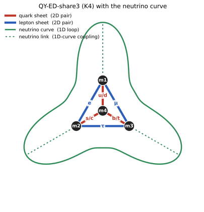

# neutrino-1D.md — neutrinos on a 1D shaped curve

**Status:** Working hypothesis / how-to. Documents the case for hosting neutrinos on a 1D closed curve with N-fold symmetric shape (rather than a 2D Ma(i,j) sheet), the reasons the lowest three modes naturally fit the three-generation neutrino spectrum, and the development strategy.

**Cross-references:**
- [electron-tube.md](electron-tube.md) — bilobe (N=2) tube hosting T(1, 2) as the electron; sets the framework's "shape × twist" vocabulary
- [tube-function.md](tube-function.md) — generalized N-fold-symmetric polar curve r(φ) = R·[1 + a₁·cos(Nφ) + a₂·cos(2Nφ)]; supplies the shapes used here on a 1D substrate
- [config-neutrino.md §ND](config-neutrino.md) — the neutrino-delta config (three 2D sheets), the multi-pair alternative to the 1D substrate
- [candidates.md](candidates.md) — current topology candidates (none of which yet uses 1D substrates)
- [../../metric-mass/](../../metric-mass/) — single-compact-dimension framework; chargeless ±n mode pairs
- [config-neutrino.md §NC](config-neutrino.md) — the NC (Neutrino Curve) config; **carries the numerical findings** for this picture
- [cand-QY-ED.md](cand-QY-ED.md) — the K4 candidate (QY-ED-share3) this curve interconnects to (§6.4)
- [baryon-number.md](baryon-number.md) — the cycle/cut graph language used in §2.3 and §6.4
- [mode-stability.md](mode-stability.md) — the decay-dynamics picture; the neutrino as the energy-and-charge-neutral sink

---

## 0. Status note — Phase B run; doublet split solved by a Wilson-loop flux (2026-05-19)

This document is the **original hypothesis and roadmap**; it predates the numerical test. Phase B (§8.2) has been executed; the findings live in [config-neutrino.md §NC.5–NC.6](config-neutrino.md). Summary:

- **The wall, and the fix.** A plain C_N-symmetric curve under the intrinsic operator locks the lowest three modes to a 1 : 1 : 2 ratio and hits a ~6 % wall — the n = ±1 doublet is symmetry-protected and no shape perturbation splits it. The fix is a **Wilson-loop flux** Φ threaded through the closed loop (the chirality breaker of §4.3, candidate 3): it shifts mode n to (n + f) with f = Φ/2π, splits the doublet *linearly* in f, and brings the fit to **~1.5 %**. The flux is sourced by the substrate's antisymmetric chirality χ_anti ([grid-primitive ch.9](../../grid-primitive/09-chirality-asymmetry.md)) — a substrate constant, not a free knob. Script: [scripts/neutrino_1d_fit.py](../scripts/neutrino_1d_fit.py); output [outputs/neutrino_1d_fit.txt](../outputs/neutrino_1d_fit.txt).
- **Oscillation / PMNS mixing — not yet computed.** Phase C (§8.3) has not been run. But the same χ_anti that splits the doublet is expected to source θ₁₃ and δ_CP, so the §4.3 linkage now has a concrete physical carrier.
- **Caveats.** The flux breaks time-reversal, so the exact Majorana structure of §3.3 becomes slightly broken — consistent with δ_CP ≠ 0, and with the unsettled empirical status of Majorana neutrinos. Q = 0 (the load-bearing result) is untouched. A light n = 0 state at ~1.6 meV is predicted. The residual ~1.5 % sits on m₃.
- **Mode-occupancy fork — two candidates kept open (2026-05-23).** The Phase B fit hard-codes the assignment (ν₁, ν₂, ν₃) ↔ modes (n = −1, +1, −2) — a "1 : 1 : 2" triple, predicting **normal mass ordering**. An equally consistent alternative takes the three *genuine lowest rungs* of the loop ladder, (ν₃, ν₁, ν₂) ↔ (n = 0, −1, +1), predicting **inverted mass ordering** with one near-massless eigenstate. Both fit the measured Δm² splittings with the same two knobs (R/c, f). See §4.4 for the arithmetic and §9 open question 2. JUNO / DUNE will pick between them this decade.

The structural arguments of §1–§7 (no EM charge, Majorana, three-fold generation count) stand; the §8 spectrum-fit roadmap now has a working mechanism — with a live ordering fork in §4.4.

---

## 1. Motivation

Two empirical features of neutrinos are awkward to reproduce on a 2D Ma(i, j) sheet but fall out for free on a 1D substrate:

- **No electric charge.** In the metric-charge framework, EM charge is a topological label of a *two*-dimensional Bloch state (the boundary winding k_θ = m_r − τ·m_t, plus the cross-section's per-region turning ledger). A 1D periodic dimension has only one winding number and no closure rule in the metric-charge sense, so there is no slot for an EM-charge label to occupy. Neutrinos appearing as uncharged isn't engineered with τ and σ; it falls out of the dimension count.

- **Majorana symmetry.** On a 1D circle, modes ψ_n ∝ exp(2πi·n·s/L) and ψ_−n are degenerate (mass ∝ |n|), and any real combination ψ_n + ψ_−n* is its own complex conjugate. The ψ ↔ ψ̄ distinction has no geometric content at the level of the substrate — the equality of particle and antiparticle is structural rather than imposed. Matches the empirical pull (oscillation, neutrinoless double-β constraints) toward Majorana neutrinos.

Two empirical features that *don't* fall out on a pure circle, but do fall out on a *shaped* closed 1D curve:

- **Three mass eigenstates** with the observed hierarchy m_1 ≈ m_2 < m_3.
- **Mixing structure** (PMNS) with large θ_12, near-maximal θ_23, small θ_13.

Both come from imposing N-fold symmetry on the curve's shape rather than leaving it a featureless circle. This document develops that picture.

---

## 2. The substrate

The neutrino dimension is a closed 1D curve with N-fold symmetric shape:

<!-- r(φ) = R · [1 + a₁·cos(N·φ) + a₂·cos(2N·φ)] -->
$$
r(\varphi) \;=\; R \cdot \bigl[\, 1 \,+\, a_1 \cos(N\varphi) \,+\, a_2 \cos(2N\varphi) \,\bigr]
$$

— exactly the family from [tube-function.md §2](tube-function.md), now used to define a single closed 1D curve (parameterized by arc length s ∈ [0, L)) rather than the cross-section of a 2D tube.

The curve closes onto itself after one full traversal (s = 0 maps to s = L); no twist parameter τ is needed because there is no second dimension to wrap around. The cross-section parameters (N, a₁, a₂) here play a different physical role than they did for tube cross-sections: they shape the *substrate dimension itself* rather than shaping a face of a 2D sheet.

### 2.1 Two interpretations of "shaped 1D dimension"

The same family supports two physical pictures:

**Embedding picture.** The curve is a closed loop in a 2D embedding plane. A mode ψ confined to the curve obeys the Jensen-Koppe / da Costa effective Hamiltonian, which adds a geometric potential to the kinetic operator:

<!-- V_geom(s) = -(ℏ² / 8m) · κ(s)² -->
$$
V_{\text{geom}}(s) \;=\; -\,\frac{\hbar^2}{8m}\, \kappa(s)^2
$$

where κ(s) is the curve's signed curvature at arc length s. The potential is attractive everywhere (κ² ≥ 0), with depth proportional to local curvature squared.

**Intrinsic picture.** The curve is an abstract 1D manifold with a non-uniform metric ds = g(φ) dφ, where g(φ) is the local arc-speed (= r(φ) in the polar form). The Laplacian on this manifold is

<!-- Δψ = (1/g) d/dφ ((1/g) dψ/dφ) -->
$$
\Delta \psi \;=\; \frac{1}{g(\varphi)} \frac{d}{d\varphi}\!\left(\frac{1}{g(\varphi)} \frac{d\psi}{d\varphi}\right)
$$

Modes are eigenfunctions of −Δ with eigenvalues ω², and the mass spectrum is m_n = ℏω_n / c.

The two pictures give the same band structure to leading order but differ in subleading corrections. Section 4 develops the spectrum for both and notes where they diverge.

### 2.2 Why the same shape family as for 2D cross-sections?

Pragmatic: the tube-function family is the simplest closed-form C^∞ N-fold-symmetric closed curve, parameterized by knobs already understood. The visualizer ([viz/tube-lab](../../../viz/tube-lab.html)) already plots it. The lobe / saddle vocabulary carries over even though the physics interpretation differs.

Conceptual: a 1D substrate is the **degenerate limit of a 2D sheet with one infinitesimal dim**. The [tiny-tube reading on Ma(5, 6)](#5-relation-to-the-tiny-tube-2d-picture) makes this concrete: as L_tube → 0, the 2D sheet's m_t = 0 sector loses its closure label and becomes an effectively-1D curve. The cross-section's shape *becomes* the 1D dimension's shape in this limit.

### 2.3 The marked loop is a 1D delta

A neutrino curve does not sit in isolation; it couples to a host candidate at a few points (§6.4). Mark those attachment points on the loop and the closed curve becomes a graph: with **three** attachment points the loop is a **3-cycle** — three nodes, three arcs — a triangle, i.e. a **1D delta**. The three arcs are the curve's three legs.

This gives the substrate a natural three-fold decomposition for free: the three arcs are a ready-made three-component basis (used as the flavor basis in §6.4). It also places the curve cleanly in the cycle/cut language of [baryon-number.md](baryon-number.md) — a 1D delta is a **cycle**, and a cycle is what carries a winding. The Wilson-loop flux that splits the doublet (§0, §4.3) is exactly such a winding, so the substrate **must** be a cycle to host it.

A 1D **wye** — a Y-graph: a hub with three arcs and no closed loop — is the other three-fold 1D graph. It is a *tree*, not a cycle: it carries no winding, so it cannot host the flux, and it predicts no mass pattern (three free arm lengths fitting three masses is an underdetermined exercise). The 1D wye is therefore not a substrate candidate. It reappears only as the *connector* structure of §6.4 — the three spokes that join the loop to the host.

---

## 3. Mode quantum numbers; charge; Majorana

### 3.1 Quantum numbers

For a closed 1D curve, modes are labeled by a single integer n (the "winding number" around the loop) and, on a *shaped* curve, by a band index b distinguishing higher-energy excitations within each n-sector.

A useful reorganization for an N-fold symmetric shape: by Bloch decomposition, modes within each band split into N sub-bands labeled by the discrete quasi-momentum q ∈ {0, 1, …, N − 1} (mod N), corresponding to the irreducible representations of the cyclic group C_N. The total label is (b, q).

### 3.2 No EM charge

EM charge is the boundary winding k_θ in the 2D-sheet framework. A 1D curve has only one winding (n, or equivalently q in each band) and no closure-rule slot for a separate charge label. So all modes on the curve are EM-neutral.

The shape of the curve does *not* introduce a charge label; only an additional dimension would. This is the substrate-level reason neutrinos are uncharged.

### 3.3 Majorana

For each (b, q) ≠ (b, 0), the conjugate state is (b, −q mod N) (= (b, N − q)). Because the Hamiltonian commutes with complex conjugation (time-reversal), these conjugate pairs are *degenerate*. Their real combinations are eigenstates of complex conjugation — Majorana states.

The (b, 0) state is real by construction (totally symmetric under C_N); it is its own conjugate.

So *every* mode on the 1D curve is naturally Majorana: either as a real C_N-invariant singlet or as a real combination of a conjugate pair.

---

## 4. The lowest three modes for N = 3

### 4.1 Band-structure outline

For a closed curve of total length L with an N-periodic shape (sub-period L/N), the Bloch decomposition splits each band into N states labeled by q ∈ {0, …, N − 1}. The lowest band's three lowest states for N = 3 are:

- **q = 0 (A representation, singlet):** wavefunction totally symmetric under the C_3 rotation. Real, no phase winding between the three fundamental domains.
- **q = ±1 (E representation, doublet):** complex Bloch states with one phase wind of e^{±2πi/3} per fundamental domain. For a real Hamiltonian these two are conjugate and degenerate.

So the lowest band has the structure **one singlet + one degenerate doublet** — three states total — before any C_3-breaking perturbation.

### 4.2 Ordering: which is heavier, singlet or doublet?

Both orderings are accessible depending on the shape parameters; the calculation is required to determine which holds for a given (N, a₁, a₂).

**Standard tight-binding intuition (attractive potential, lowest band).** For a periodic attractive potential with three deep wells (one per fundamental domain), the lowest band is well-approximated by a tight-binding model on three sites with bonding-favored hopping. The symmetric q = 0 combination then sits *below* the doublet:

<!-- ε_q = ε₀ − 2t · cos(2π q / N) -->
$$
\varepsilon_q \;=\; \varepsilon_0 \;-\; 2t \,\cos\!\left(\frac{2\pi q}{N}\right)
$$

For N = 3: ε_0 = ε₀ − 2t (singlet, lowest), ε_{±1} = ε₀ + t (doublet, t above the band center). Gap 3t between singlet and doublet.

**Reversed ordering (second band, frustrated lattice, or repulsive potential).** If the relevant sub-band has a node structure that flips the hopping sign, or if the potential is repulsive at the high-curvature points, the singlet sits *above* the doublet. The energies are then ε_0 = ε₀ + 2t (singlet, highest) and ε_{±1} = ε₀ − t (doublet, lowest), with the same 3t gap.

**Which matches observed neutrinos?** The observed mass-squared hierarchy is

Δm²_21 = m_2² − m_1² ≈ 7.5×10⁻⁵ eV²    (small)
Δm²_31 = m_3² − m_1² ≈ 2.5×10⁻³ eV²    (large; ratio ≈ 33)

This requires m_1 and m_2 close, m_3 far above. That is the **doublet-below-singlet** pattern: m_1, m_2 = doublet halves; m_3 = singlet. So the geometry must realize the *reversed* ordering above — either via the second-band reading or via a curve shape whose potential frustrates the bonding combination.

The strategy below tests both readings numerically; whichever recovers the observed sign is the right interpretation for the neutrino curve.

### 4.3 The doublet split

In the unbroken C_3 limit the doublet is exactly degenerate. The observed Δm²_21 ≠ 0 requires breaking C_3 → C_1 by some perturbation. Three candidate breakers:

| Source | Mechanism | Geometric signature |
|---|---|---|
| **Asymmetric shape** | The three lobes (or saddles) aren't all the same size. Encode by replacing the symmetric a₁ cos(3φ) by a₁ cos(3φ) + δ·cos(φ + φ₀), introducing a 1-fold harmonic. | Permanent curve asymmetry. |
| **Coupling through a shared dim** | The neutrino curve is connected to a sector that distinguishes a direction (a charged-lepton sheet that picks out a flavor axis). | Localized perturbation at the shared dim's intersection points. |
| **Small chirality / shear** | A continuous σ-like parameter on the curve that distinguishes traversal direction; breaks time-reversal and lifts the conjugate-pair degeneracy. | The two doublet halves separate by a CP-odd phase. |

Observed ratio Δm²_31 / Δm²_21 ≈ 33 says the C_3 breaking is **~3 % of the singlet–doublet gap**. A small natural-looking perturbation — consistent with "C_3 is the substrate's nominal symmetry, broken slightly by external couplings."

The same perturbation that lifts the doublet degeneracy is the natural source of the observed θ_13 ≠ 0 in the mixing matrix; the two observations are *linked* rather than independent.

**Update (Phase B — see §0).** The third breaker, *small chirality*, is the one that has been realized and numerically tested. It enters the operator as a **Wilson-loop flux** through the closed loop — sourced by the substrate's antisymmetric chirality χ_anti ([grid-primitive ch.9](../../grid-primitive/09-chirality-asymmetry.md)) — and brings the mass fit to ~1.5 % (config-neutrino §NC.5). The first breaker (asymmetric shape) was tried earlier and is too weak: a 1-fold shape harmonic splits the doublet only at second order, whereas the flux splits it at first order.

### 4.4 Mode-occupancy fork: which three rungs?

The §0 update assigned the three observed neutrinos to loop modes **n = −1, +1, −2**. That is one of *two* equally consistent assignments to the same flux-shifted ladder; the other takes the three genuine *lowest* rungs, **n = 0, −1, +1**. The choice is not internal to the curve's mode structure — it commits the framework to a specific neutrino mass ordering.

**Common arithmetic.** Under flux fraction f = Φ/2π the closed-loop modes have m ∝ |n + f| (linear dispersion; eigenvalue (n+f)²). The plain ladder n ∈ {0, ±1, ±2, ±3, …} is the spectrum from which three rungs become (ν₁, ν₂, ν₃). Two assignments survive structurally — they both produce a "1 + 2" pattern (one isolated mode plus a tight doublet) that matches the observed shape of the neutrino spectrum.

| Choice | Modes | Masses (∝) | Isolated mode | Ordering |
|---|---|---|---|---|
| **A** (current §0 fit) | n = −1, +1, −2 | \|1−f\|, \|1+f\|, \|2−f\| | n = −2 at top | **normal** (m₁, m₂ light; m₃ ≈ 2 m₁ above) |
| **B** (alternative) | n = 0, −1, +1 | \|f\|, \|1−f\|, \|1+f\| | n = 0 at bottom | **inverted** (m₃ ≈ 0 alone; m₁, m₂ close above) |

**Knob count is the same for both** — c (overall dispersion scale) and f (flux fraction) — two free parameters, two measured splittings (Δm²_sol ≈ 7.5×10⁻⁵ eV², Δm²_atm ≈ 2.5×10⁻³ eV², ratio ≈ 1/33). Solving each:

| | A: {−1, +1, −2} | B: {0, −1, +1} |
|---|---|---|
| Δm²_small / Δm²_large formula | 4f / (3 − 2f) | 4f / (1 − 2f) |
| f reproducing ratio 1/33 | ≈ 0.022 | ≈ 0.0075 |
| c reproducing Δm²_large | ≈ 29 meV | ≈ 50 meV |
| Predicted masses (meV) | 28.5, 29.7, 57.6 | 0.4, 50.0, 50.8 |
| Σm_ν (meV) | ≈ 116 | ≈ 101 |
| Frequency triple (THz) | 6.9, 7.2, 13.9 | 0.09, 12.1, 12.3 |
| Lightest eigenstate | m₁ ≈ 28 meV (compressed spectrum) | m₃ ≈ 0.4 meV (near-massless) |
| Mass ordering predicted | **normal** | **inverted** |

(The §NC.5 fit used f ≈ 0.051, not 0.022 — it was fit to working masses 30 / 33 / 60 meV, not to the measured Δm² ratio directly. Retuning to the measured ratio gives the table values above.)

**Why the ordering is forced for choice B.** Under any flux with |f| < ½, the constant mode n = 0 has the smallest |n+f| and is necessarily the *lightest* — the constant function always minimizes the Rayleigh quotient on the loop. So choice B is locked to inverted ordering (light isolated ν₃ = n = 0); no shape perturbation, deformation, or further chirality moves n = 0 off the bottom. Choice A excludes n = 0 entirely and grabs the n = −2 mode instead, leaving the (n = ±1) doublet as the *light* pair and the lone heavy mode (n = −2) on top — that is normal ordering.

**Why both are kept open.**

- *Cleanliness.* Choice B is the natural "three lowest rungs"; choice A excludes n = 0 and skips a rung to reach n = −2. The choice-A reading needs a *structural* reason n = 0 is omitted — that the constant mode is the loop's non-propagating zero/gauge mode, with no particle interpretation. That reason is plausible but not yet derived.
- *Fingerprint.* The "two near 7 THz + one near 14 THz" pattern referenced informally for the framework's neutrino spectrum is the choice-A signature (the n = −2 rung is literally ~2× the doublet). Choice B replaces it with a near-zero mode plus a tight pair near 12 THz — a quite different observable triple.
- *Experimental status.* Global oscillation fits currently *mildly* favor normal ordering (≈ 2σ, not decisive). Cosmology mildly disfavors inverted (choice B's Σm_ν ≈ 0.10 eV is uncomfortably close to the ≈ 0.12 eV bound). JUNO and DUNE will resolve the ordering this decade — the same experiment selects between A and B.

**Honest summary.** The "why not n = 0" gap flagged earlier in this section is *the same question* as the mass-ordering choice. Adopting choice A commits the framework to normal ordering plus a structural exclusion of the n = 0 mode; adopting choice B commits to inverted ordering with n = 0 as the lightest physical neutrino (ν₃). Both are live; the document holds them as parallel candidates until experiment selects, and §NC.7 in [config-neutrino.md](config-neutrino.md) carries the same fork at the config level.

**Operational note.** The fit script [scripts/neutrino_1d_fit.py](../scripts/neutrino_1d_fit.py) presently hard-codes choice A. To genuinely keep both candidates symmetric, the mode triple needs to be a CLI parameter (e.g. `--modes=-1,1,-2` vs `--modes=0,-1,1`) so a choice-B fit can be run and compared at the same precision. This is downstream work, not part of the present documentation pass.

---

## 5. Relation to the tiny-tube 2D picture

A complementary reading: the neutrino does sit on a 2D Ma(i, j) sheet, but L_tube is small enough that m_t ≥ 1 modes are inaccessible at neutrino energy scales. The m_t = 0 sector is then effectively a 1D curve (the ring dimension), with the *cross-section* shape playing the role of the "1D dimension's shape" in this document.

In this limit:

- The charged-lepton on the same Ma(i, j) pair is the m_t = 1 mode, mass ~1/L_tube.
- The neutrino is the m_t = 0 sector with whatever ring quantum number is allowed.
- The "1D-circle / shaped-curve" structure of this document describes the m_t = 0 sector's ring spectrum.

So the two pictures are **equivalent under the identification L_tube → 0 limit ↔ 1D-curve substrate**. Charged-lepton physics is on a 2D sheet; neutrino physics is the 1D-projected reading.

This is structurally appealing because it folds the neutrino sector into the same architecture as the charged leptons (one Ma(i, j) pair per lepton generation), with the 1D-collapse only at m_t = 0. It also gives the SU(2)_L doublet (ν_e, e) of the Standard Model a geometric origin: two m_t sectors of the same pair.

---

## 6. Mixing (PMNS) and tribimaximal structure

### 6.1 Flavor vs mass basis

Flavor eigenstates (ν_e, ν_μ, ν_τ) are determined by which charged-lepton sheet a neutrino couples to via the weak interaction. Mass eigenstates (m_1, m_2, m_3) are the (b, q) eigenbasis of the curve's Hamiltonian. They are related by a unitary mixing matrix U_PMNS.

### 6.2 Tribimaximal as the natural C_3-symmetric limit

If three charged-lepton sheets sit at positions on the C_3-symmetric neutrino curve related by 2π/3 rotations, the unbroken-C_3 PMNS structure is the **tribimaximal** matrix:

<!-- U_TBM = (1/√6) · [[2, √2, 0], [-1, √2, √3], [-1, √2, -√3]] -->
$$
U_{\text{TBM}} \;=\; \frac{1}{\sqrt{6}}
\begin{bmatrix}
2 & \sqrt{2} & 0 \\
-1 & \sqrt{2} & \sqrt{3} \\
-1 & \sqrt{2} & -\sqrt{3}
\end{bmatrix}
$$

This gives θ_12 ≈ 35.3° (observed 33° — good), θ_23 = 45° (observed ≈ 49° — good), θ_13 = 0 (observed ≈ 8.6° — needs the same perturbation that splits the doublet).

### 6.3 Beyond tribimaximal

The exact observed PMNS deviates from TBM in the same way the doublet deviates from degeneracy. A single small C_3-breaking parameter ε ≈ 3 % should simultaneously:

1. Lift the (m_1, m_2) doublet by Δm²_21,
2. Move θ_13 from 0 to ≈ 8.6°,
3. Shift θ_12 from 35.3° to 33° and θ_23 from 45° to ≈ 49°.

If a single physical parameter can reproduce all four deviations within experimental error, that is strong evidence for the 1D-curve picture. If multiple independent parameters are required, the structural fit is weaker.

### 6.4 Interconnection to a host candidate

§6.2 placed three lepton couplings at 2π/3 on the curve and obtained tribimaximal mixing. On the K4 candidate QY-ED-share3 ([cand-QY-ED.md](cand-QY-ED.md)) those couplings have a concrete home: the **three corners of the electron delta** — shared dims the candidate already carries. The neutrino curve attaches to the three corners at 120°, C₃-symmetrically, and the assembled neutrino structure is two parts:

- a **cycle** — the neutrino delta-loop (§2.3): it carries the masses (the NC band structure) and the doublet-splitting Wilson flux;
- a **wye of three connectors** — one 1D-curve link from the loop out to each corner.

So the full structure is a cycle plus a connector-wye — the cycle/cut pairing of [baryon-number.md](baryon-number.md) again, with the mass-bearing part a cycle and the connecting part a tree.

**Why the 120°, C₃-symmetric attachment matters.** The three arcs of the 1D delta (§2.3) are the **flavor-localized basis**: a packet on one arc couples to one corner, hence to one charged-lepton flavor. The delocalized q = 0, ±1 modes are the **mass basis**. Sampling the doublet modes at three points 120° apart evaluates them at the three cube roots of unity, so the flavor↔mass change of basis is the C₃ discrete Fourier transform — the tribimaximal matrix of §6.2. And because the attachment is C₃-symmetric it does **not** break C₃: it adds no uncontrolled doublet-splitter, leaving the Wilson flux as the sole, controlled source of m₁ ≠ m₂.

**Connection type.** The K4 sheets are 2D `Ma(i, j)` pairs; the neutrino's three links are **1D-curve** couplings — a lighter kind of connection. Their precise form is open (config-neutrino §NC; [mode-stability.md §10](mode-stability.md)): it is the cross-sector channel by which the neutrino — the energy-and-charge-neutral sink of mode-stability §5 — reaches the rest of the candidate.

The assembled candidate is shown below: the quark wye centred in the electron delta, the 1D neutrino curve as the outer loop, the two connection kinds drawn heavy (2D sheet) versus dotted (1D-curve).

The concentric "enclosing" layout is a drawing device — it makes the C₃ symmetry legible at a glance. It carries no physics: the masses are intrinsic and embedding-blind, and the Wilson flux is W = A·L, independent of what the loop encircles ([grid-primitive ch.9](../../grid-primitive/09-chirality-asymmetry.md)).

---

## 7. Why N = 3 is uniquely clean

| N | Lowest-band irreps (C_N) | Lowest 3 modes | Verdict |
|---|---|---|---|
| 2 | A, B | two singlets | too few states; only two generations |
| **3** | **A, E** | **1 singlet + 1 degenerate doublet** | **exactly 3 modes, clean band gap above** |
| 4 | A, B, E | 1 singlet + 1 doublet + 1 singlet | 4 states in lowest band; predicts a 4th light neutrino |
| 6 | A_1, A_2, E_1, E_2 | (depends on shape) | 6 states in lowest band; predicts more light states |

For N ≥ 4 the lowest band carries more than three modes, predicting extra light neutrinos that haven't been observed (with relevant masses below the experimental "fourth neutrino" bounds). Only N = 3 fills the three-generation slot exactly before a band gap.

The same N = 3 that gives the proton-clover its fractional Z_3 charge ledger ([clover-quarks](../../sheet-proton/work/clover-quarks.md)) also gives the 3-generation neutrino spectrum on a 1D substrate. **Three-fold symmetry may be the framework's universal "generation count" mechanism**, appearing in different forms on different sheets.

---

## 8. Development strategy

### 8.1 Phase A — substrate vocabulary

A short-fuse task: settle the language for "1D dimension with non-trivial shape." Two readings, both consistent with the band structure:

1. *Embedding picture:* the curve is the boundary of a small 2D region; modes obey the Jensen-Koppe Hamiltonian H = −(ℏ²/2m) ∂_s² − (ℏ²/8m) κ(s)². The geometric potential is an emergent feature, not a primary one.
2. *Intrinsic picture:* the curve is an abstract 1D manifold with non-uniform metric ds = r(φ) dφ. Modes are Laplacian eigenstates; "shape" enters via the metric, not via an embedding potential.

The intrinsic picture is more natural for the framework (which treats dimensions as abstract closed objects, not embedded surfaces). The embedding picture is more familiar from molecular physics. Both predict the same singlet-plus-doublet structure but differ in the *quantitative* gap and the corrections.

Action: write a short subsection in [architecture.md](architecture.md) that adds the 1D-shaped-dimension as a substrate primitive. Specify which reading the framework adopts.

### 8.2 Phase B — spectrum calculation  *(executed — see §0 Status note)*

Goal: compute the lowest three eigenvalues of the curve's Hamiltonian as functions of (a₁, a₂) for N = 3. Test whether the observed Δm²_31 ≈ 2.5×10⁻³ eV² fixes (R, a₁, a₂) to a physically sensible scale (compared to other neutrino-mass-scale lengths in the project).

Method options:
- **Analytic perturbation theory in a₁** (small): start from the uniform-circle eigenstates and add the shape as a perturbation. Gives the singlet–doublet gap to leading order in a₁².
- **Numerical Laplacian diagonalization:** discretize the curve into n ≫ N points, build the Laplacian matrix on the non-uniform mesh, diagonalize. Computes the spectrum for arbitrary (a₁, a₂) without small-parameter assumption.

The numerical route was implemented as [scripts/neutrino_1d_fit.py](../scripts/neutrino_1d_fit.py). It takes the shape parameters plus a Wilson-loop flux and outputs the three lowest eigenvalue masses. Result: a plain C_N curve hits a ~6 % wall, resolved to ~1.5 % once the flux is added — see the §0 Status note and config-neutrino §NC.5–NC.6.

Outputs:
- Plot of singlet vs doublet energies in (a₁, a₂) plane.
- Region of parameter space where the *observed* ordering (doublet below singlet) holds.
- Identification of the (a₁, a₂) value that gives the observed Δm²_31 with realistic R.

### 8.3 Phase C — symmetry-breaking source

Goal: identify which of the three candidate C_3-breaking sources (asymmetric shape, shared-dim coupling, chirality) gives the observed pattern of Δm²_21, θ_12, θ_13, θ_23 deviations with a *single* small parameter.

Method: extend the Phase B Hamiltonian to include each candidate breaker (each as a one-parameter perturbation), compute the full 3×3 mixing matrix and the doublet splitting, and compare to observed values. Whichever single perturbation best fits all four observables is the right mechanism.

This is a model-building exercise: the comparison should be quantitative (sum of squared deviations from observed values, or similar) and should rule out at least one of the three candidates by an order of magnitude or more.

### 8.4 Phase D — connection to charged leptons

If the 1D-collapse / tiny-tube reading of §5 is adopted, each lepton generation lives on one Ma(i, j) pair, with the charged lepton at m_t = 1 and the neutrino at m_t = 0 (1D-curve sector). Three pairs, six L parameters (three L_tube, three L_ring), six masses to fit.

Method: per-generation fit, using the general solver [cand_solver.py](../scripts/cand_solver.py) extended to include the neutrino sector. If the fit closes to a few percent across both charged leptons and neutrinos using the same six geometric parameters, that is strong evidence for the unification.

### 8.5 Phase E — promotion to derivation

If A–D all close, the 1D-curve neutrino picture is mature enough to promote out of work-folder hypothesis into the project's mathematical-derivation track. A natural sequence:

1. Add "1D-shaped-dimension primitive" to the framework's substrate vocabulary in [architecture.md](architecture.md).
2. Write a chapter-level derivation of the 1D-curve mode spectrum (analytic or semi-analytic) for arbitrary shape.
3. Add the lepton unification as a structural result in the charged-lepton / neutrino sector documentation.
4. Predict and publish: neutrinoless double-β rate, oscillation parameter corrections, hint at fourth-neutrino exclusion from the N = 3 cleanliness.

---

## 9. Open questions

1. **Which Hamiltonian?** The Jensen-Koppe / intrinsic-Laplacian split has to be resolved. They differ in subleading orders but agree on the structural result (singlet + doublet). Phase A.

2. **Spectrum ordering — live fork between mass orderings.** Tight-binding gives singlet below doublet (attractive standard); observed pattern wants singlet above doublet. **Update (Phase B run + 2026-05-23 review):** the flux picture admits *two* equally consistent mode-occupancy choices, each fitting the measured Δm² ratio with the same two knobs (R/c, f):
   - **Choice A:** modes (n = −1, +1, −2) → light doublet + heavy ≈ 2× singleton → **normal mass ordering** (m₁, m₂ light; m₃ above). Requires a structural reason the n = 0 mode is excluded.
   - **Choice B:** modes (n = 0, −1, +1) → near-massless ν₃ + heavy close pair → **inverted mass ordering**. Forced by the constant mode always sitting at the bottom for |f| < ½.

   The framework therefore *predicts* the mass ordering, depending on which choice is structurally correct. See §4.4 for the arithmetic and config-neutrino §NC.7. The ordering is experimentally decidable by JUNO / DUNE; cosmology (Σm_ν bound) is an independent mild discriminator.

3. **C_3-breaking source.** Asymmetric shape vs shared-dim coupling vs chirality — only one of these is likely to fit all four deviations from TBM with a single parameter. Phase C.

4. **Generation hierarchy.** Why is L_ν^(1) > L_ν^(2) > L_ν^(3) (or in some order), and how does it relate to the charged-lepton tube-radius hierarchy? Same problem the existing candidates face; not specific to this picture.

5. **Flavor-change protection.** If the tiny-tube reading is adopted, neutrinos and charged leptons sit on the same pair as different m_t sectors. What forbids ν_e → e + γ-like transitions? Some geometric protection of m_t-sector transitions on a single pair is needed.

6. **CP violation.** The chirality reading of C_3-breaking would naturally introduce a CP-odd phase (δ_CP in PMNS). Observed value of δ_CP is debated but seems nonzero. Phase C should pin this down.

---

## 10. Summary

A 1D closed curve with N-fold symmetric shape is a natural neutrino substrate because the dimension count automatically removes EM charge and the closed-loop topology automatically gives Majorana symmetry. Imposing N = 3 shape gives exactly three lightest modes — one C_3 singlet plus one degenerate doublet — matching the three-generation count with a clean band gap to anything heavier. A small C_3-breaking perturbation lifts the doublet by Δm²_21 ≪ Δm²_31, simultaneously moves θ_13 from 0 to its observed nonzero value, and shifts θ_12, θ_23 from tribimaximal to observed PMNS. The mass scale and the breaking parameter are testable from a single small numerical calculation.

The picture is consistent with the existing tube-function vocabulary (same shape family, used on a different substrate type) and unifies with the charged-lepton sector via the tiny-tube limit of a 2D Ma(i, j) sheet. The development strategy is concrete: write the spectrum calculator (Phase B), identify the C_3-breaking source (Phase C), and fold the result into a per-generation lepton-pair unification (Phase D), then promote to derivation if all close.

Of the geometric reframings the project has considered for the neutrino sector, this is the most parsimonious. The proton-clover, electron-bilobe, and neutrino-1D-curve all share the same shape family and the same N-fold-symmetry vocabulary; only the substrate dimensionality (2D for charged sectors, 1D for neutrinos) and the role of the cross-section parameters (shape of a face vs shape of the substrate itself) differ.
