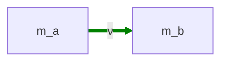
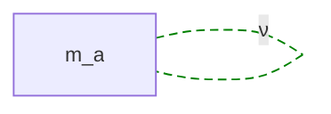

# neutrino-configs.md — neutrino-sector topology configurations

**Purpose:** catalog the topology configurations available for producing 3 neutrino mass eigenstates at the observed meV scale, with oscillation behavior modelled by the structure of the substrate the modes live on.

**Neutrino sector requirements:** host 3 mass eigenstates (m_ν₁ ≈ 30 meV, m_ν₂ ≈ 33 meV, m_ν₃ ≈ 60 meV — span ~2×) with **no EM charge** (Q = 0) and **Majorana-like equivalence** of particle and antiparticle (or, at minimum, an architecture that doesn't *forbid* Majorana behavior). The meV scale requires a macroscopic substrate (min L ≳ 4 cm) — far larger than the fm-to-mm dim sizes that suffice for quark and electron sectors.

**Labelling convention (local to this file):** dims are named `m_a`, `m_b`, … abstractly. The configs say nothing about which globally-labelled dims they map onto — that is a candidate-level choice ([candidates.md](candidates.md)).

---

## N2 — Neutrino 2D Sheet

Single pair topology `Ma(a, b)` — one 2-dim sheet hosting all three ν mass eigenstates via multiple closure modes per pair.

### N2.1 — How three mass eigenstates emerge

A single 2D pair under the strict closure-mode rule ([architecture.md §3.3.1](architecture.md)) has only **two** modes at m_t = 1: T(1, 1) and T(1, 2). Three ν mass eigenstates require either:

- **Sign-flipped m_t modes.** Per [metric-charge ch. 4](../../metric-charge/04-the-closure-condition.md), the closure rule `m_t | m_r` with both nonzero admits T(1, n) for n ∈ ℤ \ {0} — *including negative m_t*. The trio T(1, 1), T(−1, 1), T(1, 2) (or similar) gives **three distinct closure-satisfying modes** with three distinct detunings δ = m_r − σ_eff·m_t when σ_eff ≠ 0. This is the mechanism used by model-F's R49 ν-sheet.

- **Shear-resonance trio (R49-style).** With σ_eff tuned to a specific near-integer value, the three nearby modes (T(1, 1), T(1, 2), T(2, 3) or similar) give three close-but-distinct masses. This is structurally the same as the shear-resonance mechanism that R53 uses for charged leptons, applied at much smaller σ_eff and much larger L.

Both mechanisms live on a single 2D pair — no extra dims required. Oscillation phenomenology (mass eigenstate mixing into flavor eigenstates) is modelled by the relationships between the three modes and their detunings, in spirit consistent with the existing R49 / model-F treatment.

### N2.2 — Geometric requirements

For meV-scale masses, the mass formula m ≈ 2πℏc·max(1/L_T, δ/L_R) requires at least one of L_a, L_b to be at the macroscopic scale:

- **Fat-torus, δ ≈ 0.1:** L_R ≈ 2πℏc·δ/m ≈ 4 × 10⁹ fm ≈ **4 mm**
- **Fat-torus, δ ≈ 0.001 (near-resonance):** L_R ≈ **40 μm**
- **Thin-torus:** L_T ≈ **4 cm**

Both L_a, L_b are free parameters of N2; at least one must satisfy the macroscopic floor. The other can be anywhere from sub-fm to macroscopic depending on the mode mechanism (sign-flipped vs near-resonance).

### N2.3 — Fit status

**Sign-flipped m_t modes, spot-checked.** A least-squares spot-check with sign-flipped modes admitted and L varied across cm–dm scales:

| L_a (fm) | Best max \|Δ%\| | L_b (fm) | Mode trio |
|---:|---:|---:|---|
| 1 × 10¹⁰ | 167% | 1 × 10¹⁵ | T(±1, n) — wrong assignment |
| 4 × 10¹⁰ (4 cm) | **1.05%** | 2.3 × 10¹¹ | T(−1, 1), T(1, 1), T(−1, 2) |
| 1 × 10¹¹ (10 cm) | **0.74%** | 4.3 × 10¹⁰ | T(−1, 1), T(1, 1), T(1, 2) |

N2 is viable to roughly **~1%** with sign-flipped modes on a fresh single pair at the cm scale. A canonical least-squares script for N2 with closure-mode admittance has not been formalized yet; the spot-check is preliminary.

### N2.4 — Verdict

**Working approximately at ~1%** with sign-flipped modes; precision is limited by the spot-check not having been refined. Architecturally simple (1 pair, 2 dims). The Q = 0 result is consistent but not *automatic* — it relies on the σ_eff = 0 reading of the closure rule (uncharged when modes are sign-symmetric pairs). Majorana-like equivalence emerges from the pairing of T(1, n) and T(−1, n) modes, not from a structural feature.

---

## N1 — Neutrino 1D Shaped Substrate

Single 1D closed curve on dim `m_a` — no pair, no 2D structure. The closed curve has an N-fold symmetric shape `r(φ) = R[1 + a₁·cos(Nφ) + a₂·cos(2Nφ)]` and hosts three modes from its **band structure**.

### N1.1 — How three mass eigenstates emerge

The closed 1D curve has natural modes labelled by a single integer winding n (the analogue of m_t/m_r on a 2D pair). On a *featureless* circle the spectrum is m_n ∝ |n|/L — equally spaced. On a *shaped* curve with N-fold symmetry, the spectrum has **band structure**: modes group into bands separated by gaps determined by the shape parameters (a₁, a₂, N).

The lowest three bands give three masses with the observed hierarchy m_ν₁ ≈ m_ν₂ < m_ν₃, and the mixing structure (PMNS-like) emerges from the shape symmetry. Full development in [neutrino-1D.md](neutrino-1D.md).

Two physical pictures of the substrate:

- **Embedding picture:** the curve is a closed loop in a 2D embedding plane. Modes obey the Jensen-Koppe / da Costa effective Hamiltonian with a geometric potential V_geom(s) = −(ℏ²/8m)·κ(s)² where κ is the curvature.
- **Intrinsic picture:** the curve is an abstract 1D manifold with a non-uniform metric ds = g(φ)dφ. Modes are eigenfunctions of the Laplacian Δψ = (1/g)·d/dφ((1/g)·dψ/dφ) on this manifold.

### N1.2 — Q = 0 and Majorana fall out structurally

**Q = 0 falls out from the dim count.** EM charge in the metric-charge framework is a topological label of a *two*-dimensional Bloch state (the boundary winding k_θ = m_r − τ·m_t, plus the cross-section's per-region turning ledger). A 1D periodic dimension has only one winding number and no closure rule in the metric-charge sense — so there is no slot for an EM-charge label to occupy. Uncharged-ness is *structural*, not engineered with σ and τ.

**Majorana equivalence falls out from the substrate.** On a 1D circle, modes ψ_n ∝ exp(2πi·n·s/L) and ψ_(−n) are degenerate (mass ∝ |n|), and any real combination ψ_n + ψ_(−n)* is its own complex conjugate. The ψ ↔ ψ̄ distinction has no geometric content at the level of the substrate; particle and antiparticle equivalence is structural rather than imposed.

### N1.3 — Geometric requirements

The substrate's circumference L_a must satisfy L_a ≳ 4 cm (~4 × 10¹⁰ fm) for the lowest mode to be at the meV scale. The shape parameters (a₁, a₂, N) control band gaps and thus the splittings ν₁–ν₂ and ν₂–ν₃.

### N1.4 — Fit status (intrinsic-operator picture)

**Numerically tested; hits a ~6% wall.** Script: [scripts/neutrino_1d_fit.py](../scripts/neutrino_1d_fit.py); output: [outputs/neutrino_1d_fit.txt](../outputs/neutrino_1d_fit.txt). The intrinsic Laplace-Beltrami operator on the shaped curve was solved for several N values (2, 3, 4), with shape parameters (R, a₁, a₂, δ, φ₀) fit to the (30, 33, 60) meV targets and the validity constraint r(φ) > 0 enforced.

**Best max |Δ%| ≈ 6%.** All fits converge to mass ratios near (1.03 : 1.03 : 2.06), i.e., m_1 ≈ m_2 ≈ 31 meV and m_3 ≈ 62 meV. The optimizer cannot produce the ~10% doublet split needed for m_2 = 33 meV.

**Why this happens — the doublet is structurally robust under polar-curve shape perturbations.** The lowest three eigenvalues on a closed 1D curve are the n = ±1 doublet (degenerate on a circle) plus n = +2 (one half of the next doublet) at twice the mass. The polar parameterization `r(φ) = R · [1 + Σ harmonics]` produces curves *close to an offset-circle / shape-symmetric structure*, and the n = ±1 doublet stays nearly degenerate even under strong shape perturbations. Diagnostic check: a pronounced limaçon r(φ) = R(1 + 0.5·cos(φ)) splits the doublet by only ~10⁻⁵ relative — far below the 10% needed.

So the 1:1:2 spectral pattern is what this substrate-and-operator combination naturally produces. The observed (30, 33, 60) hierarchy with its 10% doublet split is not reachable via this family.

### N1.5 — Verdict and remaining paths

**Architecturally appealing but the intrinsic-operator fit on a polar `cos`-harmonic curve doesn't reproduce the observed hierarchy.** Q = 0 and Majorana fall out for free. But the curve family + intrinsic operator naturally produces 1:1:2, not 1:1.1:2.

**Structural reason for the wall.** The lowest modes on a closed 1D loop have wavelength comparable to the total arc length L — they integrate over the whole loop and don't resolve local shape features. The intrinsic operator senses only L. So any closed-loop tube function under the intrinsic operator gives the 1:1:2 pattern at low modes, with shape perturbing it only at the 10⁻⁵ level. The wall is the **operator**, not the shape. Picking a different tube function (more lobes, different harmonics, etc.) will not break it.

Four paths could rescue N1; ranked roughly by structural cleanliness:

1. **Embedding picture with V_geom = −ℏ²κ²/(8m)** (Jensen-Koppe / da Costa). The strongest candidate, and the only one that preserves the "pure 1D substrate" purity. The intrinsic operator ignores the geometric potential coming from how the curve sits in its embedding plane. The κ² potential is highly localized at high-curvature regions and acts very differently on cos- vs sin-symmetric modes — a strong candidate for splitting the doublet. Worth coding as a separate script using a uniform arc-length grid. ~150 lines of new code.

2. **Different 1D topology** — figure-8, theta graph, multiple disconnected loops. Fundamentally different spectrum. Bigger architectural change but still "pure 1D." Mass eigenstates emerge from the topology's branch structure, not from a single loop's harmonics.

3. **One tiny extra dim** appended to the ν loop, effectively making `Ma(ν_loop, ν_tiny)` a 2D sheet with extreme aspect ratio (L_loop ~ cm, L_tiny ~ fm). At meV scales only the n_tiny = 0 sector is accessible, but the cross-term σ between the two dims still acts on those modes (via virtual coupling through the heavy n_tiny ≥ 1 sector). This gives the loop spectrum a σ-dependent perturbation that *can* break the doublet — exactly the freedom missing in pure 1D. **This is essentially N2 in disguise** (or a near-degenerate limit of it). If pursued, it should be recognized as N2 with an aspect-ratio constraint, not as a distinct config.

4. **Three tiny extra dims** appended to the ν loop, giving three independent cross-terms σ_{loop, i} acting on the loop spectrum. Three free shear parameters to tune three mass eigenstates — underdetermined and easy to fit. Architectural cost is the highest: it uses "tiny dims" as a backdoor for adding adjustable knobs, and Q = 0 has to be argued for each extra dim individually (each must be closure-rule-trivial in 2D). The N1 appeal (charge=0 and Majorana from dim count) dilutes. Reads as a parameter-fitting exercise rather than a structural prediction.

**Tube-function shape is not the right knob.** Multiple lobes, more cos-harmonics, exotic shape functions — all stay within the same operator + curve family that hits the 6% wall. The lever has to be the operator (path 1) or the topology (path 2), or you give up "pure 1D" and accept either an N2-equivalent (path 3) or a knob-laden version (path 4).

In the absence of one of these rescues, **N2 is the preferred ν config**: the 2D-sheet topology with sign-flipped m_t modes is spot-checked at ~1%, and the 10% doublet split is structurally easy on a 2D pair (two independent dim scales available). The natural next investigation is path 1 (embedding picture) — it's the only path that preserves N1's structural advantage over N2.

---

## Why not a neutrino delta or wye?

Both shapes could be explored — a 3-pair delta `Ma((a,b), (a,c), (b,c))` or a 4-dim wye `Ma((a,h), (b,h), (c,h))` would host three ν mass eigenstates as *one per pair*, with each pair contributing a single T(1, 2) mode. But:

- **No empirical signal motivates the extra complexity.** Neutrino oscillation phenomenology is well-explained by mixing among three mass eigenstates regardless of whether those eigenstates come from three pairs, multiple modes on one pair, or three bands on a 1D substrate. The observed PMNS structure does not single out a multi-pair topology.

- **Each pair brings 2 new dims and 1 new σ_eff** to fit one mass — over-parameterised relative to the 3 observed masses. A 2D sheet fits 3 masses with 2 dims + 1 σ_eff (3 params for 3 observables); a 1D substrate fits 3 masses with 1 dim + 2–3 shape params (3–4 params for 3 observables). Either is more parsimonious than a delta (3 dims + 3 σ_eff = 6 params) or wye (4 dims + 3 σ_eff = 7 params).

- **Q = 0 is harder to get from multi-pair topologies.** On a 2D sheet, Q = 0 is the σ_eff = 0 case of the closure rule; on a 1D substrate, it's automatic. On a delta or wye, each pair carries its own (σ_eff, τ) and would need each separately to land at Q = 0 — workable but not free.

If a downstream argument (cross-term sparsity, sector-unification, etc.) forces a multi-pair ν topology, configs ND (neutrino delta) and NY (neutrino wye) can be added here. For now no such argument exists.

---

## Comparison

| Feature | N2 | N1 |
|---|:---:|:---:|
| Dims used | 2 (m_a, m_b) | 1 (m_a) |
| Substrate | 2D pair (torus) | 1D shaped closed curve |
| Mass-eigenstate mechanism | 3 closure modes on one pair (sign-flipped or shear-resonance trio) | 3 lowest bands of shaped curve |
| Continuous parameters | L_a, L_b, σ_eff (3) | L_a, plus shape (a₁, a₂, N) (3–4) |
| Best fit | ~1% (spot-check, sign-flipped modes) | not yet tested |
| Q = 0 | from σ_eff = 0 / mode pairing | **structural** (no 2D closure rule) |
| Majorana equivalence | from sign-flipped mode pairs | **structural** (ψ_n ↔ ψ_(−n) degeneracy) |
| Macroscopic dim required | yes, ≳ 4 cm or larger | yes, L_a ≳ 4 cm |
| New machinery required | none beyond metric-charge closure | 1D Schrödinger solver on shaped curve |

N2 is the path of least architectural change (extends the existing 2D-sheet machinery with sign-flipped modes); N1 is the path of greatest structural elegance (Q = 0 and Majorana fall out for free).

---

## Cross-references

- [candidates.md](candidates.md) — active combinations; maps these abstract labels to global dim indices
- [architecture.md §3.3.1](architecture.md) — closure-mode inventory per pair (T(1, n) for n ∈ ℤ \ {0})
- [metric-charge ch. 4](../../metric-charge/04-the-closure-condition.md) — full closure rule including sign-flipped m_t
- [neutrino-1D.md](neutrino-1D.md) — full development of the N1 substrate, band-structure math, and Majorana derivation
- [scripts/candidate_fits.py:neutrino_pair_fit_check()](../scripts/candidate_fits.py) — current N2-style viability check (strict modes only)
- (open) `scripts/neutrino_1d_fit.py` — N1 fit script not yet written
