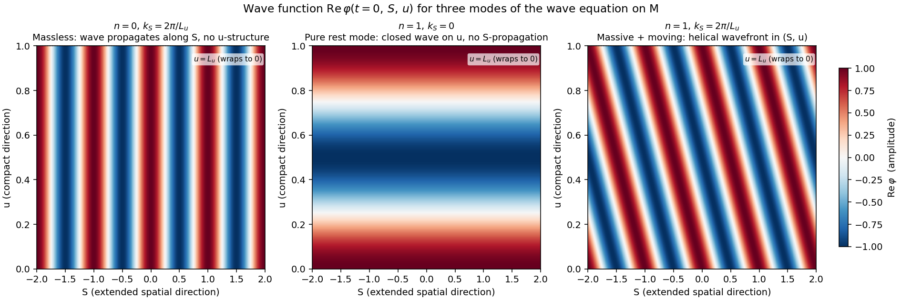
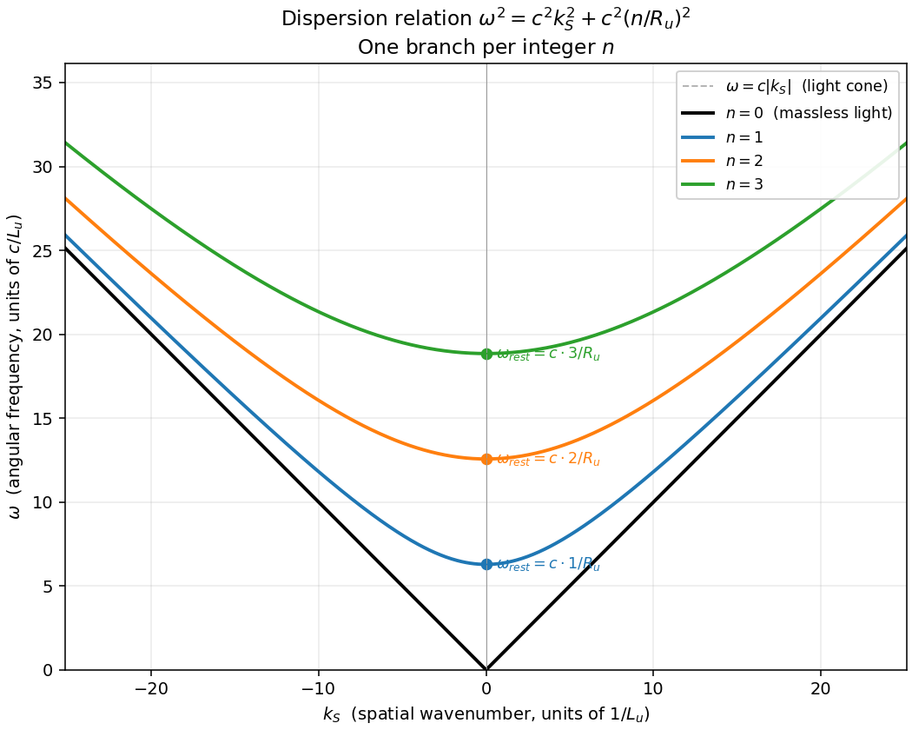

# Chapter 2 — Solving the wave equation on M

**Status:** Bare outline. Each section is one sentence describing
the derivation step that section will perform. To be filled out
once the outline is approved.

This chapter takes the givens of [Chapter 1](01-foundation.md) —
the manifold M, the bare diagonal metric, the real scalar field φ,
the massless wave equation □φ = 0, and the periodicity condition
on u — and derives what kinds of solutions the wave equation
actually admits. We do not assume the answer; the math is allowed
to say whatever it says.

---

## Bare outline

### 1. Setting up: separation of variables

Our task is to find solutions of the wave equation on M. Recall
from [Chapter 1 §6](01-foundation.md):

<!-- (-1/c²)∂²φ/∂t² + ∂²φ/∂S² + ∂²φ/∂u² = 0 -->
$$
-\frac{1}{c^2}\frac{\partial^2\varphi}{\partial t^2}
+ \frac{\partial^2\varphi}{\partial S^2}
+ \frac{\partial^2\varphi}{\partial u^2}
= 0
$$

This is a partial differential equation in three variables (t, S,
u), and in general such equations do not have closed-form
solutions. But there is a standard technique that often works
when the equation has a clean structure: **separation of variables**.

#### What separation of variables means

The technique is to *guess* that solutions take a particularly
simple form: a product of three single-variable functions.

<!-- φ(t, S, u) = T(t) · X(S) · U(u) -->
$$
\varphi(t, S, u) = T(t) \cdot X(S) \cdot U(u)
$$

That is, the t-dependence is captured entirely by some function
T(t), the S-dependence by X(S), and the u-dependence by U(u). The
three pieces multiply.

A guess of this form is called an **ansatz** in physics — German
for "approach" or "starting form." It is a *trial shape* for the
solution that we plug into the equation and see whether it works.
If it does, great; we have found a family of solutions. If it
doesn't, we have ruled out one form and try another.

This particular ansatz cannot find *every* solution of the wave
equation — solutions that mix the variables in non-product ways
exist too. But the wave equation is *linear*, so any sum of
product-form solutions is also a solution. As long as the
product-form solutions are rich enough to "build up" arbitrary
solutions by linear combination (they are, via Fourier
decomposition), finding all the product-form solutions is enough
to characterize the full solution space. We will exploit that
later; for now we just look for solutions of product form.

#### Plugging in: derivatives factor

Each second derivative of φ acts on only one of the three factors,
because the other two factors are constants from that derivative's
point of view. For example:

- ∂²/∂t² acts on T(t) and leaves X(S)·U(u) untouched.
- ∂²/∂S² acts on X(S) and leaves T(t)·U(u) untouched.
- ∂²/∂u² acts on U(u) and leaves T(t)·X(S) untouched.

Applying each derivative:

<!-- ∂²φ/∂t² = T''(t) X(S) U(u),  etc. -->
$$
\frac{\partial^2\varphi}{\partial t^2} = T''(t)\,X(S)\,U(u)
\qquad
\frac{\partial^2\varphi}{\partial S^2} = T(t)\,X''(S)\,U(u)
\qquad
\frac{\partial^2\varphi}{\partial u^2} = T(t)\,X(S)\,U''(u)
$$

(We use the prime notation T'' to mean the second derivative of T
with respect to its single argument, and similarly for X'' and
U''.)

Substituting into the wave equation:

<!-- -(1/c²) T'' X U + T X'' U + T X U'' = 0 -->
$$
-\frac{1}{c^2}\,T''(t)\,X(S)\,U(u)
+ T(t)\,X''(S)\,U(u)
+ T(t)\,X(S)\,U''(u)
= 0
$$

Every term contains T(t)·X(S)·U(u) as a factor in some
arrangement. We can divide the entire equation by T(t)·X(S)·U(u)
(assumed nonzero — the trivial solution φ = 0 is the case where
the product vanishes, and we set it aside):

<!-- -(1/c²) T''/T + X''/X + U''/U = 0 -->
$$
-\frac{1}{c^2}\,\frac{T''(t)}{T(t)}
+ \frac{X''(S)}{X(S)}
+ \frac{U''(u)}{U(u)}
= 0
$$

This is the key step. We started with a partial differential
equation that mixed three variables, and after dividing through we
have a sum of three pieces — *each of which depends on only one
variable*.

#### The "must be constant" argument

Rearrange so that the t-piece is on the left and the rest on the
right:

<!-- (1/c²) T''/T = X''/X + U''/U -->
$$
\frac{1}{c^2}\,\frac{T''(t)}{T(t)}
= \frac{X''(S)}{X(S)} + \frac{U''(u)}{U(u)}
$$

The left side depends only on t. The right side depends only on S
and u. For this equality to hold *for every choice* of t, S, u,
both sides must be the same number — and that number cannot depend
on any of the three variables, because the left side is t-only
(can't depend on S or u) and the right side is S, u-only (can't
depend on t).

> **The only quantity that depends on no variables is a constant.**

So both sides equal some constant. We have not yet decided what
constant — it is determined by the particular solution we are
looking at. Let us call it −ω²/c², for reasons that will be clear
shortly. (The minus sign and the factor of c² are bookkeeping that
make later equations look familiar; if we picked them wrong, ω²
would just come out negative and we would absorb the sign.)

Setting the t-piece equal to the constant:

<!-- T''(t) / T(t) = -ω²,  i.e.,  T'' + ω² T = 0 -->
$$
\frac{T''(t)}{T(t)} = -\omega^2
\qquad \Leftrightarrow \qquad
T''(t) + \omega^2\,T(t) = 0
$$

That is the equation of a **simple harmonic oscillator**: T(t)
oscillates sinusoidally with angular frequency ω. We will examine
its solutions in a later section.

Setting the (S, u)-piece equal to the same constant:

<!-- X''/X + U''/U = -ω²/c² -->
$$
\frac{X''(S)}{X(S)} + \frac{U''(u)}{U(u)} = -\frac{\omega^2}{c^2}
$$

Now we apply the same argument *again*. Rearrange:

<!-- X''/X = -ω²/c² - U''/U -->
$$
\frac{X''(S)}{X(S)} = -\frac{\omega^2}{c^2} - \frac{U''(u)}{U(u)}
$$

The left side depends only on S; the right side depends only on u.
Both must equal the same constant. Call it −k_S²:

<!-- X'' + k_S² X = 0 -->
$$
X''(S) + k_S^2\,X(S) = 0
$$

That's another simple harmonic oscillator, this time in S, with
spatial wavenumber k_S.

What is left for U? Substituting back:

<!-- U''/U = -ω²/c² + k_S² -->
$$
\frac{U''(u)}{U(u)} = -\frac{\omega^2}{c^2} + k_S^2
$$

Define a new constant k_u by
k_u² ≡ ω²/c² − k_S²
(positive if ω/c > k_S, negative if not — we will keep both
possibilities open until the boundary condition forces a choice).
Then:

<!-- U'' + k_u² U = 0 -->
$$
U''(u) + k_u^2\,U(u) = 0
$$

#### What we have

The original three-variable wave equation has reduced to **three
independent single-variable equations** — one for each coordinate
— plus a constraint that ties their constants together:

| Coordinate | Equation | Form |
|---|---|---|
| t | T''(t) + ω² T(t) = 0 | Harmonic oscillator with frequency ω |
| S | X''(S) + k_S² X(S) = 0 | Harmonic oscillator with wavenumber k_S |
| u | U''(u) + k_u² U(u) = 0 | Harmonic oscillator with wavenumber k_u |

Constraint among the constants:
<!--EC Did we explain what allows us to set this equality of the constants? -->
<!-- ω² = c² k_S² + c² k_u² -->
$$
\omega^2 = c^2\,k_S^2 + c^2\,k_u^2
$$

This last equation already looks like a dispersion relation (it
relates frequency to wavenumbers via c), but at this point ω, k_S,
and k_u are *any* constants that satisfy it — no quantization, no
discreteness yet. Those will come in §2 once we apply the
periodicity boundary condition on u.

#### What this section established

The wave equation **does** admit product-form solutions
φ(t, S, u) = T(t)·X(S)·U(u). The technique of separation worked,
and reduced the problem to three ordinary differential equations
(harmonic oscillators), tied together by a single algebraic
constraint among their constants. The next sections solve those
three equations — applying the periodicity boundary condition to
U first, since that is where the structure of the manifold
enters most directly.

### 2. The u-equation under periodicity

We start with the u-equation because the boundary condition on u
is what gives the manifold its distinctive structure. The other
two coordinates (t, S) extend to infinity and have no built-in
restriction; u wraps after a finite distance L_u, and that closure
will force something specific about the solutions.

The equation from §1:

<!-- U'' + k_u² U = 0 -->
$$
U''(u) + k_u^2\,U(u) = 0
$$

The boundary condition from [Chapter 1 §7](01-foundation.md):

<!-- U(u + L_u) = U(u) -->
$$
U(u + L_u) = U(u)
$$

#### General solutions of the ODE

The equation U'' + k_u² U = 0 is the same equation that describes
a simple harmonic oscillator (a mass on a spring) — except the
"time variable" of the oscillator is the spatial variable u. The
shape of U(u) is sinusoidal: as you walk along u, U goes up and
down sinusoidally with a specific spatial wavelength.

There are three regimes to consider, depending on the sign of
k_u²:

**Case A: k_u² > 0.** The two linearly independent solutions are:

<!-- U(u) = A cos(k_u u) + B sin(k_u u) -->
$$
U(u) = A\,\cos(k_u\,u) + B\,\sin(k_u\,u)
$$

Or equivalently, using complex exponentials:

<!-- U(u) = C e^(i k_u u) + D e^(-i k_u u) -->
$$
U(u) = C\,e^{i\,k_u\,u} + D\,e^{-i\,k_u\,u}
$$

(Both forms describe the same family of solutions; they are two
different bases. The cos/sin basis is convenient when we want
real-valued U; the complex-exponential basis is convenient when we
want to track which way U "winds" around u, as we will see below.
The two are related by Euler's identity:
e^(±i k_u u) = cos(k_u u) ± i sin(k_u u).)

**Case B: k_u² = 0.** The equation becomes U''(u) = 0, with
solutions U(u) = A + B u. This is linear in u — and a linear
function with B ≠ 0 grows without bound and cannot satisfy the
periodicity condition. So B = 0 and U is just a constant.

**Case C: k_u² < 0.** Write k_u² = −κ² with κ real. The equation
becomes U'' − κ² U = 0, with solutions U(u) = A e^(κ u) + B e^(−κ
u). These are exponentially growing and decaying; neither can be
periodic unless its coefficient vanishes. The only periodic
solution in this case is U = 0 (trivial). So Case C is ruled out
by the boundary condition.

The boundary condition has already done some work: **k_u² must be
non-negative**.

#### Applying periodicity to Case A

Take the cos/sin form and require it to be periodic in u with
period L_u:

<!-- A cos(k_u (u+L_u)) + B sin(k_u (u+L_u)) = A cos(k_u u) + B sin(k_u u) -->
$$
A\,\cos\bigl(k_u(u + L_u)\bigr) + B\,\sin\bigl(k_u(u + L_u)\bigr)
= A\,\cos(k_u\,u) + B\,\sin(k_u\,u)
$$

Using the angle-addition identities:

<!-- cos(k_u u + k_u L_u) = cos(k_u u) cos(k_u L_u) - sin(k_u u) sin(k_u L_u) -->
$$
\cos(k_u\,u + k_u\,L_u) = \cos(k_u\,u)\,\cos(k_u\,L_u) - \sin(k_u\,u)\,\sin(k_u\,L_u)
$$

and similarly for sin. Comparing coefficients of cos(k_u u) and
sin(k_u u) on both sides forces:

<!-- cos(k_u L_u) = 1  and  sin(k_u L_u) = 0 -->
$$
\cos(k_u\,L_u) = 1, \qquad \sin(k_u\,L_u) = 0
$$

The pair of equations has solutions exactly when k_u L_u is an
integer multiple of 2π:

<!-- k_u L_u = 2π n,  n ∈ Z -->
$$
k_u\,L_u = 2\pi\,n, \qquad n \in \mathbb{Z}
$$

(ℤ is the symbol for "all integers": …, −2, −1, 0, 1, 2, …)

Solving for k_u:

<!-- k_u = 2π n / L_u -->
$$
k_u = \frac{2\pi\,n}{L_u}
$$

Equivalently, defining the **compact radius** R_u ≡ L_u / (2π) —
the radius of the circle if we pictured the compact direction as
drawn on a cylinder — we get the cleaner form:

<!-- k_u = n / R_u -->
$$
k_u = \frac{n}{R_u}
$$

This is the central result of §2: **periodicity forces k_u to be
discrete**, taking only integer multiples of 1/R_u (or
equivalently 2π/L_u).

#### Why integers, intuitively

The boundary condition U(u + L_u) = U(u) says: as you walk once
around the compact direction, U has to return to its starting
value. A sinusoidal wave with wavelength λ_u completes one full
cycle every distance λ_u; for the wave to return to its starting
value after a distance L_u, the circumference L_u must contain a
*whole number* of wavelengths. Fractional cycles wouldn't return
to the start.

The wavelength of the n-th mode:

<!-- λ_u = 2π / k_u = L_u / n -->
$$
\lambda_u = \frac{2\pi}{k_u} = \frac{L_u}{|n|}
$$

So:
- n = ±1: one wavelength fits around u → λ_u = L_u
- n = ±2: two wavelengths → λ_u = L_u / 2
- n = ±3: three wavelengths → λ_u = L_u / 3
- and so on for higher |n|

Every "wavelength count" must be an integer, because the wave has
to close on itself smoothly when it returns to its starting point.
This is the same logic that quantizes notes on a guitar string,
quantizes angular momentum, and quantizes electron orbitals — once
a wave is forced to fit on a closed shape, only integer-fitting
solutions are allowed.

#### What about negative n?

In the cos/sin basis, k_u and −k_u give the same equation (only
k_u² appears), and cos(k_u u) = cos(−k_u u) — so n and −n look
like the same solution.

In the *complex-exponential* basis, however, n and −n are
physically distinct:

<!-- U_+n = e^(+i n u / R_u),  U_-n = e^(-i n u / R_u) -->
$$
U_{+n}(u) = e^{+i\,n\,u/R_u}, \qquad
U_{-n}(u) = e^{-i\,n\,u/R_u}
$$

These describe waves "winding" around u in opposite directions —
U_+n turns one way as u advances; U_-n turns the other. (Think of
a screw thread: clockwise versus counter-clockwise.)

Because of this, we will adopt the complex-exponential basis from
here on. It makes the "which way does it wind" structure visible.
The independent solutions for the u-equation are then:

<!-- U_n(u) = e^(i n u / R_u),  n ∈ Z -->
$$
U_n(u) = e^{i\,n\,u/R_u}, \qquad n \in \mathbb{Z}
$$

For each integer n (positive, negative, or zero), there is one
solution. Real-valued φ can be built later by combining +n and −n
modes (their sum gives 2 cos(n u/R_u), a real standing wave; their
difference gives 2i sin(n u/R_u), also real after dividing out the
i). For the derivation it is cleanest to keep the complex basis.

#### Standing wave or traveling wave?

A natural question at this point: is the u-oscillator a *standing*
wave or a *traveling* wave?

The answer is: **it is a closed wave that wraps around u**, and
whether one describes it as standing or traveling is a basis
choice.

- In the **cos/sin (real) basis**, the modes look like *standing
  waves* on the circle — fixed nodes and antinodes that don't
  move along u as time goes on.
- In the **e^(i n u/R_u) (complex) basis**, the modes look like
  *traveling waves* around the circle — patterns that turn one
  way (positive n) or the other (negative n).

Both are valid descriptions of the same physical solutions, related
by linear combinations. The physical fact that survives both
descriptions is: **the wave is closed**. It does not propagate
outward or decay; it wraps around u and returns to itself. This
closure is what will turn out to be the defining feature of the
n ≠ 0 modes when we look at energy in later sections.

#### What §2 establishes

| Claim | Status |
|---|---|
| k_u² must be ≥ 0 | Established by ruling out exponential growth/decay |
| k_u must take discrete values k_u = n/R_u, n ∈ ℤ | Established by periodicity |
| Solutions form a countable family U_n(u) = e^(i n u/R_u) | Established |
| n = 0 mode is constant in u | Established (degenerate "no winding" case) |
| n ≠ 0 modes wind around u, |n| times | Established |

The constraint from §1, ω² = c² k_S² + c² k_u², now becomes:

<!-- ω² = c² k_S² + c² (n / R_u)² -->
$$
\omega^2 = c^2\,k_S^2 + c^2\left(\frac{n}{R_u}\right)^2
$$

This still depends on k_S (which we have not yet quantized — and
won't, since S is non-compact) but the u-contribution has become
discrete. Each integer n picks out a particular "branch" of the
dispersion relation.

The next section solves the S- and t-equations, neither of which
has a periodicity boundary, and combines all three pieces into a
full description of the modes.

---

### 3. The S- and t-equations

The remaining two ODEs from §1 are:

<!-- X'' + k_S² X = 0 -->
$$
X''(S) + k_S^2\,X(S) = 0
$$

<!-- T'' + ω² T = 0 -->
$$
T''(t) + \omega^2\,T(t) = 0
$$

Neither S nor t is compact — both extend to infinity in both
directions, so neither has a periodicity boundary condition. This
means k_S and ω are *not* quantized by the manifold's structure;
they can take continuous values. Only the constraint
ω² = c² k_S² + c² (n/R_u)² ties them together.

#### General solutions

Both equations are the same form as the u-equation — a harmonic
oscillator. Their solution shape is identical:

**For X(S)** (using the complex basis for the same reason as in
§2):

<!-- X(S) = A_+ e^(+i k_S S) + A_- e^(-i k_S S) -->
$$
X(S) = A_+\,e^{+i\,k_S\,S} + A_-\,e^{-i\,k_S\,S}
$$

**For T(t)**:

<!-- T(t) = B_+ e^(+i ω t) + B_- e^(-i ω t) -->
$$
T(t) = B_+\,e^{+i\,\omega\,t} + B_-\,e^{-i\,\omega\,t}
$$

What does "harmonic oscillator in S" mean physically? It means
X(S) is a *sinusoidal pattern in space* — as you walk along the S
direction, the value of X rises and falls in a regular wave shape
with wavelength λ_S = 2π/k_S. It is the spatial face of an
ordinary wave, the "snapshot" of one moment in time. (The
oscillator analogy is just that the equation has the same shape as
the spring-mass equation; the spatial nature of S is what
distinguishes this case.)

What does T(t) describe? It is a *temporal oscillation* at angular
frequency ω. T rises and falls in time with period 2π/ω. This is
the wave's "frequency of light" in your reading: how fast the
field oscillates at any fixed point in space.

#### Ruling out non-oscillatory cases

Just as in §2, we should consider what happens if k_S² or ω² is
zero or negative.

**k_S² < 0 or ω² < 0** would make X or T exponentially growing
(or decaying) instead of oscillating. With S and t both extending
to infinity, an exponentially growing X(S) → ∞ as S → ∞ would have
infinite energy and we reject it for a free wave on an unbounded
manifold; similarly for T(t). So we restrict to k_S² ≥ 0 and
ω² ≥ 0 for the wave-like solutions of interest.

(Aside: solutions with k_S² < 0 are allowed mathematically and
correspond to *evanescent waves* — fields concentrated near a
boundary. They will not appear in our analysis because M has no
boundary in S; we mention them only to be honest that we are
discarding part of the formal solution space, and we will note if
that ever becomes restrictive.)

**k_S² = 0 or ω² = 0** are the boundary cases. k_S = 0 means X is
spatially uniform — no S-dependence at all. ω = 0 means T is
constant in time — a static field. These are limit cases that
will turn out to play special roles: ω = 0 is "no temporal
oscillation," which corresponds to no energy; k_S = 0 is "no
S-propagation," which corresponds to a particle at rest (we will
make this identification properly in §6).

#### The full mode

We have three single-coordinate functions: T(t), X(S), and U(u).
Each one alone tells us only how the field varies in *one*
direction. The original ansatz from §1 was that the field is the
product of the three:

<!-- φ(t, S, u) = T(t) · X(S) · U(u) -->
$$
\varphi(t, S, u) = T(t) \cdot X(S) \cdot U(u)
$$

So the natural next step is to multiply the three solutions
together — that is what the ansatz commits us to.

Why do we want the multiplied form? Because the multiplied form
*is* what we mean by "the field" — its value at any point of M.
Without combining the three, we have a recipe for how φ varies in
each coordinate separately, but we cannot yet evaluate φ(t, S, u)
at any specific point.

The combined form lets us answer concrete questions like:

- **Wavefront geometry.** Where in the manifold M does φ have the
  same value? (This is what "constant-phase surfaces" means and
  is the key to visualizing the wave.)
- **Time evolution.** How does the wave at a fixed (S, u) location
  change as t advances?
- **Spatial structure.** What does a snapshot of the wave look
  like at a fixed t?
- **Energy and momentum.** Which combinations of derivatives carry
  energy? Which carry momentum? (We'll need these in §§5–6 to
  identify mass.)

None of these can be answered from T, X, U alone. The product is
the wave; the factored pieces are just the way the wave's
coordinate-dependence happens to factor.

A single product-form solution of the wave equation is therefore:

<!-- φ_(n, k_S, ω, signs) = e^(±i k_S S) · e^(±i ω t) · e^(i n u / R_u) -->
$$
\varphi_{n, k_S, \omega}(t, S, u) = e^{\pm i\,k_S\,S}\;e^{\pm i\,\omega\,t}\;e^{i\,n\,u/R_u}
$$

with the integer n labeling the u-mode, the continuous variable
k_S labeling the spatial wavenumber in S, and ω determined by

<!-- ω = ± c √(k_S² + (n/R_u)²) -->
$$
\omega = \pm\,c\,\sqrt{k_S^2 + (n/R_u)^2}
$$

(both signs of ω correspond to physically distinct "forward" and
"backward" time-evolutions; we'll usually take the convention ω > 0
and let the sign of the e^(±iωt) piece carry the
forward-vs-backward information).

The *general* solution of the wave equation is a sum (an integral,
really, since k_S is continuous) over all such product modes —
this is the Fourier decomposition we mentioned in §1. For the
purposes of understanding the mode structure, examining one
product mode at a time is sufficient.

#### A useful rewrite: the plane-wave form

Writing the (S, t) part as a single exponential:

<!-- e^(i k_S S) · e^(-i ω t) = e^(i (k_S S - ω t)) -->
$$
e^{i\,k_S\,S}\;e^{-i\,\omega\,t} = e^{i\,(k_S\,S - \omega\,t)}
$$

This is a **plane wave** in (S, t): a sinusoidal pattern whose
wavefronts (lines of constant phase) move along S over time. The
phase advances at velocity ω/k_S — this is the *phase velocity* of
the wave. Combined with the u-piece:

<!-- φ_(n, k_S) = exp(i (k_S S - ω t + n u / R_u)) -->
$$
\varphi_{n, k_S}(t, S, u) = \exp\bigl(i\,(k_S\,S - \omega\,t + n\,u/R_u)\bigr)
$$

Reading this as a single complex exponential of a single phase:
the phase is k_S S − ω t + n u/R_u. As t advances, the phase
decreases at rate ω; as S advances, it increases at rate k_S; as u
advances, it increases at rate n/R_u.

For visualization purposes (a chapter or two ahead) this means: a
mode of fixed n looks like a *helical wavefront* in (S, u, t)
space — a constant-phase surface that winds n times around u as it
advances along S, and shifts in time at rate ω.

#### A first picture of the modes

The figure below shows the real part of φ at a fixed time t = 0,
plotted on the (S, u) face of the manifold, for three example
modes. The compact direction u is drawn as the unrolled vertical
strip from u = 0 to u = L_u; the dashed horizontal lines mark where
u wraps back on itself.

Reading the three panels:

- **Left (n = 0, k_S ≠ 0).** The wave has no u-structure — its
  value depends only on S. Vertical bands of red and blue mark
  successive crests and troughs along S. As t advances, these
  bands slide along S at speed c. This is the picture of
  ordinary light propagating along the spatial direction.

- **Middle (n = 1, k_S = 0).** The wave has no S-structure — its
  value depends only on u. Horizontal bands mark crests and
  troughs around the compact direction. Going up and around (u
  increases by L_u and wraps), the wave completes exactly one
  full cycle. As t advances, the colors at any fixed point
  oscillate in time, but the band pattern doesn't slide along S.
  This is the picture of a "particle at rest" — to be made
  precise in §6.

- **Right (n = 1, k_S ≠ 0).** The wave has structure in both
  directions. Bands tilt diagonally — they move along S as t
  advances, and they wind around u at the same time. When the
  flat strip is conceptually rolled back into a cylinder, these
  diagonal bands become a *helical* wavefront. This is the
  picture of a moving massive object: motion along S combined
  with the closed u-cycle that makes it massive.

(Source: [`figures/wave-modes.py`](figures/wave-modes.py). The
script can be re-run to regenerate the image, or modified to plot
other (n, k_S) combinations.)

#### Three things to take away

| Claim | Meaning |
|---|---|
| "Harmonic oscillator in S" means *a wave-shape in S* | X(S) is sinusoidal in space, with wavelength 2π/k_S |
| The u-oscillator is a *closed wave* on the circle | Whether one describes it as standing or traveling is a basis choice; both views are valid descriptions of the same field |
| T(t) is the *frequency-of-oscillation in time* | T(t) oscillates at angular frequency ω; T(t) and the temporal frequency are the same object |

#### What §3 establishes

| Claim | Status |
|---|---|
| X(S) is sinusoidal with wavenumber k_S (continuous) | Established |
| T(t) is sinusoidal with angular frequency ω (continuous) | Established |
| ω and k_S are tied together by ω² = c²k_S² + c²(n/R_u)² | Established (combined with §2) |
| Modes are labeled by (n, k_S) with n ∈ ℤ, k_S ∈ ℝ | Established |
| Each mode is a complex plane-wave-times-helix in (t, S, u) | Established |

The central object emerging from §§1–3 is the **dispersion
relation**:

<!-- ω² = c² k_S² + c² (n / R_u)² -->
$$
\omega^2 = c^2\,k_S^2 + c^2\,\left(\frac{n}{R_u}\right)^2
$$

This is what later sections will read as energy-momentum, with one
of the three pieces playing the role of mass. We have not yet made
that identification — that is the work of §§5–6. For now, we have
solved the wave equation; in the next sections we ask what the
solutions *mean*.

### 3. The S- and t-equations
<!--EC Is this a stranded/leftover? -->
Examine what the remaining equations require of X(S) and T(t),
without yet assuming oscillatory or growing solutions.

### 4. The dispersion relation

The previous three sections produced, almost as a side effect, an
equation that ties together the three constants of a product-mode:
<!--EC That last sentence isn't very understandable.  What does it mean? 

Is there any intuitive way to interpret each of the three constants?
What they each control and define?
-->

<!-- ω² = c² k_S² + c² (n/R_u)² -->
$$
\omega^2 = c^2\,k_S^2 + c^2\,\left(\frac{n}{R_u}\right)^2
$$

This is the **dispersion relation** for the wave equation on M.
The name comes from optics: in any medium, the dispersion
relation tells you which frequencies propagate at which speeds, and
how a packet of waves "disperses" (spreads out) over time because
its components travel differently. For a free wave on M, the
relation says: not every (ω, k_S, n) combination is a solution —
only those that satisfy the equation above. Once any two of the
three are chosen, the third is fixed up to a sign.

This section examines what that equation is saying. It is the
structural climax of the chapter: the single equation that holds
all of the wave-physics that emerged from solving □φ = 0 on our
manifold. Sections 5–6 will translate it into the language of
energy, momentum, and mass, but those translations need
identifications we have not yet introduced. For this section, we
keep the language pure wave-physics.

#### Branch structure: one curve per integer n

The dispersion relation is one equation in three unknowns (ω, k_S,
n). Because n is restricted to integers, the equation cuts the
allowed (k_S, ω) plane into a *family of curves*, one curve per
value of n. Each curve is the locus of (k_S, ω) pairs that the
wave equation permits at that fixed n.

For n = 0 the relation simplifies to ω² = c² k_S², i.e.,
ω = ±c|k_S|. This is a pair of straight lines through the origin
of the (k_S, ω) plane — the *light cone* of the (k_S, ω)
diagram. (We will conventionally take ω > 0, which gives the
single line ω = c|k_S|.)

For n ≠ 0 the relation gives ω = ±c·√(k_S² + (n/R_u)²) — a
**hyperbola** sitting *above* the n = 0 line. The hyperbola never
touches the line at any finite (k_S, ω), but approaches it
asymptotically as |k_S| → ∞. At k_S = 0, the hyperbola reaches its
minimum: ω = c|n|/R_u, a strictly positive value. This minimum is
the **rest frequency** of the n-th branch — the frequency the wave
oscillates at when there is no S-propagation.

For each integer n, then, we get a separate "branch" of allowed
modes:

- n = 0: the line ω = c|k_S|
- n = ±1: a hyperbola with rest frequency c/R_u
- n = ±2: a hyperbola with rest frequency 2c/R_u
- n = ±3: a hyperbola with rest frequency 3c/R_u
- and so on for higher |n|

The branches form a *tower* in the (k_S, ω) plane. The figure
below shows the first few:

The dashed line is the light cone ω = c|k_S|. The black V-shape
is the n = 0 branch (it coincides with the light cone). The
colored hyperbolas are n = 1, 2, 3, with their rest frequencies
marked on the ω-axis. As |k_S| grows, every hyperbola asymptotes
toward the light cone — the higher-n branches "look more and more
like light" at high spatial wavenumber.

(Source: [`figures/dispersion.py`](figures/dispersion.py).)

#### Phase velocity vs group velocity

Two distinct velocities are hidden inside any dispersion relation.
<!--EC Where are the velocities hidden?  If I saw a S vs t graph, would I see them? -->
**Phase velocity** v_p is how fast a single wave-crest moves
through space. For a plane wave of the form
<!--EC the following formula doesn't render well.  Use standard formula formatting. -->
exp(i(k_S S − ωt + n u/R_u)), the (S, t) part has its constant-
phase surfaces moving at speed:

<!-- v_p = ω / k_S -->
$$
v_p = \frac{\omega}{k_S}
$$

**Group velocity** v_g is how fast a *wave packet* — a
narrow-bandwidth sum of nearby modes that constructively
interfere — moves through space. The standard wave-mechanics
result (a calculus exercise that follows from a Taylor expansion
of ω in k_S) is:

<!-- v_g = dω/dk_S -->
$$
v_g = \frac{d\omega}{dk_S}
$$

Compute both for our dispersion relation. For the n = 0 branch:

<!-- ω = c|k_S|;  v_p = c, v_g = c -->
$$
\omega = c\,|k_S|,
\qquad
v_p = \frac{\omega}{k_S} = c\,\mathrm{sign}(k_S),
\qquad
v_g = \frac{d\omega}{dk_S} = c\,\mathrm{sign}(k_S)
$$

So phase and group velocities are both ±c (depending on direction
of propagation). For n = 0 modes, the two velocities are equal —
the wave doesn't disperse, and a packet moves rigidly at the
speed of light.

For an n ≠ 0 branch, take the derivative of
ω = c·√(k_S² + (n/R_u)²):

<!-- v_g = dω/dk_S = c² k_S / ω -->
$$
v_g = \frac{d\omega}{dk_S} = \frac{c^2\,k_S}{\omega}
$$

And:

<!-- v_p = ω/k_S -->
$$
v_p = \frac{\omega}{k_S}
$$

Multiplying the two:

<!-- v_p v_g = c² -->
$$
v_p \cdot v_g = c^2
$$

This is a striking relation: the product of phase and group
velocity equals the square of the speed of light, exactly. It
means that whenever v_g < c (a wave packet moving slower than
light), we automatically have v_p > c (the phase appears to move
faster than light).

What does v_p > c mean? Not anything physically alarming. The
*phase* is just a label of where the wave's crests sit, and a
phase pattern can move arbitrarily fast without transporting any
energy or information. The thing that *carries* energy and
information — the envelope of a wave packet — moves at v_g. So as
long as v_g ≤ c, no signals are propagating faster than light.

Several consequences fall out of v_p v_g = c²:
<!--EC This is where intuitive interpretations of the constants would help if such is possible.  It's easy to get lost in the following three cases. -->
- For an n ≠ 0 mode at small k_S, v_g is small (close to zero, by
  the formula v_g = c²k_S/ω, since ω at small k_S is dominated by
  the rest term). The mode barely moves through space.
- For an n ≠ 0 mode at large k_S, v_g approaches c from below
  (because ω → c|k_S|), and v_p approaches c from above. The
  ultra-relativistic limit recovers light-speed propagation.
- For n = 0 always, v_g = v_p = c — a "light" mode is always at
  light-speed, no ambiguity.

These three observations already strongly suggest that the n ≠ 0
branches describe something with *inertia* — something that can
sit at rest, that carries an internal frequency at zero
spatial-wavenumber, and that approaches light-speed only at high
energy. We do not yet have the right to use the word "mass" — that
identification needs the bridge of §5 — but the dispersion relation
on its own is already pointing strongly in that direction.

#### Two limiting cases worth naming

**The rest case (k_S = 0).** Set the spatial wavenumber to zero.
The dispersion relation reduces to:
<!--EC Does n=0 mean no wave in u?  N is the quantum number for u isn't it?  I'm getting lost here.  Does n=0 mean no mass or a mass that is not moving in S?>
<!-- ω(k_S=0) = c |n| / R_u -->
$$
\omega(k_S = 0) = \frac{c\,|n|}{R_u}
$$

For n = 0, this gives ω = 0 — no oscillation in time at all, just
a static field. For n ≠ 0, it gives a *nonzero rest frequency*
that depends only on the integer n and the geometry of the
compact direction (R_u). The wave at k_S = 0 has no propagation
along S, but it *still oscillates* in time. The time oscillation
is being driven entirely by the closed wave around u.

This is the key fact §6 will read as "rest energy → mass": the
n ≠ 0 mode has energy that is *stored in the compact direction's
winding*, not in any motion through S.

**The ultra-relativistic limit (|k_S| → ∞).** Take k_S much
larger than n/R_u. Then:

<!-- ω = c·sqrt(k_S² + (n/R_u)²) ≈ c|k_S|·(1 + ...) -->
$$
\omega = c\,\sqrt{k_S^2 + (n/R_u)^2}
\;=\; c\,|k_S|\,\sqrt{1 + \left(\frac{n}{R_u\,k_S}\right)^2}
\;\to\; c\,|k_S|
\quad \text{as } |k_S| \to \infty
$$

At very high spatial wavenumber, every branch — n = 0, 1, 2, … —
approaches the same asymptote ω = c|k_S|. The contribution of the
compact direction becomes negligible compared to the spatial
wavenumber. So at high momentum, even the "massive" modes look
like light. This is the standard relativistic statement that
high-energy massive particles approximate massless ones.

#### What §4 establishes

| Claim | Status |
|---|---|
| The dispersion relation ω² = c²k_S² + c²(n/R_u)² ties (ω, k_S, n) together | Established |
| The (k_S, ω) plane carries one branch per integer n | Established |
| The n = 0 branch is the light-cone line ω = c\|k_S\| | Established |
| The n ≠ 0 branches are hyperbolas above the light cone | Established |
| Phase × group velocity = c² for n ≠ 0 modes | Established |
| Group velocity is below c for n ≠ 0; equals c for n = 0 | Established |
| n ≠ 0 modes have a nonzero rest frequency at k_S = 0 | Established |
| All branches approach ω = c\|k_S\| as \|k_S\| → ∞ | Established |

What §4 has *not* done:

- Identified ω as energy, k_S as momentum, or anything as mass.
  Those are linguistic bridges from wave-physics to particle-
  physics, and they belong to §5.
- Asserted that any branch corresponds to a physical "particle."
  The dispersion relation tells us which (k_S, ω) pairs are
  *allowed solutions*; whether nature populates them, and with
  what abundance, is outside the scope of solving the wave
  equation.

The next section makes the bridge: introduce p = ℏk and E = ℏω as
the standard wave-to-particle identifications, apply them to our
modes, and rewrite the dispersion relation in physical-quantity
language. After that, §6 will recognize the result as the
relativistic energy-momentum identity and read off the mass —
*and demonstrate that the read-off mass behaves inertially*.

---

### 5. Energy and momentum of a mode

To bridge from wave-physics to particle-physics we need two
identifications. Both are standard consequences of quantum
mechanics, but they apply to *any* wave (not just quantum
wavefunctions), and they will let us turn the wave-physics
quantities ω and k_S into the physical quantities energy E and
momentum p.

#### The Planck–Einstein relation: energy from frequency

For any wave that carries energy, the energy of a single mode is
proportional to its angular frequency:

<!-- E = ℏ ω -->
$$
E = \hbar\,\omega
$$

This is the **Planck–Einstein relation**. Historically it was
introduced by Planck (for blackbody radiation, 1900) and used by
Einstein (for the photoelectric effect, 1905) to link a wave's
oscillation rate to a quantum of energy. In the quantum-mechanical
context it is the relation between a wavefunction's time-dependent
phase and the energy of the state it represents.

Operationally for our derivation: a mode oscillating at angular
frequency ω carries E = ℏω of energy. ω is a wave-physics
quantity (radians per second) and E is a physics quantity (joules
or eV). The constant ℏ ("h-bar," reduced Planck constant) is what
makes the units balance. We do not need to derive ℏ here — we
take it as the standard physical constant linking frequency and
energy.

#### The de Broglie relation: momentum from wavenumber

The spatial counterpart says: a wave's momentum is proportional to
its spatial wavenumber:

<!-- p = ℏ k -->
$$
p = \hbar\,k
$$

This is the **de Broglie relation**. Historically de Broglie
(1924) proposed it as the inverse of the Planck–Einstein relation:
if waves carry quantized energy via E = ℏω, then symmetry between
time and space suggests waves carry quantized momentum via
p = ℏk. Experimentally this was confirmed by electron
diffraction (Davisson–Germer, 1927).

Operationally for our derivation: a mode with spatial wavenumber
k carries p = ℏk of momentum in that spatial direction.

#### Why these are the right identifications

A wave with no notion of "particle" still has a *frequency* and a
*wavenumber*. Why should we be allowed to multiply by ℏ and call
the result energy or momentum?

The honest answer is: for our purposes, *we are using these
identifications as definitions*. We are claiming: when this wave
deposits energy somewhere (perhaps via a coupling we have not
specified), the deposited energy is ℏω per quantum; when it
deposits momentum, the deposited momentum is ℏk per quantum.
These claims have been verified for every kind of wave in physics
where the experiment has been done. We import them here as the
standard wave-particle bridge.

A reader who wants more rigor can look at the Lagrangian
formulation of a free scalar field, where these identifications
follow directly from Noether's theorem applied to time-translation
and space-translation symmetries. We will not need that level of
detail; we use the relations as established physical bridges.

#### Applying the identifications to our modes

Our modes are labeled by (n, k_S), with ω determined by the
dispersion relation. Apply the bridge to each piece:

| Wave-physics quantity | Particle-physics quantity |
|---|---|
| ω (angular frequency in t) | E = ℏω (total energy of the mode) |
| k_S (wavenumber in S) | p_S = ℏ k_S (momentum along S) |
| n / R_u (effective wavenumber in u) | p_u = ℏ n / R_u (momentum along u) |

The third row is new: we are extending the same identification to
the compact direction. Whatever oscillation we see in u
corresponds to a momentum component in u, equal to ℏ times the
"effective wavenumber" n/R_u that emerged from periodicity. Note
that **p_u is quantized** (it can only take values nℏ/R_u for
integer n) because k_u was quantized — the periodicity boundary
condition has propagated through to the momentum.

#### Rewriting the dispersion relation in physical quantities

Take the dispersion relation:

<!-- ω² = c² k_S² + c² (n/R_u)² -->
$$
\omega^2 = c^2\,k_S^2 + c^2\,\left(\frac{n}{R_u}\right)^2
$$

Multiply both sides by ℏ² to bring in the ℏ-factors:

<!-- (ℏω)² = c² (ℏk_S)² + c² (ℏ n/R_u)² -->
$$
(\hbar\,\omega)^2 = c^2\,(\hbar\,k_S)^2 + c^2\,\left(\frac{\hbar\,n}{R_u}\right)^2
$$

Now substitute the bridge identifications E = ℏω, p_S = ℏk_S,
and p_u = ℏn/R_u:

<!-- E² = c² p_S² + c² p_u² -->
$$
E^2 = c^2\,p_S^2 + c^2\,p_u^2
$$

This is the dispersion relation, written in the language of
energy and momentum. It is the same equation we had before; we
have just renamed the quantities through the bridge.

#### What this looks like — and why we don't yet jump to mass

The final equation, E² = c²p_S² + c²p_u², bears a striking
resemblance to the **relativistic energy-momentum identity**:

<!-- E² = (pc)² + (mc²)² -->
$$
E^2 = (p\,c)^2 + (m\,c^2)^2
$$

If we identify the "spatial momentum" with p_S, and somehow
identify mc² with cp_u, we would land on E² = (p_S c)² + (m c²)²
with mc² = c p_u, i.e., m = p_u / c = ℏ |n| / (R_u c).

That identification is what §6 will make rigorous. But before
asserting it, we should be careful about what we have actually
shown. So far:

- E² = c²p_S² + c²p_u² is **derived**: it follows from the wave
  equation plus the bridge.
- E² = (pc)² + (mc²)² is **a known identity from relativity**: it
  describes a free relativistic particle.

These two equations have the *same form* if we identify
mc² = cp_u. But "having the same form" is not yet "they describe
the same physics." To make the identification, we need to verify
that the quantity we are about to call "mass" actually behaves
like inertial mass — that is, that it produces the right
relationship between momentum and velocity for a slow-moving
mode, namely p = m v_g.

That verification — the **inertial proof of mass** — is the work
of §6.

#### What §5 establishes

| Claim | Status |
|---|---|
| E = ℏω is the standard energy-frequency bridge | Imported as a physical relation |
| p = ℏk is the standard momentum-wavenumber bridge | Imported as a physical relation |
| Every mode carries E = ℏω, p_S = ℏk_S, and p_u = ℏn/R_u | Established by applying the bridge |
| p_u is quantized: p_u = ℏn/R_u for integer n | Established (inherited from k_u quantization) |
| E² = c²p_S² + c²p_u² is the dispersion relation rewritten | Established |
| E² = c²p_S² + c²p_u² **looks like** E² = (pc)² + (mc²)² | Observed — not yet identified |
| The quantity p_u / c **plausibly is** rest mass | Conjectured — to be verified by §6's inertial check |

The next section makes the identification rigorous by showing
that p_u / c, when used as the "mass," produces the correct
non-relativistic momentum-velocity relation p = m v_g for a slow
mode. That correspondence is what turns "looks like a mass" into
"is a mass."

### 5. Energy and momentum of a mode

Use the standard wave-mechanics identifications p = ℏk and E = ℏω
to translate the dispersion relation from wave-vectors into
physical quantities.

### 6. Reading the dispersion relation as energy-momentum

Compare the result to the relativistic identity
E² = (pc)² + (mc²)² and see whether anything in the dispersion
relation plays the role of a "mass."

### 7. The lowest u-mode

Examine what kind of object the lowest-mode case is, and check
whether it is consistent with a massless object propagating along
S.

### 8. Higher u-modes

Examine what kind of object the higher-mode cases are, and derive
the form of any rest energy that appears.

### 9. Self-consistency of the bare metric

Verify whether the solutions we have found respect the
diagonal-and-constant metric of Chapter 1, or whether they force
any modification.

### 10. Summary of what we derived

List, in plain language, what the math actually establishes — and
what questions remain open for later chapters.

---

## What's next

After Chapter 2, the natural follow-ups depend on what the
self-consistency check (§9) reveals. See the project README for
the tentative downstream chapter arc.
