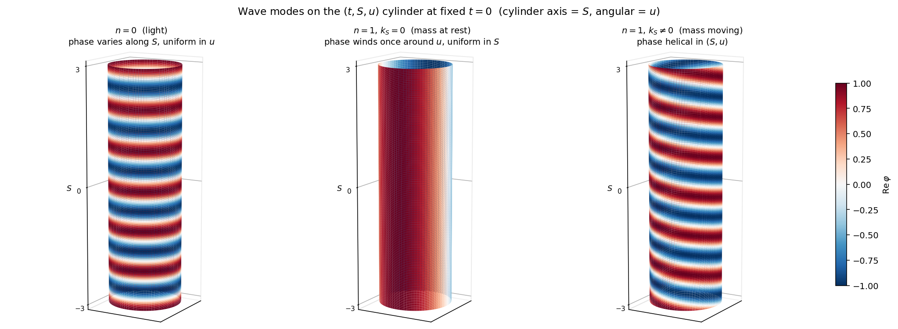

# Chapter 3 — Examining the modes

[Chapter 2](02-mass-from-u.md) derived the mode structure of the
wave equation on M and identified a discrete rest-mass spectrum
m_n = ℏ|n|/(R_u c). This chapter takes that result and looks at
what each mode family is *like* — what shape the modes take in
spacetime, how they move, and what visualizing them on the (t, S,
u) manifold reveals. New visualization figures (cylinder
embeddings, light cones, helical phase contours of massive modes)
belong here.

The chapter is examination, not derivation. It does not introduce
new givens or prove new identities; it asks what the result of
Chapter 2 *means* by looking at it carefully.

---

### 1. The lowest mode (n = 0): light

The n = 0 case is the unique mode in the family that has *no
winding* around the compact direction. Its u-piece is the
constant solution U_0(u) = 1, which substitutes back into the
full mode to give:

<!-- φ_{0, k_S}(t, S, u) = exp(i (k_S S - ω t)) -->
$$
\varphi_{0, k_S}(t, S, u) = \exp\!\bigl(i\,(k_S\,S - \omega\,t)\bigr)
$$

Notice that u has dropped out of the formula entirely — the
mode is uniform in the compact direction. It would have the
same value at u = 0, u = L_u/4, u = L_u/2, and so on. The
compact dimension is *present* in the manifold but the n = 0
mode is blind to it: nothing in the field varies with u.

#### What its dispersion looks like

The dispersion relation for n = 0
([Chapter 2 §4](02-mass-from-u.md)) is the simplest possible:

<!-- ω = c |k_S| -->
$$
\omega = c\,|k_S|
$$

Phase velocity equals group velocity equals c
(see [Chapter 2 §4](02-mass-from-u.md), velocities subsection):

<!-- v_p = v_g = c (for n = 0) -->
$$
v_p = v_g = c \qquad \text{(for } n = 0\text{)}
$$

A wave packet of n = 0 modes propagates at speed c without
spreading (no dispersion), and individual crests within the
packet travel at the same speed as the packet itself. The
identification with light, made formal in
[Chapter 2 §6](02-mass-from-u.md), holds without qualification:
m_0 = 0, no rest energy, no rest frequency, no internal
structure to speak of.

#### What it looks like on the manifold

Picture M as the cylinder of [Chapter 1 §1](01-foundation.md)
with t running vertically and u wrapping horizontally. The
n = 0 mode at any fixed t is uniform around u — slicing the
cylinder horizontally gives a value that doesn't depend on
which u-coordinate you sample. The wavefronts (surfaces of
constant phase) are *flat planes* perpendicular to the
direction of propagation in S, extending all the way around the
cylinder without twist. As t advances, those planes slide
along S at speed c.

This is the picture the *left panel* of the
[wave-modes figure](figures/wave-modes.png) in
[Chapter 2 §3](02-mass-from-u.md#3-the-s--and-t-equations)
already shows: vertical bands of phase that run straight up the
u-axis, with no helical twist. There is no internal structure
to render in 3D beyond what that 2D heatmap already conveys —
the mode simply has no u-dependence to render.

#### Why this matters for §2

The pedagogical point of §1 is the *absence* of internal
structure. n = 0 is a wave on (t, S) only; the u direction is
along for the ride but contributes nothing. This is what light
is on M: a mode that travels in extended space without engaging
the compact dimension at all.

Mass, as derived in [Chapter 2 §6](02-mass-from-u.md), comes
from exactly the structure that n = 0 lacks. The instant the
mode engages the compact direction — n becomes nonzero, the
u-piece of the wave function becomes e^(i n u/R_u) instead of
1 — the mode acquires a rest frequency, a rest energy, and (by
the inertial proof) an inertial mass. That engagement is the
subject of §2.

### 2. The massive modes (n ≠ 0): wave + winding, not particle on a spiral

When n is any nonzero integer, the u-piece of the wave function
stops being trivial. Instead of U(u) = 1, we have

<!-- U_n(u) = exp(i n u / R_u),  n ∈ ℤ, n ≠ 0 -->
$$
U_n(u) = \exp\!\bigl(i\,n\,u/R_u\bigr), \qquad n \in \mathbb{Z},\; n \neq 0
$$

a complex exponential whose phase advances n times as u sweeps
once around the compact direction. The full mode becomes:

<!-- φ_{n, k_S}(t, S, u) = exp(i (k_S S - ω t + n u / R_u)) -->
$$
\varphi_{n, k_S}(t, S, u) = \exp\!\bigl(i\,(k_S\,S - \omega\,t + n\,u/R_u)\bigr)
$$

with ω fixed by the dispersion relation
ω = c·√(k_S² + (n/R_u)²)
([Chapter 2 §4](02-mass-from-u.md)). The new term `n u/R_u` is
what makes the mode *massive* — and what the rest of this section
is about.

A natural and tempting first picture, looking at the formula, is
that the mode describes a particle physically spiraling around the
compact direction as it advances through (t, S). That picture is
*wrong*, and it is wrong in a specific way that matters: a literal
spiraling worldline would couple to off-diagonal metric components
and would, in standard Kaluza-Klein language, produce *charge*,
not mass. So this section's job is to be careful about what
exactly is helical, what exactly is straight, and why mass arises
from one of those features rather than the other.

#### Modes vs. wave packets

Before going further, a small but essential distinction.

A *single mode* of the form above is **not** a particle. It is a
plane wave: spatially infinite, with the same amplitude
everywhere along S. There is no localized "thing" to point at and
call "the particle." A real, localized particle in wave mechanics
is a **wave packet** — a narrow-bandwidth sum of nearby modes
that constructively interferes in some neighborhood of S and
destructively interferes outside it. Schematically:

<!-- ψ_packet(t, S, u) = ∫ dk_S g(k_S - k₀) · exp(i(k_S S - ω(k_S) t + n u/R_u)) -->
$$
\psi_\text{packet}(t, S, u)
\;=\; \int dk_S\;g(k_S - k_0)\;\exp\!\bigl(i\,(k_S\,S - \omega(k_S)\,t + n\,u/R_u)\bigr)
$$

where g(·) is a narrow envelope around some central wavenumber k₀.
The u-piece, exp(i n u/R_u), factors out of the integral because
n is fixed; only the (k_S, ω) part is summed over. So the packet
has the same u-winding at every (S, t) where it has support, but
its localization in S comes from the interference of many k_S
values.

This factorization is the geometric heart of the section.
*Localization in S* and *u-winding* live in completely separate
parts of the wave function. The packet has a *position in S*
(where its envelope is concentrated) but no *position in u* (it
fills the compact circle uniformly, with phase varying around the
circle but amplitude not).

Two distinct things to render, then, when picturing such a packet:

1. **The worldline** — the path of the packet's *center* through
   (S, t). This tracks where the localized amplitude is.
2. **The phase contour** — the set of points in (t, S, u) where
   the wave's phase takes some specific value. This tracks where
   the wave has, say, a crest.

The first is straight. The second is helical. Conflating them is
what produces the mistaken "particle on a spiral" picture.

#### The worldline is straight

Where is the packet's center at time t? A standard wave-packet
calculation (Taylor expansion of ω around k₀, recognition that
the envelope translates rigidly in the small-bandwidth limit)
gives the packet center at:

<!-- S_center(t) = S_0 + v_g · t,  with v_g = c² k_0 / ω(k_0, n) -->
$$
S_\text{center}(t) = S_0 + v_g\,t,
\qquad
v_g = \frac{c^2\,k_0}{\omega(k_0, n)}
$$

This is a **straight line** in the (S, t) plane: slope = v_g.
The line lies in a single plane that runs *parallel* to the
u-axis — at every t, the packet is at one specific S, but spread
uniformly around the entire u circle. It does not loop, spiral,
or deviate from the straight (S, t) line; the compact direction
plays no role at all in *where the packet is*.

(For a packet *at rest*, k_0 = 0, so v_g = 0 and the worldline
is *vertical* in (S, t) — a stationary particle's wave packet
just sits at fixed S as t advances. Still straight, still
uniform around u.)

This is the worldline. Whatever else we say about a massive
mode, **the particle's path through extended spacetime is a
straight line**, and that line lies in a u-axis-parallel plane,
not on a helix.

#### The phase contour is helical

Now look at where the *phase* of the wave takes a particular
value — say, where it equals zero (the crests of the real part):

<!-- phase: k_S S - ω t + n u / R_u = 2π · m,  for integer m -->
$$
k_S\,S - \omega\,t + \frac{n\,u}{R_u} \;=\; 2\pi\,m, \qquad m \in \mathbb{Z}
$$

This is one equation in three variables (t, S, u) — so the
solution is a 2D surface inside the 3D (t, S, u) volume. Solve
for u as a function of (S, t):

<!-- u = (R_u / n) · (2π m + ω t - k_S S) -->
$$
u(S, t) = \frac{R_u}{n}\bigl(2\pi\,m + \omega\,t - k_S\,S\bigr)
\pmod{L_u}
$$

(The mod L_u is the periodicity of u — the surface re-enters the
manifold each time u advances by L_u.)

This is the equation of a **helical sheet** in (t, S, u). At
fixed t, the crest follows a line u = a S + b on the (S, u)
plane that wraps around the cylinder; at fixed S, the crest
follows a helix u = c·t + d that winds up the cylinder as t
advances. The helix is steep (winds tightly) when |n| is large,
shallow when |n| is small, and tilts in S when k_S ≠ 0.

These constant-phase surfaces are real — they are where the wave
has, at each moment in time, a particular phase value. They
correspond to physical crests and troughs of the real part of φ.
They are also a feature of the *wave's geometry*, not of any
particle's trajectory. The helix lives entirely in the
description of how the wave's phase varies across the manifold.

#### Two pictures, one wave

Putting the two together:

- The packet's amplitude is concentrated near
  S_center(t) = S_0 + v_g t and uniform around u. This is the
  particle's *position*.
- The phase of the wave underneath that amplitude is winding,
  helically, around u. The phase advances n times around u per
  circumference and shifts in time at rate ω.

A clean mental picture: imagine a thin Gaussian "tube" around
the worldline (the region where the packet has appreciable
amplitude). The tube itself is a straight rod parallel to the
u-axis, of small extent in S and of full extent (the entire L_u)
in u. *Inside* this tube, the wave's phase is helical — color
the tube's surface by the real part of φ and you would see a
spiral pattern of red-blue-red-blue winding around the tube's
length. As t advances, the tube slides in S at speed v_g, and
the spiral pattern on its surface rotates uniformly.

This is the right way to read the formula
φ = exp(i(k_S S - ωt + nu/R_u)) on a localized packet:

- exp(i(k_S S - ωt)) carries the packet's spatial motion in (S, t)
- exp(i n u/R_u) carries the wave's compact-direction phase
  winding
- The two factors multiply because the wave equation is separable
  ([Chapter 2 §1](02-mass-from-u.md))

The worldline is straight; the phase winds. *Mass is the energy
stored in the compact-direction phase winding* — the rest
frequency ω(k_S = 0) = c|n|/R_u that the wave oscillates at even
when the packet is at rest in S
([Chapter 2 §4](02-mass-from-u.md), rest-case discussion). It
is not the result of any spatial motion in u.

#### Why this matters: the mass-vs-charge distinction

The reason it is critical to keep worldline and phase contour
distinct is that *both* show up in physical theory, but they
represent different things and they couple to the metric in
different ways.

Suppose, hypothetically, a particle's *worldline* were genuinely
helical — that the particle's trajectory had nonzero du/dτ as
well as nonzero dS/dτ. Then the particle would have actual
spatial momentum in the compact direction, and that momentum
would couple to any off-diagonal metric components g_μu present
in the manifold. In standard Kaluza-Klein this is exactly the
mechanism by which charge appears: compact-direction momentum
couples to A_μ (= the cross-block of the metric) and produces
the Lorentz force ([primers/kaluza-klein.md §10](../../primers/kaluza-klein.md)).

In our setup the worldline is *not* helical. The packet has no
du/dτ — it has no u-position to even take a derivative of, since
it is uniformly spread around u. The compact-direction
information lives entirely in the wave's phase, not in the
particle's trajectory. So:

| Where compact-direction structure lives | Physical reading |
|---|---|
| In the wave's *phase* (e^(i n u/R_u) factor) | **Mass** (rest energy from compact phase winding) |
| In the particle's *worldline* (du/dτ ≠ 0) | **Charge** (compact momentum coupling to off-diagonal metric) |

In this project we have only the first. Charge is deferred to a
future project where a second compact direction (w) is added and
the worldline can have du/dτ ≠ 0 there. The distinction lines up
naturally with the project structure.

This will matter again in [Chapter 4](04-metric-self-consistency.md):
when we ask whether the bare diagonal metric of Chapter 1
remains consistent under the existence of these massive modes,
the absence of any worldline du/dτ is exactly what protects the
metric from being sourced into off-diagonal form. Mass without
charge means metric without cross-terms.

#### Side-thread: the wave is real

A note that points toward something larger than this project,
worth flagging here for future work to take up.

In the standard quantum-mechanics presentation, the wavefunction
ψ is given a probabilistic reading: |ψ|² is interpreted as a
probability density, ψ itself as an amplitude whose modulus
squared has physical meaning but whose phase is "non-classical."
The wave/particle duality of a massive particle is presented as
a tension or a complementarity: sometimes the particle is wave-
like, sometimes particle-like, and the two pictures are
mysterious.

The picture this section paints is significantly more concrete:
the wave is *literally there*. The mode

<!-- φ_{n, k_S}(t, S, u) = exp(i (k_S S - ω t + n u / R_u)) -->
$$
\varphi_{n, k_S}(t, S, u) = \exp\!\bigl(i\,(k_S\,S - \omega\,t + n\,u/R_u)\bigr)
$$

is a real wave on the manifold M. It has a frequency, a
wavelength along S, and a winding count around u. Its rest energy
comes from a definite geometric feature (winding around the
compact direction). Its motion through extended space is the
straight worldline of a wave packet. Nothing about this picture
requires a probabilistic interpretation to make sense; it is just
a wave with extra structure.

The connection to Schrödinger's original 1926 reading of ψ — that
the wavefunction was a real wave in some sense, not a probability
amplitude — is suggestive. Compactification in the (t, S, u)
manifold of this project would, if taken seriously, give the
"particle" of orthodox quantum mechanics a literal wave-mechanical
identity: it is a wave on M whose compact-direction structure
gives it mass. The wave/particle duality is not a duality; it is
a single object — a wave with structure — viewed from two angles.

This thread is not pursued further here. Examining whether the
Schrödinger interpretation can be reconstructed coherently from
the geometry of M would be its own project, and would need to
engage with measurement, decoherence, the role of probability,
and the existing literature on hidden-variable interpretations.
The point of the aside is just to note that the picture this
project produces is *available* as a wave-realist reading, not
that the project has yet earned the right to claim it.

### 3. The ±n distinction: what direction of u-winding carries

[Chapter 2 §2](02-mass-from-u.md) found that periodicity on u
forces the wave's u-piece to take the form e^(inu/R_u) with n
ranging over *all* integers — positive, negative, and zero. The
+n and −n solutions are genuinely distinct: e^(+inu/R_u) and
e^(−inu/R_u) are linearly independent functions of u that wind
the compact direction in opposite directions. The wave equation
admits both, and a general solution can include either or both.

Yet mass, as derived in [Chapter 2 §6](02-mass-from-u.md),
depends only on the *magnitude* of n:

<!-- m_n = ℏ |n| / (R_u c) -->
$$
m_n = \frac{\hbar\,|n|}{R_u\,c}
$$

The +n and −n modes have the same rest mass. Section 2 already
walked through why the wave-mechanical degree of freedom labeled
by n really does run over all integers; this section asks the
follow-up: given that ±n are mathematically distinct solutions
but mass treats them identically, what physical distinction does
the sign of n carry?

#### Where the absolute value came from

The absolute value in m = ℏ|n|/(R_u c) is not a notational
convenience or an arbitrary convention layered on top of the
math. It comes out of the structural matching procedure used in
[Chapter 2 §6](02-mass-from-u.md), and it is worth reconstructing
the step here so the role of the sign is clear.

Chapter 2 §6 had the dispersion relation in physical-quantity form

<!-- E² = c² p_S² + c² p_u² -->
$$
E^2 \;=\; c^2\,p_S^2 \;+\; c^2\,p_u^2
$$

with p_u = ℏn/R_u. This was placed alongside the relativistic
energy-momentum identity

<!-- E² = (p c)² + (m c²)² -->
$$
E^2 \;=\; (p\,c)^2 + (m\,c^2)^2
$$

and the structural correspondence read off term-by-term. The
key observation is that *both* the derivation and the
relativistic identity contain the relevant compact-direction
quantity only in *squared form*: c² p_u² on the left, (mc²)² on
the right. So matching produces

<!-- (m c²)² = c² p_u²  ⟹  m² c⁴ = c² p_u²  ⟹  m² = p_u²/c² -->
$$
(m\,c^2)^2 \;=\; c^2\,p_u^2
\qquad \Longrightarrow \qquad
m^2 \;=\; \frac{p_u^2}{c^2}
$$

This determines m² but *not* the sign of m. There are two
square roots: m = +|p_u|/c and m = −|p_u|/c.

The choice m ≥ 0 is then made on universal physical grounds:
rest energy mc² is conventionally read as a positive quantity
(massive particles have positive rest energy), and rest mass m
is the same convention applied to the m factor. Negative-mass
solutions are formally available in the mathematics but have
never been adopted in any physical theory; they would imply
exotic behavior (negative energy, negative inertial response)
that does not match observation.

So:

- The math gives m² = p_u²/c² = ℏ²n²/(R_u² c²) — the *square*
  of the mass is fixed by n².
- The convention m ≥ 0 picks the positive root, giving
  m = ℏ|n|/(R_u c).
- The absolute value is therefore *forced* by the math (m²
  depends on n²) plus *fixed* by the universal convention that
  rest mass is non-negative.

This is the answer to "is mass proportional to |n| by choice or
forced by the math?" — it is both. The math fixes that mass
depends on n², and the positive-root convention turns n² into
|n|. Neither piece is arbitrary; both apply equally to ±n.

#### What the sign of n actually does carry

Even though ±n give the same mass, the +n and −n modes are not
the same wave. They differ in their *winding direction* around
u:

- e^(+inu/R_u): phase advances counter-clockwise as u increases
  (looking at the cylinder from the +u-axis end, by some
  convention).
- e^(−inu/R_u): phase advances clockwise as u increases.

Or equivalently: as t advances at fixed S (so the wave's overall
phase rotates by e^(−iωt)), the constant-phase contour of the
+n mode and the constant-phase contour of the −n mode wind in
opposite senses around the cylinder.

So the sign of n carries a *handedness* — a choice of rotation
direction in the compact direction. Mass is symmetric in
handedness (both senses contribute equally to m²), but the
modes themselves are not the same.

The question this section needs to answer: does that handedness
have any physical content on the minimal manifold of this
project, or is it a label without consequences?

#### Comparison: the standard KK "charge sign" reading

In standard Kaluza-Klein, where compact-direction momentum p_w
is identified with electric charge rather than mass, the same
±n distinction picks out a sign:

- +n → positive charge (electron's antiparticle, the positron,
  in the simplest reading).
- −n → negative charge (the electron).

The two modes have the same mass (same |n|), opposite charges
(±n × elementary charge unit), and are physically distinct
because charge couples to the electromagnetic field and the
two signs respond oppositely. KK's structure provides a
*coupling* (to A_μ via off-diagonal metric components) that
turns the sign of n into a measurable physical difference.

Our setup is at a different point. The bare metric of
[Chapter 1](01-foundation.md) was *posited* diagonal as a
starting condition, but whether it stays diagonal is the
specific open question of [Chapter 4](04-metric-self-consistency.md);
this project is not in a position to assert that off-diagonals
are absent. So the question of what ±n carries cannot be
settled by appeal to "there is no coupling for the sign to
break against" — we have not yet shown there is no coupling.

What we *can* observe is that the structural matching of
[Chapter 2 §6](02-mass-from-u.md) does not distinguish ±n: the
identification mc² = c|p_u| treats +n and −n symmetrically by
construction, so whatever role the sign plays must be one that
the bare-mass derivation does not see.

This raises an interesting possibility worth flagging — and one
that loops back into Chapter 4's question. If the ±n mass
symmetry is to remain *consistent* once Chapter 4 examines
whether off-diagonals get sourced, the off-diagonals (if they
appear) must themselves respect that symmetry: they cannot
distinguish +n from −n in any way that would split the rest
mass. So the mode-level fact that ±n give the same mass is a
constraint on what the metric is allowed to do, not just an
observation about the modes. Whether this constraint *forces*
the metric to remain diagonal, or merely restricts which
off-diagonal patterns are allowed, is something Chapter 4 can
check.

#### What the sign of n could carry on M

Four plausible readings of the sign on this minimal manifold:

1. **Particle/antiparticle distinction (mass-only analog of KK
   charge sign).** ±n gives "matter vs antimatter" — both have
   the same rest mass, but they are otherwise distinguishable
   by *some* feature of the wave or the metric that the bare
   derivation has not yet examined. Compelling structurally;
   becomes a sharper claim once Chapter 4 settles whether the
   metric's off-diagonals can or cannot support such a
   distinction.

2. **Internal handedness or chirality.** ±n is a real label
   of how the wave winds, but mass is symmetric in it; whether
   any *other* observable on M sees the handedness depends on
   what Chapter 4 finds about the metric. If the metric stays
   diagonal, the handedness is unobservable here; if
   off-diagonals develop, they may or may not couple to the
   sign.

3. **A label without physical content.** ±n are mathematically
   distinct solutions of the wave equation, but on this
   manifold the distinction is purely formal — there is no
   physical observable, no measurement, no coupling that can
   tell them apart. The wave-mechanical spectrum is
   redundant: every distinct mass value m_n appears twice in
   the mode list (at +n and at −n), and the redundancy has no
   physical role. Defensible *if* Chapter 4 confirms the
   metric remains diagonal and contains no other structure
   that breaks the ±n symmetry.

4. **Something the project hasn't anticipated.** The minimal
   manifold may simply be too poor to settle the question, and
   a richer setup (charge, gravity, more dimensions) might
   reveal physical content the bare cylinder cannot host.

#### Position taken here

On this minimal manifold, the honest reading is **(2) +
(3) hybrid**: ±n is a real wave-mechanical handedness, but
mass does not see it (m depends on n²) and the structural
matching of [Chapter 2 §6](02-mass-from-u.md) does not see it
(p_u² is what enters the energy-momentum identity). Whether
*any* feature of the metric or the dynamics can see it is a
question this chapter cannot settle, because it depends on
what Chapter 4 finds about the metric.

Reading (1) — the particle/antiparticle interpretation — is
*structurally suggestive* and lines up with the broader
expectation that compact-momentum sign should eventually
discriminate matter from antimatter (this is what happens in
standard KK with charge). But this project is not in a
position to confirm that reading; doing so requires the metric
to develop the right kind of structure to break the ±n
symmetry, and whether it does is exactly Chapter 4's question.
The reading is flagged as a hypothesis worth tracking, not an
established result.

So this section closes with:

- *Established*: ±n are linearly independent solutions of the
  wave equation; they wind u with opposite handedness; mass is
  symmetric in the sign because m depends on n²; the
  positive-root convention forces m = ℏ|n|/(R_u c).
- *Open*: whether the handedness ever becomes physically
  distinguishable, what physical role it plays, and whether
  the metric is required to break or to preserve the ±n
  symmetry.
- *Hypothesis worth tracking*: that ±n carries a
  matter/antimatter-style distinction that becomes observable
  once richer structure is introduced — and that the
  ±n-symmetry of mass may itself be a *constraint* on what
  forms of off-diagonal structure are allowed in the metric.
  [Chapter 4](04-metric-self-consistency.md) is the relevant
  follow-up.

The minimal manifold of this project is the right place to
notice the question and the wrong place to answer it. Both
facts are part of the project's design.

### 4. Visualization on the cylinder

The (t, S, u) manifold of [Chapter 1 §1](01-foundation.md)
embeds naturally in 3D as a cylinder: u is the angular
coordinate around the cylinder, S runs along the cylinder's
axis, and t is the parameter along which the wave evolves. Each
moment in time is a snapshot of the field on the cylinder
surface. This section renders three such snapshots — one per
mode family — and reads the structural points of §§1-3 off the
pictures.

#### Three mode snapshots

The figure below shows Re(φ) at a fixed time t = 0 on the
cylinder embedding, for three modes. The cylinder surface is
colored according to the value of Re(φ) at each (S, u) point;
red is positive, blue is negative, white is zero.

(Source: [`figures/cylinder-modes.py`](figures/cylinder-modes.py).
The cylinder uses the embedding x = R_u cos(2π u/L_u),
y = R_u sin(2π u/L_u), z = S; t is held at 0 for the
snapshot.)

Reading the three panels:

- **Left (n = 0, k_S ≠ 0).** The wave's phase varies along S
  but is uniform around the cylinder. Bands of red and blue
  run *horizontally* — they wrap fully around the cylinder
  with no twist. As t advances (not shown in the static
  figure), the bands slide along S at speed c. The compact
  direction is along for the ride but plays no role: there is
  no u-structure to see. This is the picture of light from §1,
  rendered on the cylinder.

- **Middle (n = 1, k_S = 0).** The wave's phase varies around
  u but is uniform along S. The cylinder shows a single full
  cycle of red-to-blue-to-red as you go around once. Slicing
  the cylinder at any S height gives the same pattern; the
  bands run *vertically* up the cylinder along u. As t
  advances, the entire pattern rotates uniformly around the
  cylinder (the e^(−iωt) factor turns the colors at every
  point in unison). No motion along S — this is the
  "particle at rest" of §2: the wave's phase circles around
  u in place.

- **Right (n = 1, k_S ≠ 0).** The wave's phase varies in both
  S and u. The bands are now *diagonal* — they wrap around
  the cylinder while advancing along its length, forming a
  helical pattern. Each diagonal stripe is a constant-phase
  contour: a curve where Re(φ) takes the same value
  everywhere along it, and that curve threads helically up the
  cylinder. As t advances, the helical pattern slides along S
  *and* rotates around u simultaneously, in a way that
  preserves the helix shape. This is the picture of a moving
  massive mode: the phase contour is helical even though the
  wave packet's worldline (not drawn here, since these are
  unbounded plane waves rather than localized packets) is a
  straight line.

#### What the figure makes visible

Three observations land more cleanly with the figure than with
the algebra alone.

**The contrast between n = 0 and n ≠ 0 is geometric, not
just algebraic.** Light is a mode whose pattern is uniform
around u (left panel); mass is a mode whose pattern winds
around u (middle and right panels). The presence or absence of
u-structure is what the eye sees, and it lines up with the
presence or absence of rest mass — which the algebra of
[Chapter 2 §6](02-mass-from-u.md) tied to whether n is zero or
not.

**Helicity comes from combining S-propagation with u-winding.**
The middle panel has u-winding without S-propagation: vertical
bands. The left panel has S-propagation without u-winding:
horizontal bands. Only when *both* are present does the
pattern tilt into a helix. This makes the "helical phase
contour" of §2 a direct consequence of the geometry: it is the
combined slope of the wave's phase across both directions.

**The phase contour is a feature of the wave, not of any
trajectory.** The diagonal stripes in the right panel are
where Re(φ) has, say, a peak — they are coordinates in
(t, S, u) where the wave is at a particular phase value.
Following one stripe is following a constant-phase locus. It
is *not* the path of any particle. (A wave packet's worldline
in this picture would be a straight line at slope v_g across
the cylinder length; the packet's center would sit at one S
value at any given t, with the helical phase pattern visible
locally inside the packet's envelope. The static plane-wave
figure does not show the packet envelope; only the phase
structure.)

#### About the static figure vs. an interactive view

The figure above is a static snapshot at t = 0. The full
behavior of each mode is inherently four-dimensional — it
evolves in t — and a still image cannot show that evolution.
For readers who want to dial parameters and watch the
patterns evolve, the project's [mass-uni.md](mass-uni.md)
specification describes a future interactive 3D viewer that
will live at `viz/mass-uni.html` and render the same modes
with time controls, multiple particles, and parameter
sliders. When built, it serves as a richer companion to this
section.

For the purposes of the chapter prose, the static snapshot is
sufficient: it makes visible the qualitative structure of each
mode family, and the algebraic time-evolution from
[Chapter 2 §3](02-mass-from-u.md#3-the-s--and-t-equations) is
enough to imagine the patterns sliding (left panel) or
rotating (middle panel) or co-translating-and-rotating (right
panel) as t advances.

---

### 5. End of Chapter 3

The chapter took the result of [Chapter 2](02-mass-from-u.md) —
a discrete spectrum of massive modes plus a massless light
mode on the manifold M — and looked at what each mode family
*is* in concrete geometric terms.

#### What was established

| Question | Answer |
|---|---|
| What does light look like on M? | A wave whose phase varies along S and is uniform around u. No internal structure. (§1) |
| What does a massive mode look like on M? | A wave whose phase winds n times around u, with the localized wave packet's *worldline* a straight line in (S, t) and the wave's *phase contour* a helical sheet in (t, S, u). (§2) |
| Why do the worldline and phase contour have such different shapes? | Localization in S (the worldline) and u-winding (the phase contour) live in completely separate factors of the wave function — they don't interact, so they don't have to look the same. (§2) |
| Why isn't the helical phase a "spiral worldline" interpretable as charge? | The particle is delocalized in u (uniform amplitude around the compact circle), so it has no u-position and therefore no du/dτ. Compact-direction *phase* is not the same as compact-direction *trajectory*. The first is mass; the second would be charge. (§2) |
| How did |n| get into the mass formula? | Via the structural matching mc² = c|p_u| in [Chapter 2 §6](02-mass-from-u.md), which determines m² from n² and then takes the positive root by convention. (§3) |
| Are ±n genuinely separate solutions, or is mass really only positive-n? | Both senses of n are linearly independent solutions of the wave equation. Mass treats them symmetrically. (§3) |
| What does the sign of n carry? | Open. A wave-mechanical handedness, but whether any observable on M sees that handedness depends on what Chapter 4 finds about the metric. Hypothesis worth tracking: ±n becomes a particle/antiparticle distinction once the manifold has structure that breaks the symmetry. (§3) |

#### What was *not* introduced

No new physics. Every claim in the chapter is a consequence of
Chapter 2's derivation, made visual or made conceptually
explicit. The chapter:

- Did not derive new equations.
- Did not introduce new degrees of freedom.
- Did not modify the metric.
- Did not assume any coupling, gravitational dynamics, or
  measurement framework that Chapter 1 declined to assume.

#### What remains

The chapter has positioned the reader to ask the metric
question: given the modes we now have explicit pictures of,
does the bare diagonal metric of Chapter 1 stay diagonal, or
does the existence of these modes force structural changes? A
related question, raised in §3, is whether the ±n mass
symmetry is itself a *constraint* on what kinds of metric
structure are allowed.

---

## What's next

For the next chapter and the rest of the project arc, see the
project [README's table of contents](README.md#chapters).
