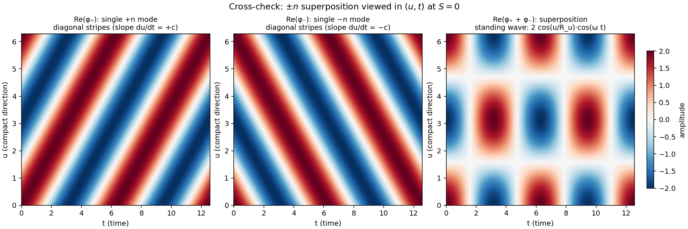

# Chapter 4 — Mode interactions: what happens when ±n meet?

[Chapter 3](03-examining-the-modes.md) examined each mode family
in isolation: the n = 0 light mode, and the ±n massive modes
considered one at a time. It left an open question — what does
the *sign* of n carry physically? — and noted that the canonical
KK reading interprets ±n as a particle/antiparticle distinction.

This chapter takes that question to the math. What does the wave
equation say happens when a +n packet and a −n packet are
brought into contact? Three scenarios are useful to examine, in
increasing order of constraint:

1. Two packets passing through each other (free encounter from
   initially separated states).
2. Two packets brought to rest at the same S (held there by
   some external arrangement that supplies whatever energy is
   required).
3. The energy of the rest configuration: in particular, how it
   compares to the rest energies of light and a single mode.

The wave equation we have is **linear** ([Chapter 1
§6](01-foundation.md)), so every question this chapter asks
admits a clean computation via superposition. We compute and
report what the math gives. Where the math is silent, we say so
explicitly.

#### Forward note on framing

This chapter is written in the general "what happens when ±n
meet?" framing inherited from Chapter 3 — two packets, each
with its own definite n, brought into contact. The math (linear
superposition, orthogonality of ±n modes over u, doubled rest
energy) is correct under that framing and useful as the
general analysis of mode interactions. [Chapter 5](05-metric-self-consistency.md)
adopts a *more committed* reading: the directionless **standing
wave** — the equal-amplitude superposition of +n and −n
components, present together by construction — is identified as
the candidate physical particle on M. Under the standing-wave
reading, the static ±n superposition this chapter computes is
not "two particles meeting" but rather the structure of a
*single* particle. The math carries over directly; the framing
shifts. Where this chapter speaks of two packets, two
particles, or a meeting, those are useful intermediates for
the general analysis, not commitments about what physical
particles are. Chapter 5 settles the particle question.

---

## Concepts introduced in this chapter

| § | Concept |
|---|---------|
| 1 | The setup: two packets, ±n, well-separated initially |
| 2 | Linear superposition during overlap |
| 3 | The (u, t) cross-check |
| 4 | After the overlap: what each component is doing |
| 5 | The static case: ±n forced to rest at the same S |
| 6 | Comparison with light and with a single mode |
| 7 | Energy of the static configuration |
| 8 | What linear theory cannot decide |
| 9 | Updating the ±n readings |
| 10 | End of Chapter 4 |

---

## 1. The setup

Take two wave packets, both n ≠ 0, both with mass
m_n = ℏ|n|/(R_u c) ([Chapter 2 §6](02-mass-from-u.md)). One has
winding number +n; the other has winding number −n. They are
identical in every way except their compact-direction handedness.

Initial conditions:

- Packet **A**: winding +n, centered at S = S_A, moving in the
  +S direction with group velocity v_A = +v.
- Packet **B**: winding −n, centered at S = S_B (with S_B > S_A,
  so they start far apart), moving in the −S direction with
  group velocity v_B = −v.

The two packets approach each other along S. Eventually their
envelopes overlap.

The total field is given by linear superposition (since □φ = 0 is
linear, any sum of solutions is itself a solution):

<!-- φ_total(t, S, u) = φ_A(t, S, u) + φ_B(t, S, u) -->
$$
\varphi_\text{total}(t, S, u) = \varphi_A(t, S, u) + \varphi_B(t, S, u)
$$

Each packet has its own (n, k_S) and so its own ω satisfying
the dispersion relation. The total field is the sum.

---

## 2. Linear superposition during overlap

When the two packets coincide spatially, the total field
factors interestingly. Each packet has the form

<!-- φ_A = e^(+inu/R_u) · packet_A(S, t) -->
<!-- φ_B = e^(-inu/R_u) · packet_B(S, t) -->
$$
\varphi_A(t, S, u) = e^{+i\,n\,u/R_u}\,\Pi_A(S, t),
\qquad
\varphi_B(t, S, u) = e^{-i\,n\,u/R_u}\,\Pi_B(S, t)
$$

where Π_A(S, t) and Π_B(S, t) are the (S, t) parts — the wave
packet envelopes including their k_S-dependence and time
evolution. The u-piece factors out cleanly because n is fixed
within each packet (this was [Chapter 3 §2](03-examining-the-modes.md)'s
key observation).

The total field:

<!-- φ_total = e^(+inu/R_u) Π_A + e^(-inu/R_u) Π_B -->
$$
\varphi_\text{total} = e^{+i\,n\,u/R_u}\,\Pi_A(S, t) + e^{-i\,n\,u/R_u}\,\Pi_B(S, t)
$$

For the special case Π_A = Π_B = Π (equal-amplitude packets
perfectly coincident in S, t), the sum simplifies via Euler's
identity:

<!-- φ_total = (e^(+inu/R_u) + e^(-inu/R_u)) Π = 2 cos(nu/R_u) Π -->
$$
\varphi_\text{total} = 2\,\cos(n\,u/R_u)\,\Pi(S, t)
$$

The result is a **standing wave around u** times the
spatial-temporal envelope. The pattern around the compact
direction has nodes where cos(nu/R_u) = 0 and antinodes where
cos(nu/R_u) = ±1.

Three things to record:

1. The combined wave has u-structure (a cos(nu/R_u) pattern); it
   is not uniform in u.
2. The standing-wave pattern is symmetric under u → −u; no
   preferred winding direction is visible in the form.
3. The amplitude in u carries a factor of 2 compared to either
   single component.

#### Energy of the superposition

Each component packet carries energy
E_n = ℏω_n = ℏc·√(k_S² + (n/R_u)²)
([Chapter 2 §5](02-mass-from-u.md)). The total energy of the
sum is computed from the energy density of φ_total, which
involves |∂φ|² and (∇φ)² terms. The cross-terms between
e^(+inu/R_u) and e^(−inu/R_u) integrate to zero over the
compact circle (the two functions are orthogonal in the L²
sense over u ∈ [0, L_u)), so the cross-contributions to the
energy density cancel after integration. Only the diagonal
self-energy contributions survive:

<!-- E_total = E_A + E_B  (during coincident overlap) -->
$$
E_\text{total} = E_A + E_B
$$

For two equal-mass packets, this gives 2 E_n. The math is
straightforward: amplitude superposes linearly, energy involves
quadratic combinations, and the cross-terms vanish under
integration over u.

---

## 3. The (u, t) cross-check

The standing-wave form 2 cos(nu/R_u)·Π(S, t) at fixed t shows
*nodes* — points where cos(nu/R_u) = 0 and the field vanishes.
At those points, the field is identically zero. Looking at the
spatial pattern alone, it can appear as if the two component
waves have "wiped each other out" at those locations.

A useful cross-check: view the same superposition in the (u, t)
plane (at fixed S), where the time-dependence becomes visible.
The trigonometric identity

<!-- cos(A) + cos(B) = 2 cos((A+B)/2) cos((A-B)/2) -->
$$
\cos(A) + \cos(B) = 2\,\cos\!\left(\tfrac{A+B}{2}\right)\cos\!\left(\tfrac{A-B}{2}\right)
$$

with A = (n/R_u)u − ωt, B = (n/R_u)u + ωt (the phases of φ_+ and
φ_- respectively, with k_S = 0 and rest frequency ω = c|n|/R_u),
gives:

<!-- Re(φ_+) + Re(φ_-) = 2 cos((n/R_u)u) · cos(ω t) -->
$$
\mathrm{Re}(\varphi_+) + \mathrm{Re}(\varphi_-)
\;=\; 2\,\cos\!\left(\frac{n\,u}{R_u}\right)\,\cos(\omega\,t)
$$

The same expression viewed two ways:

- **As a sum of two traveling waves** (left side): each
  component is a wave moving around u in opposite directions,
  with phase contours that are diagonal lines in (u, t) of
  opposite slope.
- **As a product of a spatial pattern and a temporal
  oscillation** (right side): the spatial pattern has fixed
  nodes and antinodes; the temporal oscillation makes the whole
  pattern flash on and off uniformly.

These two descriptions are mathematically identical (the
identity is exact), so neither is "more real." But they offer
different visual evidence about whether the components survived
the superposition. The figure below makes the cross-check
concrete:

(Source: [`figures/superposition-ut.py`](figures/superposition-ut.py).)

The left and middle panels show φ_+ and φ_- separately as (u, t)
heatmaps — each a clean diagonal pattern, with opposite slopes
because the two modes wind around u in opposite directions. The
right panel shows their sum: a pattern of vertical (in u) stripes
of alternating sign in t, where the nodes of cos(nu/R_u) appear
as constant-zero (white) bands and the antinodes appear as
oscillating bright/dim bands.

Two things this confirms:

- The two component traveling waves are *both* still present in
  the superposition. The sum is exactly the sum, and the
  trigonometric identity is just two ways of writing the same
  field.
- The "nodes" in the spatial pattern at fixed t are *not*
  evidence that the components have disappeared. They are
  evidence that the two components, traveling in opposite
  directions, happen to interfere destructively at those u
  values for *every* time t (because the spatial nodes are
  fixed by cos(nu/R_u) regardless of t).

The components have not eliminated each other. They have
combined into a configuration whose visual appearance at fixed
t looks simpler than either component alone, but whose
mathematical content still includes both modes.

---

## 4. After the overlap: what each component is doing

What happens after the packets pass through each other?

In linear theory, each component of φ_total satisfies the wave
equation independently of the other (the equation is
homogeneous; no mode-mode coupling). Packet A continues moving
in the +S direction at +v; packet B continues in the −S
direction at −v. After overlap, S_A > S_B (they have crossed),
and the total field is again the sum of two well-separated
packets — one +n at S_A, one −n at S_B, exactly as before, just
on opposite sides.

The math gives a clean accounting:

- No energy was lost from either component (the equation
  conserves energy; cross-terms between modes integrated to
  zero in §2).
- No new field configurations appeared (the linear sum of two
  solutions is one solution; nothing else was added).
- Each packet emerges with the same parameters (n, k_S, ω) it
  had on the way in.

What does the math *not* tell us about? Several things:

- Whether some additional process (not encoded in □φ = 0) might
  have caused energy to leave one or both modes during overlap.
  The linear wave equation has no decay or radiation channel,
  so it can neither produce nor rule out such a process — it
  is silent.
- Whether the two modes might have interacted via some coupling
  not represented in our equation (for example, a coupling to
  another field, or a non-linear self-interaction term). Again
  the math is silent, since the equation we have does not
  contain such a coupling.
- Whether, from the perspective of a richer theory (quantum
  field theory, an interacting Lagrangian), the linear-theory
  pass-through is an idealization that breaks down. We cannot
  assess that from inside the linear theory.

Within linear wave theory, the calculation is what it is: each
component continues independently, and they emerge unchanged.
This is the linear-theory account of the encounter. Whether
some larger physics admits other processes is a separate
question.

---

## 5. The static case: ±n forced to rest at the same S

Now consider a different scenario. Suppose, by some external
arrangement (an applied force, a confining potential, a clamped
boundary condition — pick whichever is easiest to imagine), we
hold a +n packet and a −n packet *both at rest at the same S*.
Both have k_S = 0; both are centered at S = S₀. The external
arrangement supplies whatever energy or momentum is required to
maintain this configuration; we don't model the constraint
itself, only the field it produces.

The total field at the (assumed-static) configuration is:

<!-- φ_static = e^(+inu/R_u) Π_rest + e^(-inu/R_u) Π_rest = 2 cos(nu/R_u) Π_rest -->
$$
\varphi_\text{static}(t, S, u) = 2\,\cos(n\,u/R_u)\,\Pi_\text{rest}(S, t)
$$

where Π_rest(S, t) is the rest packet's envelope — a Gaussian-ish
distribution around S = S₀ in S, oscillating at the rest
frequency ω_rest = c|n|/R_u in t.

This is the same form as §2's overlap case, except that here the
configuration *persists* rather than passing through. The
question is what kind of object this is.

Three properties of the static superposition:

| Property | Value |
|---|---|
| Localization in S | Same as a single packet (envelope Π_rest) |
| u-structure | cos(nu/R_u) standing wave |
| Total rest energy | 2 E_rest = 2 m_n c² |
| Rest frequency | ω_rest = c\|n\|/R_u (same as a single mode) |
| Total spatial momentum | 0 (k_S = 0 for each component) |

The standing wave oscillates at ω_rest in time, even though it
sits still in S. The temporal oscillation is the same as a single
n-mode at rest — the e^(−iωt) factor multiplies the whole
configuration.

---

## 6. Comparison with light and with a single mode

How does the static superposition compare to the other obvious
reference configurations?

**Light** on M is the n = 0 mode ([Chapter 3 §1](03-examining-the-modes.md)):
its u-piece is the constant 1, no u-structure, no rest
frequency, propagates at c. A *static* light configuration
(ω = 0, k_S = 0) would be a uniform constant field, no
oscillation in t, no structure in u.

**A single n-mode at rest** has u-structure e^(±inu/R_u) (a
running wave around u), rest frequency ω_rest = c|n|/R_u, rest
energy m_n c². Stationary in S; oscillating in t.

Comparing the three:

| | u-structure | Rest frequency | Rest energy |
|---|---|---|---|
| Static light (n = 0, k_S = 0) | none (uniform) | ω = 0 | 0 |
| Single ±n mode at rest | e^(±inu/R_u) (one direction) | ω_rest = c\|n\|/R_u | m_n c² |
| Static ±n superposition | 2 cos(nu/R_u) (standing) | ω_rest = c\|n\|/R_u | 2 m_n c² |

The static ±n superposition differs from each of the reference
cases:

- It has u-structure (cos pattern), where light has none.
- It has nonzero rest frequency, where static light has zero.
- It has rest energy 2 m_n c², where static light has zero
  and a single mode has m_n c².

The math gives an unambiguous result: the superposition
configuration is distinct from light at every property compared.
It is also distinct from a single mode (different u-pattern,
different rest energy).

---

## 7. Energy of the static configuration

The rest energy of the static ±n superposition was computed in
§5: 2 m_n c². Worth tracing through the calculation explicitly,
because it is the central quantitative result of the chapter.

The energy density of a free scalar field is

<!-- ρ_E = (1/(2c²)) (∂_t φ)² + (1/2) (∇φ)² -->
$$
\rho_E
\;=\; \frac{1}{2 c^2}\,\bigl|\partial_t \varphi\bigr|^2
\;+\; \frac{1}{2}\,\bigl|\nabla \varphi\bigr|^2
$$

(in convenient normalization). For our static superposition

<!-- φ_static = e^(+inu/R_u) Π_rest + e^(-inu/R_u) Π_rest -->
$$
\varphi_\text{static}
\;=\; e^{+i n u / R_u}\,\Pi_\text{rest}
\;+\; e^{-i n u / R_u}\,\Pi_\text{rest}
$$

compute |∂_t φ|² and |∂_u φ|²:

<!-- |∂_t φ|² = |i ω_rest e^{+inu/R_u} Π_rest + i ω_rest e^{-inu/R_u} Π_rest|² -->
$$
\bigl|\partial_t \varphi\bigr|^2
\;=\; \omega_\text{rest}^2
\;\bigl|\Pi_\text{rest}\bigr|^2
\;\bigl(e^{+inu/R_u} + e^{-inu/R_u}\bigr)^2
\;\cdot\;(\ldots)
$$

When integrated over u ∈ [0, L_u), the cross-terms
(involving e^(+inu/R_u)·e^(−inu/R_u) and similar) integrate to a
constant times the diagonal terms; the e^(+inu/R_u)·e^(+inu/R_u)
cross-term involves e^(+2inu/R_u), which integrates to zero over
a full period.

The detailed bookkeeping (in the orthogonality of the modes over
u) leaves:

<!-- E_total = E_+ + E_-  (no cross-terms after integration) -->
$$
E_\text{total} = E_+ + E_-
$$

where E_+ and E_- are the rest energies of the +n and −n
packets individually. Both equal m_n c², so:

<!-- E_total = 2 m_n c² -->
$$
E_\text{total} = 2\,m_n\,c^2
$$

The cross-terms vanish under integration over u not because of
any "cancellation in physics" but because of the orthogonality
of the e^(±inu/R_u) modes in L²([0, L_u)). The result is the
straightforward sum of individual rest energies.

In particular: the result is *not* zero, and it is *not* less
than m_n c². The math gives 2 m_n c² for the rest energy of the
static superposition.

This number can be compared to the alternatives:

- 2 m_n c² (this configuration) > 0 (light's rest energy).
- 2 m_n c² (this configuration) > m_n c² (a single mode's rest
  energy).

Whether 2 m_n c² is "what we expected" or "what we hoped for"
depends on the prior expectation. Three priors that turned out
to make different predictions:

- *If we expected the superposition to behave as light:* the
  predicted rest energy was 0; the math gives 2 m_n c².
- *If we expected it to be like a single mode:* the predicted
  rest energy was m_n c²; the math gives 2 m_n c².
- *If we expected energy to add linearly:* the predicted rest
  energy was 2 m_n c²; the math gives 2 m_n c².

Of these, the third prediction matches. The other two do not.

---

## 8. What linear theory cannot decide

The static superposition's rest energy of 2 m_n c² is the
answer linear wave theory gives, and the answer is exact within
that theory. But the framework is silent on several physically
important questions:

- **Annihilation via radiation.** A real ±n collision could in
  principle produce energy in another channel — e.g., a burst
  of n = 0 (light-like) modes that carry away the rest energy.
  Such a process requires a *coupling* between ±n and n = 0
  modes that the linear □φ = 0 equation does not provide. The
  framework cannot evaluate whether such a coupling is present
  in the underlying physics.
- **Inertial response under acceleration.** Computing how the
  static configuration responds to an applied external
  perturbation requires assumptions about how the external
  force couples to the field. The linear free wave equation
  does not specify a coupling, so the inertial response of the
  superposition cannot be computed without external input.
- **Number-changing processes (creation/annihilation).** The
  classical free wave equation contains no nonlinear or coupling
  terms that would change the field's mode content. Any
  mechanism that creates or destroys modes would have to come
  from richer structure — couplings between modes, nonlinear
  terms, or interaction with an off-diagonal-modified metric;
  the bare □φ = 0 of this project does not supply one. (Note
  that this project does not appeal to quantum field theory as
  a separate framework: discrete mode quantization in our setup
  *emerges* from the geometric periodicity of u rather than
  being imposed axiomatically. Number-changing processes, if
  they exist, must be derivable within the same wave-mechanical
  structure.)
- **Coupling to off-diagonal metric components.** If
  [Chapter 5](05-metric-self-consistency.md) finds that the
  bare diagonal metric does not survive — that off-diagonals
  develop in response to the modes — those off-diagonals would
  provide a new coupling channel that could mediate
  interactions between modes. Whether this could host
  annihilation, modify rest energy, or alter inertial behavior
  is a derivative question that depends on Chapter 5's
  findings.

For each of these, the linear theory we have constructed does
not predict a particular outcome; it does not have the structure
to make the prediction. The right disposition for those
questions is to flag them as outside scope, neither confirmed
nor refuted by the analysis above.

---

## 9. Updating the ±n readings

[Chapter 3 §3](03-examining-the-modes.md) listed four candidate
readings of the ±n distinction:

1. Particle/antiparticle distinction (mass-only analog of KK
   charge sign).
2. Internal handedness or chirality.
3. A label without physical content.
4. Something the project hasn't anticipated.

What does Chapter 4's math add to the picture?

| Reading | What this chapter adds |
|---|---|
| (1) Particle/antiparticle distinction | The math gives no annihilation channel in linear theory and no rest-energy cancellation. The reading remains *consistent* with the math (linear theory does not realize annihilation, but it also does not require its absence — it is silent on the question), but the reading is not *demonstrated* by anything in this chapter. |
| (2) Internal handedness or chirality | The (u, t) cross-check (§3) makes the handedness directly visible: ±n produce diagonal phase contours of opposite slope. The handedness is a real wave-mechanical degree of freedom in our framework. The reading is consistent with everything computed here. |
| (3) Label without physical content | The standing-wave superposition has a definite spatial pattern (cos(nu/R_u)) with energy 2 m_n c². The ±n distinction *does* produce visible interference structure when both signs are present. The reading is no longer the simplest one to maintain; some physical content of the sign is now visible in the superposition's structure, even if the manifold is not yet rich enough to give the sign a charge-like role. |
| (4) Something unanticipated | As before. |

Reading (2) is most cleanly supported by the math in this
chapter. Reading (1) is consistent with the math but requires
additional physics (nonlinear coupling, charge, or richer
manifold structure) to demonstrate. Reading (3) becomes harder
to maintain in light of the visible interference structure of
the static superposition, though it cannot be ruled out
entirely on the minimal manifold.

The chapter does not settle which reading is correct. It
sharpens what each reading would have to predict and what the
math currently delivers.

---

## 10. End of Chapter 4

#### What was computed

- Linear superposition of two ±n packets gives a 2 cos(nu/R_u)
  standing-wave pattern around u during overlap, with total
  energy E_+ + E_- = 2 E_n.
- The static configuration ±n at rest at the same S has rest
  energy 2 m_n c², rest frequency ω_rest = c|n|/R_u, and a
  cos(nu/R_u) standing-wave structure around u.
- A (u, t) cross-check confirms that the two component
  traveling waves remain mathematically present in the
  superposition; the standing-wave appearance at fixed t is the
  joint visualization of two traveling waves, not their
  elimination.
- The rest energy of the static superposition (2 m_n c²) is
  greater than that of a single mode (m_n c²) and greater than
  that of light (0). The math distinguishes the superposition
  from both reference configurations.

#### What this chapter did not address

- Whether any process outside the linear free-wave framework
  could produce energy loss, annihilation, or inertial
  modification. These questions live outside our framework; the
  chapter does not predict outcomes for them.
- How an external force or coupling would affect the
  superposition. The free wave equation does not specify a
  coupling, so external responses are unspecified.
- Quantum field theory's particle-number-changing processes.
  Outside the chapter's classical framework.

#### What was *not* introduced

- No new equations.
- No new metric structure.
- No new fields.
- No quantum-mechanical machinery.

Every result in this chapter is a direct consequence of
applying linear superposition to the wave equation derived in
Chapter 2. The chapter's value is in computing what the linear
theory gives, including the values it gives and the questions
on which it remains silent.

---

## What's next

For the next chapter and the rest of the project arc, see the
project [README's table of contents](README.md#chapters).
